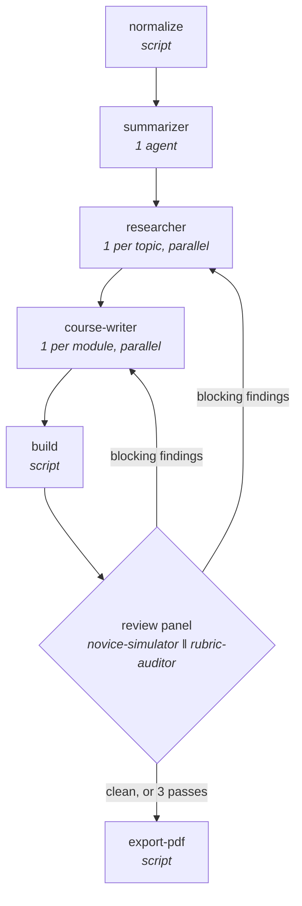

# Presentation2Course

Turns a lecturer's slide deck into a course you can actually learn from.

> **Status: built.** The design is in
> [2026-07-28-presentation2course-design.md](docs/superpowers/specs/2026-07-28-presentation2course-design.md);
> the implementation plan is in
> [2026-07-28-presentation2course.md](docs/superpowers/plans/2026-07-28-presentation2course.md).

## The problem

Lecturers build decks as prompts for themselves. Terse bullets, dense jargon, no
background — because the background was spoken aloud in the room and never written down.
Come revision time you're left with slides that state conclusions and explain nothing.

This skill reads that deck and writes the course the lecturer delivered out loud:
plain-language framing, an analogy *before* the jargon, a diagram, a worked example, and
a comprehension check after every single topic.

## What you get

- **`course.html`** — self-contained, offline, zero external requests. Sidebar
  navigation, click-to-reveal glossary on every jargon term, inline quizzes with
  instant feedback, light/dark.
- **`course.pdf`** — same content, print layout, quiz answers and explanations inline.
- **`course.md`** — the source of truth, so reruns diff cleanly.
- **`KNOWN-ISSUES.md`** — only when something couldn't be resolved. You always find out
  which sections to distrust; weak material never ships silently.

## Usage

```
Turn ./lectures/week3.pdf into a course
Turn ./lectures/ into a course
```

A single file becomes a single course. A directory becomes one multi-module course
covering the whole set. Both PDF and PPTX work.

The skill asks you **nothing** while it runs. You didn't write the deck, so you have no
context to contribute — everything is reported at the end instead.

## Requirements

| | |
|---|---|
| Python 3.12+ with `markdown>=3.5` | Required. `python3 -m pip install --user 'markdown>=3.5'`. The only runtime dependency. |
| LibreOffice (`soffice`) | Required **only** for PPTX input. Missing it is a hard failure, because falling back to text extraction would silently throw away every diagram on the slides. |
| Headless Chromium | Optional. Produces `course.pdf`. Without it you get the HTML plus a working Download PDF button. |
| Network | Used by the research phase to ground explanations in real sources. |

## How it works

Five agent roles, three deterministic scripts, and a review loop that terminates.



**normalize** converts everything to PDF so slides are read *visually*, page by page.
Text extraction is not used, because the architecture diagram is usually the most
valuable thing on the slide.

**summarizer** produces the course outline and — most importantly — a `gaps` list: every
claim the deck asserts but never explains. That list is the entire work order for
what follows.

**researcher** fans out one agent per topic to fill those gaps from real sources. When a
topic can't be substantiated it gets marked `unverified` and the writer must hedge.
**Fabricating a confident explanation is never allowed** — for a student who can't tell
the difference, invention is worse than an admitted gap.

**course-writer** fans out one agent per module, writing prose and its quizzes together
so questions never drift from the text that taught them.

**build** is a script, not an agent. Rendering markdown into a shipped theme is
mechanical work with a right answer, so it's deterministic and reproducible — which is
also what makes review iterations cheap enough to run three times.

**review panel** runs two agents with deliberately different information:

- **novice-simulator** sees *only* the finished HTML. Never the deck, never the
  research. A reviewer that has seen the upstream context can't un-see it, and will read
  a confusing sentence as clear because it knows what was meant. Its decisive
  instruction is *attempt every quiz using only what the course itself taught you* — a
  question needing outside knowledge is a bug. That turns "is this
  comprehensible" from a matter of taste into a pass/fail test.
- **rubric-auditor** sees the artifact, the outline, and the original deck, and checks
  fidelity: nothing invented, nothing important dropped.

Findings route back to the one unit responsible — a single topic's researcher or a single
module's writer — never the whole pipeline. The loop stops on a clean pass, on a repeated
finding, or after three passes.

## Design choices worth knowing

**Themes ship as assets, not as agent output.** Three variants selected by subject
matter. Authoring CSS at runtime makes visual quality a fresh gamble every run and one
you can never improve; a checked-in theme is a file you fix once and every future course
inherits.

**Quizzes are ungraded.** One or more multiple-choice questions after each topic,
immediate correct/incorrect, and an explanation that addresses the *tempting* wrong
answer rather than restating the right one. No scores means no stored state, which means
no stale-state bugs.

**The loop has a hard cap.** "Iterate until it's good" does not terminate — a reviewer
can always find something. Findings are split into blocking and noted, and only blocking
ones cost another pass.

## What this won't do

No video or audio. No LMS export. No multi-language output. No student accounts or
cross-session progress. It won't edit your source deck, and it can't recover content the
lecturer never put on a slide and no source discusses — that becomes an admitted gap,
by design.

The known-hard part is analogy quality: a subtly misleading analogy can pass every
mechanical validator. The novice-simulator is the only real defence, and it's judgment,
not a guarantee.

## Repository layout

```
SKILL.md            orchestrator
references/          rubric, style guide, quiz format, outline schema
assets/themes/       3 theme variants + shared print stylesheet
scripts/             normalize, build, export-pdf
tests/               fixture decks, and a deliberately broken course
                     used to verify the reviewer actually catches things
docs/superpowers/specs/   design docs
```

## Installation

This repository *is* the skill. Copy or symlink it into your skills directory:

```bash
ln -s "$PWD" ~/.claude/skills/presentation2course
```

## Development

```bash
python3 -m venv .venv
.venv/bin/pip install -r requirements-dev.txt
.venv/bin/pytest
```

Two tests skip unless the optional tools are installed: PPTX conversion needs `soffice`,
and the real PDF export needs Chromium.

The deterministic half — quiz and glossary grammars, front matter, anchors, theme mapping,
validation, and a golden `course.md` → `course.html` snapshot — is unit tested and is most
of the risk surface. Regenerate the snapshot deliberately, never casually:

```bash
P2C_UPDATE_GOLDEN=1 .venv/bin/pytest tests/test_build.py -k golden
```

The agent half is tested by invariants instead of snapshots, since its output is not
deterministic. Grade any produced course:

```bash
PYTHONPATH=scripts .venv/bin/python -m p2c.invariants ./week3-course
P2C_COURSE_DIR=./week3-course .venv/bin/pytest tests/test_invariants.py
```

The novice-simulator is the highest-value agent in the pipeline, so its regression is a
fixture rather than an article of faith: `tests/broken-course/` is a course with two
defects that pass every mechanical validation. See
[tests/broken-course/README.md](tests/broken-course/README.md) for the procedure. Vendored
Mermaid is pinned at 11.16.0 by sha256 in `tests/test_assets.py`; changing the version
means changing that hash on purpose.
