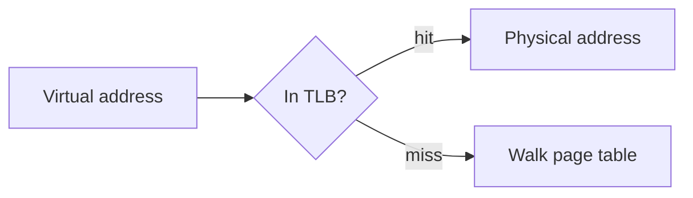
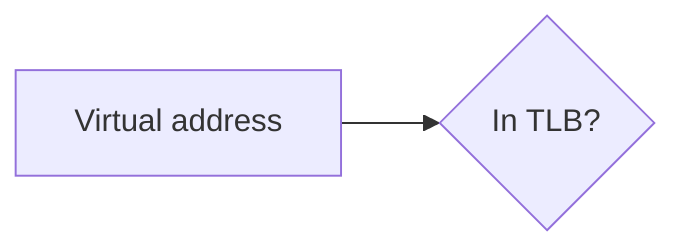
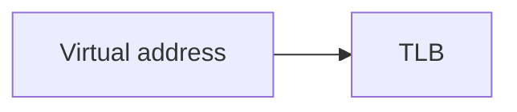

# Presentation2Course Implementation Plan

> **For agentic workers:** REQUIRED SUB-SKILL: Use superpowers:subagent-driven-development (recommended) or superpowers:executing-plans to implement this plan task-by-task. Steps use checkbox (`- [ ]`) syntax for tracking.

**Goal:** Build the Presentation2Course skill — a repository that turns a lecturer's PDF/PPTX deck into a self-contained, quiz-bearing `course.html` + `course.pdf` a student can learn from unaided.

**Architecture:** Three deterministic Python CLIs (`normalize`, `build`, `export-pdf`) carry all mechanical work and hold nearly all the unit-test surface; `SKILL.md` orchestrates five agent roles (summarizer, researcher, course-writer, novice-simulator, rubric-auditor) whose every handoff is a file on disk under `<output>/.p2c/`. Themes ship as checked-in assets: one fixed layout plus per-theme CSS-custom-property files, so a theme can vary type and colour but can never break a build.

**Tech Stack:** Python 3.12 (stdlib + `markdown` 3.5), pytest, vendored Mermaid 11.16.0 UMD, LibreOffice `soffice` (PPTX input only), headless Chromium (optional, PDF export only). No web fonts, no CDN, no JS build step.

## Environment findings (verified 2026-07-28 on this machine)

| Fact | Value | Consequence |
|---|---|---|
| Python | 3.12.3 | Target; use `dataclasses`, `match`, `Path` freely |
| `markdown` | 3.5.2 importable system-wide | The one runtime dependency |
| `pytest` | **not installed** | Task 1 creates a `.venv` |
| `soffice` | **absent** | The "PPTX without LibreOffice → hard fail" test runs for real here; the conversion test must `skipif` |
| Chromium | **absent** | `export-pdf` must skip gracefully; its happy path test must `skipif` |
| `pdftoppm`, `pandoc` | absent | Not used — the summarizer reads PDFs visually via the Read tool |
| Network | works (jsdelivr 200) | Mermaid can be vendored in Task 10 |
| Mermaid 11.16.0 UMD | 3 565 102 bytes, sha256 `74d7c46dabca328c2294733910a8aa1ed0c37451776e8d5295da38a2b758fb9b`, ends with `globalThis["mermaid"] = ...` | Inlining exposes `window.mermaid`; pin the hash |
| `.gitignore` line 1 | `docs/` | **Wrong** — the spec under `docs/` is tracked. Task 1 fixes it. Until then this plan file is invisible to `git status`. |

## Global Constraints

- **Zero external requests in `course.html`.** No CDN, no web fonts, no analytics, no `fetch`. Theme type pairings use system font stacks only.
- **Zero questions during a run.** No agent and no script prompts the user. Everything is reported at the end.
- **Fabrication is never permitted.** A topic research cannot substantiate is marked `unverified: true` and the writer hedges.
- **Every phase handoff is a file** under `<output>/.p2c/`. Nothing important lives only in an agent's context.
- **Hard cap of 3 review passes.** Early exit on a pass with no new blocking findings. A finding that reappears after being marked fixed is recorded, not re-fixed.
- **`export-pdf` runs once**, after the review loop converges — never inside the loop.
- **Blocking findings surviving pass 3 ship with `KNOWN-ISSUES.md`.** Silent shipping of weak sections is forbidden.
- **Runtime dependency floor:** `markdown>=3.5`. Dev: `pytest>=8`.
- **Mermaid is pinned** at 11.16.0 with the sha256 above; it is inlined only when the course actually contains a mermaid block.
- **`soffice` missing with PPTX input is a hard failure** printing the install command. Chromium missing is a graceful skip.
- Python: 4-space indent, type hints on public functions, `from __future__ import annotations` not needed on 3.12.
- All scripts are `python3` with a shebang, no extension, `chmod +x`, and are thin wrappers over importable modules in `scripts/p2c/`.

## Exit-code contract (SKILL.md depends on these)

| Code | Script | Meaning |
|---|---|---|
| 0 | all | Success |
| 1 | all | Unexpected error (traceback printed) |
| 2 | all | Bad usage / missing arguments |
| 3 | `build` | Rendered, but blocking validation findings written to `.p2c/review/build-findings.json` |
| 4 | `normalize` | PPTX input and `soffice` absent — hard fail, install command printed |
| 5 | `normalize` | Unreadable or zero-page deck — hard fail, offending file printed |
| 6 | `export-pdf` | Chromium absent — skipped; `SKIP:` note on stderr, JSON summary still on stdout |

## File Structure

```
SKILL.md                            orchestrator: phases, review loop, reporting    (18)
README.md                           MODIFY: drop "not yet built", add development   (19)
pyproject.toml                      pytest config (pythonpath = scripts, tests)     (1)
requirements.txt                    markdown>=3.5                                   (1)
requirements-dev.txt                pytest>=8                                       (1)
.gitignore                          MODIFY: drop `docs/`, add .venv/ __pycache__/   (1)
references/
  quiz-format.md                    quiz, mermaid, glossary, callout, marker grammar (5, 10)
  outline-schema.json               summarizer output contract (JSON Schema 2020-12) (7)
  style-guide.md                    topic rhythm, tone, analogy rules, hedging      (15)
  rubric.md                         blocking vs noted, reviewer output contract     (17)
  agents/summarizer.md              prompt: decks -> outline.json                   (15)
  agents/researcher.md              prompt: topic -> research/<id>.md               (15)
  agents/course-writer.md           prompt: module -> modules/<nn>-<slug>.md        (15)
  agents/novice-simulator.md        prompt: course.html only -> review findings     (17)
  agents/rubric-auditor.md          prompt: artifact+outline+decks -> findings      (17)
assets/                                                                             (12)
  base/template.html                the one layout; {{PLACEHOLDER}} substitution
  base/layout.css                   structure, spacing scale, components (fixed)
  base/course.js                    TOC highlight, quizzes, terms, theme, mermaid
  themes/{slate,parchment,clinical}/theme.css    tokens only, one per theme
  print.css                         shared print layout, serves both PDF paths
  vendor/mermaid.min.js             pinned 11.16.0, sha256-verified
scripts/
  normalize  build  export-pdf      thin CLI wrappers over p2c/                     (3, 13, 14)
  p2c/__init__.py                                                                   (1)
  p2c/text.py                       slugify, AnchorAllocator                        (1)
  p2c/normalize.py                  PDF/PPTX normalization + page counting          (3)
  p2c/blocks.py                     fence + inline-code extraction/restore          (4)
  p2c/quiz.py                       quiz grammar, Quiz, quiz_to_html                (5)
  p2c/glossary.py                   glossary block, term injection, appendix        (6)
  p2c/outline.py                    load/validate outline.json, iteration helpers   (7)
  p2c/theme.py                      domain->theme map, token/placeholder checks     (8, 12)
  p2c/assemble.py                   front matter, modules -> course.md              (9)
  p2c/mdrender.py                   course.md -> html body, TOC, glossary           (10)
  p2c/validate.py                   the build validations, Finding, routing         (11)
  p2c/build.py                      build orchestration + CLI main                   (13)
  p2c/exportpdf.py                  Chromium discovery + print-to-pdf                (14)
  p2c/review.py                     review contract, guards, KNOWN-ISSUES, grading  (16, 17)
  p2c/invariants.py                 property checks over a produced course dir      (19)
tests/
  fixtures/make_fixtures.py         deterministic deck fixture generator            (2)
  fixtures/terse.pdf  terse.pptx    committed deck fixtures                         (2)
  fixtures/mini-course/             outline.json + two module files                 (13)
  golden/course.html                golden snapshot, no mermaid                      (13)
  broken-course/                    two defects no validator can catch              (17)
  test_text.py (1)  test_fixtures.py (2)  test_normalize.py (3)  test_blocks.py (4)
  test_quiz.py (5)  test_glossary.py (6)  test_outline.py (7)  test_theme.py (8)
  test_assemble.py (9)  test_mdrender.py (10)  test_validate.py (11)  test_assets.py (12)
  test_build.py (13)  test_export_pdf.py (14)  test_references.py (15)
  test_review.py (16)  test_broken_course.py (17)  test_skill.py (18)
  test_invariants.py (19)
```

Numbers in parentheses are the task that creates the file.

## Task index

| # | Task | Deliverable |
|---|---|---|
| 1 | Scaffolding, test harness, text utilities | `pytest` runs; slugs and anchors |
| 2 | Deck fixtures | A real 3-page PDF and a valid PPTX, generated reproducibly |
| 3 | Phase 0 — `normalize` | Decks become PDFs, or the run stops with a reason |
| 4 | Fenced-block extraction | Blocks survive markdown rendering intact |
| 5 | Quiz block grammar | Malformed quizzes cannot reach a student |
| 6 | Glossary | Definitions, in-prose reveals, appendix |
| 7 | `outline.json` contract | The summarizer's output is validated, not trusted |
| 8 | Theme selection and loading | A theme missing a token fails to load |
| 9 | Assembling `course.md` | One source of truth, reproducible |
| 10 | Rendering to HTML | Anchors, TOC, quizzes, callouts, diagrams |
| 11 | Validation and routing | The build's findings name one unit to re-run |
| 12 | Shipped assets | Template, layout, behaviour, three themes, Mermaid |
| 13 | Phase 4 — `build` | `course.html`, golden-tested |
| 14 | `export-pdf` | `course.pdf`, or a graceful skip |
| 15 | Style guide and producing prompts | Summarizer, researcher, course-writer |
| 16 | Review-loop mechanics | The loop provably terminates |
| 17 | Rubric, reviewers, regression fixture | The reviewer itself is tested |
| 18 | `SKILL.md` | The orchestrator |
| 19 | Invariants and README | A produced course can be graded in one command |

## Deviations from the spec's layout (deliberate, each reversible)

1. **`assets/base/` holds `template.html`, `layout.css`, `course.js`; themes hold only `theme.css`.** The spec lists `template.html` and `course.js` inside each theme directory, but also fixes layout and component structure across themes — which would mean three byte-identical copies drifting apart. `theme.py` still checks `assets/themes/<name>/template.html` first and falls back to base, so a per-theme override remains possible without triplication today.
2. **`references/agents/*.md` added.** The spec's layout omits the subagent prompts. Inlining five prompts in `SKILL.md` makes the orchestrator unskimmable; the prompt text is a reference like the rubric.
3. **A `glossary` fenced block is added to the content formats.** The spec requires a click-to-reveal definition per jargon term and a glossary appendix but never says who authors the definitions. The course-writer emits one `glossary` block per module; that is what makes "every jargon term has a glossary entry" a mechanical validation.
4. **A `<!-- topic: <id> -->` HTML-comment marker opens every topic section.** Needed to make "every `outline.json` topic present in the course" checkable without fuzzy title matching.
5. **Mermaid "parses" is validated structurally** (known diagram keyword, balanced brackets, non-empty body), not by running Mermaid in Python. Real parse failures are caught by the writer's one repair attempt and the reviewers.
6. **Two review files per pass, not one.** The spec's run layout shows `review/pass-<n>.json`, but the panel is two reviewers running in parallel and a single path would make them race. The novice-simulator writes `pass-<n>.json` and the rubric-auditor writes `pass-<n>-auditor.json`; the loop reads both.

---

### Task 1: Scaffolding, test harness, and text utilities

**Files:**
- Create: `pyproject.toml`, `requirements.txt`, `requirements-dev.txt`
- Modify: `.gitignore` (replace contents)
- Create: `scripts/p2c/__init__.py`, `scripts/p2c/text.py`
- Test: `tests/test_text.py`

**Interfaces:**
- Consumes: nothing.
- Produces: `p2c.text.slugify(text: str) -> str`; `p2c.text.AnchorAllocator` with
  `.take(title: str) -> str` returning a unique slug per instance. Every later task
  uses these for module/topic/quiz ids.

- [ ] **Step 1: Fix `.gitignore` and create the dependency files**

`.gitignore` — full new contents (the existing single `docs/` line is a mistake; the
design spec under `docs/` is already tracked, and plans belong in git too):

```gitignore
__pycache__/
*.pyc
.venv/
.pytest_cache/
```

`requirements.txt`:

```
markdown>=3.5
```

`requirements-dev.txt`:

```
-r requirements.txt
pytest>=8
```

`pyproject.toml`:

```toml
[tool.pytest.ini_options]
pythonpath = ["scripts", "tests"]
testpaths = ["tests"]
addopts = "-q"
```

- [ ] **Step 2: Create the virtualenv and confirm the harness runs**

```bash
python3 -m venv .venv
.venv/bin/pip install -q -r requirements-dev.txt
.venv/bin/pytest --version
```

Expected: pytest `8.x` or newer. Every later `Run:` in this plan uses `.venv/bin/pytest`.

- [ ] **Step 3: Write the failing test**

`tests/test_text.py`:

```python
import pytest

from p2c.text import AnchorAllocator, slugify


@pytest.mark.parametrize(
    "raw,expected",
    [
        ("Virtual Memory", "virtual-memory"),
        ("  Leading and trailing  ", "leading-and-trailing"),
        ("TLB: what it caches", "tlb-what-it-caches"),
        ("C++ / Rust", "c-rust"),
        ("Page-table walk", "page-table-walk"),
        ("Réplication", "replication"),
        ("", "section"),
        ("!!!", "section"),
        ("42", "42"),
    ],
)
def test_slugify(raw, expected):
    assert slugify(raw) == expected


def test_anchor_allocator_dedupes():
    a = AnchorAllocator()
    assert a.take("Caching") == "caching"
    assert a.take("Caching") == "caching-2"
    assert a.take("Caching") == "caching-3"
    assert a.take("Other") == "other"


def test_anchor_allocator_instances_are_independent():
    assert AnchorAllocator().take("Caching") == "caching"
    assert AnchorAllocator().take("Caching") == "caching"
```

- [ ] **Step 4: Run it to make sure it fails**

Run: `.venv/bin/pytest tests/test_text.py -v`
Expected: collection error — `ModuleNotFoundError: No module named 'p2c'`.

- [ ] **Step 5: Write the minimal implementation**

`scripts/p2c/__init__.py`:

```python
"""Deterministic helpers for the Presentation2Course pipeline."""
```

`scripts/p2c/text.py`:

```python
"""Slug and anchor generation. Shared by every id the course emits."""

import re
import unicodedata

_NON_WORD = re.compile(r"[^a-z0-9]+")


def slugify(text: str) -> str:
    """Lowercase ASCII slug. Never empty — falls back to 'section'."""
    decomposed = unicodedata.normalize("NFKD", text)
    ascii_only = decomposed.encode("ascii", "ignore").decode("ascii")
    slug = _NON_WORD.sub("-", ascii_only.lower()).strip("-")
    return slug or "section"


class AnchorAllocator:
    """Hands out unique anchors, suffixing collisions with -2, -3, ..."""

    def __init__(self) -> None:
        self._counts: dict[str, int] = {}

    def take(self, title: str) -> str:
        base = slugify(title)
        self._counts[base] = self._counts.get(base, 0) + 1
        n = self._counts[base]
        return base if n == 1 else f"{base}-{n}"
```

- [ ] **Step 6: Run the tests and make sure they pass**

Run: `.venv/bin/pytest tests/test_text.py -v`
Expected: 11 passed.

- [ ] **Step 7: Commit**

```bash
git add .gitignore pyproject.toml requirements.txt requirements-dev.txt \
        scripts/p2c/__init__.py scripts/p2c/text.py tests/test_text.py
git commit -m "feat: scaffolding, pytest harness, slug and anchor utilities"
```

---

### Task 2: Deck fixtures

Every `normalize` test needs real deck bytes. Generating them from a committed script
keeps them reproducible and reviewable; committing the outputs keeps the tests runnable
without regenerating.

**Files:**
- Create: `tests/fixtures/__init__.py` (empty), `tests/fixtures/make_fixtures.py`
- Create (generated, committed): `tests/fixtures/terse.pdf`, `tests/fixtures/terse.pptx`
- Test: `tests/test_fixtures.py`

**Interfaces:**
- Consumes: nothing.
- Produces: `fixtures.make_fixtures.make_pdf(pages: list[list[str]]) -> bytes` and
  `fixtures.make_fixtures.make_pptx(lines: list[str]) -> bytes`, used by Task 3's tests
  to build ad-hoc decks. Committed `tests/fixtures/terse.pdf` is a valid 3-page
  uncompressed PDF; `tests/fixtures/terse.pptx` is a structurally valid one-slide PPTX.

- [ ] **Step 1: Write the failing test**

`tests/test_fixtures.py`:

```python
import re
import zipfile
from pathlib import Path

from fixtures.make_fixtures import make_pdf, make_pptx

FIXTURES = Path(__file__).parent / "fixtures"


def test_committed_pdf_is_a_three_page_pdf():
    data = (FIXTURES / "terse.pdf").read_bytes()
    assert data.startswith(b"%PDF-")
    assert data.rstrip().endswith(b"%%EOF")
    assert re.search(rb"/Count\s+3", data)
    assert b"Virtual memory" in data


def test_committed_pptx_is_a_valid_zip_with_presentation_parts():
    with zipfile.ZipFile(FIXTURES / "terse.pptx") as zf:
        names = set(zf.namelist())
        assert zf.testzip() is None
    assert "[Content_Types].xml" in names
    assert "ppt/presentation.xml" in names
    assert "ppt/slides/slide1.xml" in names


def test_make_pdf_honours_page_count():
    assert re.search(rb"/Count\s+1", make_pdf([["one"]]))
    assert re.search(rb"/Count\s+5", make_pdf([["x"]] * 5))


def test_make_pptx_is_deterministic():
    assert make_pptx(["a", "b"]) == make_pptx(["a", "b"])
```

- [ ] **Step 2: Run it to make sure it fails**

Run: `.venv/bin/pytest tests/test_fixtures.py -v`
Expected: `ModuleNotFoundError: No module named 'fixtures'`.

- [ ] **Step 3: Write the generator**

`tests/fixtures/make_fixtures.py`:

```python
"""Deterministic deck fixtures. Run as a script to (re)write terse.pdf/terse.pptx."""

import io
import zipfile
from pathlib import Path

HERE = Path(__file__).parent


def make_pdf(pages: list[list[str]]) -> bytes:
    """A minimal uncompressed PDF, one text object per page. Stdlib only."""
    objs: list[str] = []
    kids = " ".join(f"{4 + 2 * i} 0 R" for i in range(len(pages)))
    objs.append("<< /Type /Catalog /Pages 2 0 R >>")
    objs.append(f"<< /Type /Pages /Kids [{kids}] /Count {len(pages)} >>")
    objs.append("<< /Type /Font /Subtype /Type1 /BaseFont /Helvetica >>")
    for i, lines in enumerate(pages):
        contents = 5 + 2 * i
        objs.append(
            "<< /Type /Page /Parent 2 0 R /MediaBox [0 0 720 540] "
            f"/Resources << /Font << /F1 3 0 R >> >> /Contents {contents} 0 R >>"
        )
        body = "BT /F1 24 Tf 40 480 Td 30 TL\n"
        for line in lines:
            esc = line.replace("\\", r"\\").replace("(", r"\(").replace(")", r"\)")
            body += f"({esc}) Tj T*\n"
        body += "ET"
        objs.append(f"<< /Length {len(body)} >>\nstream\n{body}\nendstream")

    out = bytearray(b"%PDF-1.4\n")
    offsets: list[int] = []
    for n, obj in enumerate(objs, start=1):
        offsets.append(len(out))
        out += f"{n} 0 obj\n{obj}\nendobj\n".encode("latin-1")
    xref = len(out)
    out += f"xref\n0 {len(objs) + 1}\n".encode()
    out += b"0000000000 65535 f \n"
    for off in offsets:
        out += f"{off:010d} 00000 n \n".encode()
    out += (
        f"trailer\n<< /Size {len(objs) + 1} /Root 1 0 R >>\n"
        f"startxref\n{xref}\n%%EOF\n"
    ).encode()
    return bytes(out)


_CONTENT_TYPES = """<?xml version="1.0" encoding="UTF-8" standalone="yes"?>
<Types xmlns="http://schemas.openxmlformats.org/package/2006/content-types">
<Default Extension="rels" ContentType="application/vnd.openxmlformats-package.relationships+xml"/>
<Default Extension="xml" ContentType="application/xml"/>
<Override PartName="/ppt/presentation.xml" ContentType="application/vnd.openxmlformats-officedocument.presentationml.presentation.main+xml"/>
<Override PartName="/ppt/slides/slide1.xml" ContentType="application/vnd.openxmlformats-officedocument.presentationml.slide+xml"/>
</Types>"""

_ROOT_RELS = """<?xml version="1.0" encoding="UTF-8" standalone="yes"?>
<Relationships xmlns="http://schemas.openxmlformats.org/package/2006/relationships">
<Relationship Id="rId1" Type="http://schemas.openxmlformats.org/officeDocument/2006/relationships/officeDocument" Target="ppt/presentation.xml"/>
</Relationships>"""

_PRESENTATION = """<?xml version="1.0" encoding="UTF-8" standalone="yes"?>
<p:presentation xmlns:a="http://schemas.openxmlformats.org/drawingml/2006/main" xmlns:r="http://schemas.openxmlformats.org/officeDocument/2006/relationships" xmlns:p="http://schemas.openxmlformats.org/presentationml/2006/main">
<p:sldIdLst><p:sldId id="256" r:id="rId1"/></p:sldIdLst>
<p:sldSz cx="9144000" cy="6858000"/><p:notesSz cx="6858000" cy="9144000"/>
</p:presentation>"""

_PRESENTATION_RELS = """<?xml version="1.0" encoding="UTF-8" standalone="yes"?>
<Relationships xmlns="http://schemas.openxmlformats.org/package/2006/relationships">
<Relationship Id="rId1" Type="http://schemas.openxmlformats.org/officeDocument/2006/relationships/slide" Target="slides/slide1.xml"/>
</Relationships>"""

_SLIDE_RELS = """<?xml version="1.0" encoding="UTF-8" standalone="yes"?>
<Relationships xmlns="http://schemas.openxmlformats.org/package/2006/relationships"/>"""

_SLIDE_HEAD = """<?xml version="1.0" encoding="UTF-8" standalone="yes"?>
<p:sld xmlns:a="http://schemas.openxmlformats.org/drawingml/2006/main" xmlns:r="http://schemas.openxmlformats.org/officeDocument/2006/relationships" xmlns:p="http://schemas.openxmlformats.org/presentationml/2006/main">
<p:cSld><p:spTree>
<p:nvGrpSpPr><p:cNvPr id="1" name=""/><p:cNvGrpSpPr/><p:nvPr/></p:nvGrpSpPr>
<p:grpSpPr/>
<p:sp><p:nvSpPr><p:cNvPr id="2" name="Body"/><p:cNvSpPr txBox="1"/><p:nvPr/></p:nvSpPr>
<p:spPr><a:xfrm><a:off x="457200" y="457200"/><a:ext cx="8229600" cy="4114800"/></a:xfrm>
<a:prstGeom prst="rect"><a:avLst/></a:prstGeom></p:spPr>
<p:txBody><a:bodyPr/><a:lstStyle/>"""

_SLIDE_TAIL = """</p:txBody></p:sp>
</p:spTree></p:cSld>
</p:sld>"""


def make_pptx(lines: list[str]) -> bytes:
    """A one-slide PPTX. Deterministic: fixed zip timestamps."""
    paras = "".join(
        '<a:p><a:r><a:rPr lang="en-US"/><a:t>'
        + line.replace("&", "&amp;").replace("<", "&lt;")
        + "</a:t></a:r></a:p>"
        for line in lines
    )
    parts = {
        "[Content_Types].xml": _CONTENT_TYPES,
        "_rels/.rels": _ROOT_RELS,
        "ppt/presentation.xml": _PRESENTATION,
        "ppt/_rels/presentation.xml.rels": _PRESENTATION_RELS,
        "ppt/slides/slide1.xml": _SLIDE_HEAD + paras + _SLIDE_TAIL,
        "ppt/slides/_rels/slide1.xml.rels": _SLIDE_RELS,
    }
    buf = io.BytesIO()
    with zipfile.ZipFile(buf, "w") as zf:
        for name, text in parts.items():
            info = zipfile.ZipInfo(name, date_time=(1980, 1, 1, 0, 0, 0))
            info.compress_type = zipfile.ZIP_DEFLATED
            zf.writestr(info, text)
    return buf.getvalue()


PDF_PAGES = [
    ["Virtual memory", "TLB", "Page fault"],
    ["Page table walk", "Multi-level tables"],
    ["Thrashing", "Working set"],
]
PPTX_LINES = ["Cache coherence", "MESI", "False sharing"]

if __name__ == "__main__":
    (HERE / "terse.pdf").write_bytes(make_pdf(PDF_PAGES))
    (HERE / "terse.pptx").write_bytes(make_pptx(PPTX_LINES))
    print("wrote terse.pdf and terse.pptx")
```

- [ ] **Step 4: Generate the fixtures**

```bash
touch tests/fixtures/__init__.py
.venv/bin/python tests/fixtures/make_fixtures.py
```

Expected: `wrote terse.pdf and terse.pptx`; both files exist under `tests/fixtures/`.

- [ ] **Step 5: Run the tests and make sure they pass**

Run: `.venv/bin/pytest tests/test_fixtures.py -v`
Expected: 4 passed.

- [ ] **Step 6: Commit**

```bash
git add tests/fixtures/__init__.py tests/fixtures/make_fixtures.py \
        tests/fixtures/terse.pdf tests/fixtures/terse.pptx tests/test_fixtures.py
git commit -m "test: deterministic terse PDF and PPTX deck fixtures"
```

---

### Task 3: Phase 0 — `normalize`

**Files:**
- Create: `scripts/p2c/normalize.py`, `scripts/normalize`
- Test: `tests/test_normalize.py`

**Interfaces:**
- Consumes: `fixtures.make_fixtures.make_pdf`, `p2c.text.slugify`.
- Produces:
  - `p2c.normalize.pdf_page_count(data: bytes) -> int` (raises `BadDeck`)
  - `p2c.normalize.collect_inputs(paths: list[Path]) -> list[Path]` (raises `BadDeck`)
  - `p2c.normalize.normalize(inputs: list[Path], out_dir: Path, soffice: str | None) -> NormalizeResult`
  - `NormalizeResult` dataclass: `pdfs: list[Path]`, `converted: list[Path]`, `pages: dict[str, int]`
  - Exceptions `NormalizeError` (base, `.exit_code`), `SofficeMissing` (4), `BadDeck` (5)
  - `p2c.normalize.main(argv: list[str]) -> int` — the CLI entry point, prints a JSON
    report on stdout. Task 15's `SKILL.md` parses that JSON.

- [ ] **Step 1: Write the failing test**

`tests/test_normalize.py`:

```python
import json
import shutil
import subprocess
import sys
from pathlib import Path

import pytest

from fixtures.make_fixtures import make_pdf
from p2c.normalize import (
    BadDeck,
    NormalizeResult,
    SofficeMissing,
    collect_inputs,
    normalize,
    pdf_page_count,
)

FIXTURES = Path(__file__).parent / "fixtures"
REPO = Path(__file__).resolve().parents[1]


def test_page_count_of_fixture():
    assert pdf_page_count((FIXTURES / "terse.pdf").read_bytes()) == 3


def test_page_count_of_single_page():
    assert pdf_page_count(make_pdf([["only"]])) == 1


def test_page_count_rejects_non_pdf():
    with pytest.raises(BadDeck, match="not a PDF"):
        pdf_page_count(b"PK\x03\x04 this is a zip")


def test_page_count_rejects_zero_pages():
    with pytest.raises(BadDeck, match="zero pages"):
        pdf_page_count(make_pdf([]))


def test_collect_inputs_expands_a_directory_sorted(tmp_path):
    (tmp_path / "b.pdf").write_bytes(make_pdf([["b"]]))
    (tmp_path / "a.pdf").write_bytes(make_pdf([["a"]]))
    (tmp_path / "notes.txt").write_text("ignored")
    assert [p.name for p in collect_inputs([tmp_path])] == ["a.pdf", "b.pdf"]


def test_collect_inputs_rejects_a_directory_with_no_decks(tmp_path):
    with pytest.raises(BadDeck, match="no PDF or PPTX"):
        collect_inputs([tmp_path])


def test_collect_inputs_rejects_an_unsupported_file(tmp_path):
    odd = tmp_path / "deck.key"
    odd.write_text("nope")
    with pytest.raises(BadDeck, match="unsupported"):
        collect_inputs([odd])


def test_normalize_copies_pdfs_and_reports_pages(tmp_path):
    out = tmp_path / "normalized"
    result = normalize([FIXTURES / "terse.pdf"], out, soffice=None)
    assert isinstance(result, NormalizeResult)
    assert [p.name for p in result.pdfs] == ["terse.pdf"]
    assert result.converted == []
    assert result.pages == {"terse.pdf": 3}
    assert (out / "terse.pdf").read_bytes() == (FIXTURES / "terse.pdf").read_bytes()


def test_normalize_dedupes_colliding_stems(tmp_path):
    one = tmp_path / "a"
    two = tmp_path / "b"
    for d in (one, two):
        d.mkdir()
        (d / "week1.pdf").write_bytes(make_pdf([["x"]]))
    result = normalize([one / "week1.pdf", two / "week1.pdf"], tmp_path / "out", None)
    assert [p.name for p in result.pdfs] == ["week1.pdf", "week1-2.pdf"]


def test_normalize_hard_fails_on_pptx_without_soffice(tmp_path):
    with pytest.raises(SofficeMissing) as exc:
        normalize([FIXTURES / "terse.pptx"], tmp_path / "out", soffice=None)
    assert exc.value.exit_code == 4
    assert "libreoffice" in str(exc.value).lower()


def test_normalize_rejects_a_corrupt_pdf(tmp_path):
    bad = tmp_path / "broken.pdf"
    bad.write_bytes(b"not really a pdf")
    with pytest.raises(BadDeck, match="broken.pdf"):
        normalize([bad], tmp_path / "out", None)


def _run_cli(*args):
    return subprocess.run(
        [sys.executable, str(REPO / "scripts" / "normalize"), *map(str, args)],
        capture_output=True,
        text=True,
    )


def test_cli_succeeds_on_pdf_and_prints_json(tmp_path):
    proc = _run_cli(FIXTURES / "terse.pdf", "--out", tmp_path / "out")
    assert proc.returncode == 0, proc.stderr
    report = json.loads(proc.stdout)
    assert report["pages"] == {"terse.pdf": 3}
    assert report["converted"] == []


def test_cli_exit_4_on_pptx_without_soffice(tmp_path, monkeypatch):
    proc = subprocess.run(
        [
            sys.executable,
            str(REPO / "scripts" / "normalize"),
            str(FIXTURES / "terse.pptx"),
            "--out",
            str(tmp_path / "out"),
            "--soffice",
            "definitely-not-installed-soffice",
        ],
        capture_output=True,
        text=True,
    )
    assert proc.returncode == 4
    assert "apt install libreoffice" in proc.stderr


def test_cli_exit_5_on_corrupt_deck(tmp_path):
    bad = tmp_path / "broken.pdf"
    bad.write_bytes(b"garbage")
    proc = _run_cli(bad, "--out", tmp_path / "out")
    assert proc.returncode == 5


def test_cli_exit_2_without_arguments():
    assert _run_cli().returncode == 2


@pytest.mark.skipif(shutil.which("soffice") is None, reason="LibreOffice not installed")
def test_pptx_converts_when_soffice_is_present(tmp_path):
    result = normalize([FIXTURES / "terse.pptx"], tmp_path / "out", shutil.which("soffice"))
    assert [p.name for p in result.converted] == ["terse.pdf"]
    assert result.pages["terse.pdf"] >= 1
```

- [ ] **Step 2: Run it to make sure it fails**

Run: `.venv/bin/pytest tests/test_normalize.py -v`
Expected: `ModuleNotFoundError: No module named 'p2c.normalize'`.

- [ ] **Step 3: Write the implementation**

`scripts/p2c/normalize.py`:

```python
"""Phase 0: everything becomes a PDF, or the run stops.

Text extraction is deliberately not a fallback. The architecture diagram is usually
the most valuable thing on a slide, and extraction silently discards it.
"""

import json
import re
import shutil
import subprocess
from dataclasses import dataclass, field
from pathlib import Path

SUPPORTED = {".pdf", ".pptx"}
INSTALL_HINT = (
    "PPTX input requires LibreOffice. Install it and re-run:\n"
    "  sudo apt install libreoffice        # Debian/Ubuntu\n"
    "  brew install --cask libreoffice     # macOS"
)


class NormalizeError(Exception):
    exit_code = 1


class SofficeMissing(NormalizeError):
    exit_code = 4


class BadDeck(NormalizeError):
    exit_code = 5


@dataclass
class NormalizeResult:
    pdfs: list[Path] = field(default_factory=list)
    converted: list[Path] = field(default_factory=list)
    pages: dict[str, int] = field(default_factory=dict)


def pdf_page_count(data: bytes) -> int:
    """Page count from /Count, falling back to counting /Type /Page objects."""
    if not data.startswith(b"%PDF-"):
        raise BadDeck("not a PDF (missing %PDF- header)")
    counts = [int(m.group(1)) for m in re.finditer(rb"/Count\s+(\d+)", data)]
    n = max(counts) if counts else len(re.findall(rb"/Type\s*/Page\b", data))
    if n < 1:
        raise BadDeck("PDF reports zero pages")
    return n


def collect_inputs(paths: list[Path]) -> list[Path]:
    """Expand directories to their decks; validate extensions. Sorted, stable."""
    found: list[Path] = []
    for path in paths:
        if path.is_dir():
            decks = sorted(
                p for p in path.rglob("*") if p.suffix.lower() in SUPPORTED and p.is_file()
            )
            if not decks:
                raise BadDeck(f"{path}: no PDF or PPTX files found")
            found.extend(decks)
        elif path.is_file():
            if path.suffix.lower() not in SUPPORTED:
                raise BadDeck(f"{path}: unsupported input (expected .pdf or .pptx)")
            found.append(path)
        else:
            raise BadDeck(f"{path}: no such file or directory")
    if not found:
        raise BadDeck("no inputs given")
    return found


def _unique(out_dir: Path, stem: str, taken: set[str]) -> Path:
    name, n = f"{stem}.pdf", 1
    while name in taken:
        n += 1
        name = f"{stem}-{n}.pdf"
    taken.add(name)
    return out_dir / name


def _convert_pptx(src: Path, out_dir: Path, soffice: str) -> Path:
    proc = subprocess.run(
        [soffice, "--headless", "--convert-to", "pdf", "--outdir", str(out_dir), str(src)],
        capture_output=True,
        text=True,
        timeout=300,
    )
    produced = out_dir / f"{src.stem}.pdf"
    if proc.returncode != 0 or not produced.exists():
        raise BadDeck(f"{src}: LibreOffice conversion failed\n{proc.stdout}\n{proc.stderr}")
    return produced


def normalize(
    inputs: list[Path], out_dir: Path, soffice: str | None
) -> NormalizeResult:
    decks = collect_inputs([Path(p) for p in inputs])
    if any(d.suffix.lower() == ".pptx" for d in decks) and (
        soffice is None or shutil.which(soffice) is None
    ):
        raise SofficeMissing(INSTALL_HINT)

    out_dir.mkdir(parents=True, exist_ok=True)
    result = NormalizeResult()
    taken: set[str] = set()
    for deck in decks:
        target = _unique(out_dir, deck.stem, taken)
        if deck.suffix.lower() == ".pdf":
            data = deck.read_bytes()
            try:
                pages = pdf_page_count(data)
            except BadDeck as exc:
                raise BadDeck(f"{deck}: {exc}") from exc
            target.write_bytes(data)
        else:
            produced = _convert_pptx(deck, out_dir, soffice)  # type: ignore[arg-type]
            if produced != target:
                produced.replace(target)
            pages = pdf_page_count(target.read_bytes())
            result.converted.append(target)
        result.pdfs.append(target)
        result.pages[target.name] = pages
    return result


def main(argv: list[str]) -> int:
    import argparse

    parser = argparse.ArgumentParser(
        prog="normalize", description="Normalize decks to PDFs for visual reading."
    )
    parser.add_argument("inputs", nargs="+", type=Path)
    parser.add_argument("--out", required=True, type=Path)
    parser.add_argument("--soffice", default="soffice")
    args = parser.parse_args(argv)

    result = normalize(args.inputs, args.out, args.soffice)
    print(
        json.dumps(
            {
                "pdfs": [str(p) for p in result.pdfs],
                "converted": [str(p) for p in result.converted],
                "pages": result.pages,
                "total_pages": sum(result.pages.values()),
            },
            indent=2,
        )
    )
    return 0
```

`scripts/normalize`:

```python
#!/usr/bin/env python3
"""CLI wrapper. Exit codes: 0 ok, 2 usage, 4 soffice missing, 5 bad deck."""

import sys
from pathlib import Path

sys.path.insert(0, str(Path(__file__).resolve().parent))

from p2c.normalize import NormalizeError, main  # noqa: E402

if __name__ == "__main__":
    try:
        sys.exit(main(sys.argv[1:]))
    except NormalizeError as exc:
        print(f"ERROR: {exc}", file=sys.stderr)
        sys.exit(exc.exit_code)
```

- [ ] **Step 4: Make it executable and run the tests**

```bash
chmod +x scripts/normalize
.venv/bin/pytest tests/test_normalize.py -v
```

Expected: 15 passed, 1 skipped (the `soffice` conversion test — LibreOffice is absent
on this machine).

- [ ] **Step 5: Commit**

```bash
git add scripts/p2c/normalize.py scripts/normalize tests/test_normalize.py
git commit -m "feat: normalize decks to PDF, hard-failing on PPTX without LibreOffice"
```

---

### Task 4: Fenced-block and inline-code extraction

Quiz, mermaid, and glossary blocks must be pulled out of the markdown *before*
python-markdown sees them (it would render them as code blocks) and re-injected as HTML
afterwards. Inline code spans must be protected from glossary term injection. This is
the seam every content format depends on, so it gets its own tested module.

**Files:**
- Create: `scripts/p2c/blocks.py`
- Test: `tests/test_blocks.py`

**Interfaces:**
- Consumes: nothing.
- Produces:
  - `p2c.blocks.Fence` dataclass: `kind: str`, `body: str`, `token: str`
  - `p2c.blocks.extract_fences(md: str, kinds: tuple[str, ...] | None = None) -> tuple[str, list[Fence]]`
  - `p2c.blocks.protect_inline_code(md: str) -> tuple[str, dict[str, str]]`
  - `p2c.blocks.restore(text: str, replacements: dict[str, str]) -> str`
  - Token shapes: `P2CBLOCK<n>ENDBLOCK` for fences, `P2CCODE<n>ENDCODE` for inline code —
    alphanumeric so python-markdown passes them through untouched.

- [ ] **Step 1: Write the failing test**

`tests/test_blocks.py`:

````python
from p2c.blocks import Fence, extract_fences, protect_inline_code, restore

QUIZ = """Intro text.

```quiz
q: What?
- [x] This
```

Trailing text.
"""


def test_extract_fences_replaces_block_with_token():
    md, fences = extract_fences(QUIZ)
    assert len(fences) == 1
    assert fences[0].kind == "quiz"
    assert fences[0].body == "q: What?\n- [x] This"
    assert fences[0].token in md
    assert "```" not in md
    assert "Intro text." in md and "Trailing text." in md


def test_extract_fences_filters_by_kind():
    md = "```mermaid\ngraph TD\n```\n\n```python\nx = 1\n```\n"
    stripped, fences = extract_fences(md, kinds=("mermaid",))
    assert [f.kind for f in fences] == ["mermaid"]
    assert "```python" in stripped


def test_extract_fences_handles_multiple_and_numbers_tokens():
    md = "```quiz\na\n```\n\n```quiz\nb\n```\n"
    _, fences = extract_fences(md)
    assert [f.token for f in fences] == ["P2CBLOCK0ENDBLOCK", "P2CBLOCK1ENDBLOCK"]
    assert [f.body for f in fences] == ["a", "b"]


def test_extract_fences_keeps_blank_lines_inside_body():
    _, fences = extract_fences("```quiz\na\n\nb\n```\n")
    assert fences[0].body == "a\n\nb"


def test_adjacent_blocks_are_separated_by_blank_lines():
    md, fences = extract_fences("```quiz\na\n```\n```glossary\nT: d\n```\n")
    tokens = [f.token for f in fences]
    between = md.split(tokens[0])[1].split(tokens[1])[0]
    assert between.strip() == ""
    assert between.count("\n") >= 2


def test_extract_fences_leaves_unterminated_fence_alone():
    md = "```quiz\nq: never closed\n"
    stripped, fences = extract_fences(md)
    assert fences == []
    assert stripped == md


def test_extract_fences_accepts_bare_fence_as_empty_kind():
    _, fences = extract_fences("```\nplain\n```\n")
    assert fences[0].kind == ""


def test_protect_inline_code_and_restore_round_trip():
    md = "The `TLB` caches `mappings`."
    protected, mapping = protect_inline_code(md)
    assert "`" not in protected
    assert len(mapping) == 2
    assert restore(protected, mapping) == md


def test_restore_unwraps_paragraph_wrapped_tokens():
    html = "<p>P2CBLOCK0ENDBLOCK</p>\n<p>after</p>"
    assert restore(html, {"P2CBLOCK0ENDBLOCK": "<div>q</div>"}) == (
        "<div>q</div>\n<p>after</p>"
    )


def test_restore_is_a_noop_for_unknown_tokens():
    assert restore("<p>plain</p>", {}) == "<p>plain</p>"


def test_fence_is_a_dataclass_with_the_documented_fields():
    f = Fence(kind="quiz", body="b", token="t")
    assert (f.kind, f.body, f.token) == ("quiz", "b", "t")
````

- [ ] **Step 2: Run it to make sure it fails**

Run: `.venv/bin/pytest tests/test_blocks.py -v`
Expected: `ModuleNotFoundError: No module named 'p2c.blocks'`.

- [ ] **Step 3: Write the implementation**

`scripts/p2c/blocks.py`:

```python
"""Pull fenced blocks and inline code out of markdown, and put HTML back.

python-markdown renders ```quiz as a code block, and glossary injection must never
touch code. Both problems are solved by extracting to alphanumeric tokens first.
"""

import re
from dataclasses import dataclass

_OPEN = re.compile(r"^\s{0,3}```\s*(?P<info>[A-Za-z0-9_-]*)\s*$")
_CLOSE = re.compile(r"^\s{0,3}```\s*$")
_INLINE_CODE = re.compile(r"`[^`\n]+`")

BLOCK_TOKEN = "P2CBLOCK{}ENDBLOCK"
CODE_TOKEN = "P2CCODE{}ENDCODE"


@dataclass
class Fence:
    kind: str
    body: str
    token: str


def extract_fences(
    md: str, kinds: tuple[str, ...] | None = None
) -> tuple[str, list[Fence]]:
    """Replace each matching fenced block with a token line.

    kinds=None extracts every fence. An unterminated fence is left untouched.
    """
    lines = md.split("\n")
    out: list[str] = []
    fences: list[Fence] = []
    i = 0
    while i < len(lines):
        opening = _OPEN.match(lines[i])
        kind = opening.group("info").lower() if opening else None
        if opening and (kinds is None or kind in kinds):
            close = next(
                (j for j in range(i + 1, len(lines)) if _CLOSE.match(lines[j])), None
            )
            if close is not None:
                token = BLOCK_TOKEN.format(len(fences))
                fences.append(
                    Fence(kind=kind or "", body="\n".join(lines[i + 1 : close]), token=token)
                )
                # Blank lines around the token, so two adjacent blocks cannot be merged
                # into one paragraph and end up as block HTML nested inside a <p>.
                out.extend(["", token, ""])
                i = close + 1
                continue
        out.append(lines[i])
        i += 1
    return "\n".join(out), fences


def protect_inline_code(md: str) -> tuple[str, dict[str, str]]:
    """Swap `code` spans for tokens so term injection cannot reach inside them."""
    mapping: dict[str, str] = {}

    def swap(match: re.Match[str]) -> str:
        token = CODE_TOKEN.format(len(mapping))
        mapping[token] = match.group(0)
        return token

    return _INLINE_CODE.sub(swap, md), mapping


def restore(text: str, replacements: dict[str, str]) -> str:
    """Put content back, unwrapping the <p> python-markdown may have added."""
    for token, value in replacements.items():
        text = text.replace(f"<p>{token}</p>", value).replace(token, value)
    return text
```

- [ ] **Step 4: Run the tests and make sure they pass**

Run: `.venv/bin/pytest tests/test_blocks.py -v`
Expected: 11 passed.

- [ ] **Step 5: Commit**

```bash
git add scripts/p2c/blocks.py tests/test_blocks.py
git commit -m "feat: fenced-block and inline-code extraction with restorable tokens"
```

---

### Task 5: Quiz block grammar

**Files:**
- Create: `scripts/p2c/quiz.py`, `references/quiz-format.md`
- Test: `tests/test_quiz.py`

**Interfaces:**
- Consumes: nothing.
- Produces:
  - `p2c.quiz.Quiz` dataclass: `question: str`, `options: list[str]`, `correct_index: int`, `why: str`
  - `p2c.quiz.QuizError(ValueError)`
  - `p2c.quiz.parse_quiz(body: str) -> Quiz`
  - `p2c.quiz.quiz_to_html(quiz: Quiz, qid: str) -> str` — emits
    `<div class="quiz" data-quiz="{qid}">` with `.quiz__q`, `.quiz__options` containing
    `button.quiz__option[data-correct]`, and `hidden` `.quiz__answer` / `.quiz__why`
    (`id="{qid}-why"`). Task 12's `course.js` and `print.css` target exactly these
    class names; Task 11's validator calls `parse_quiz`.

- [ ] **Step 1: Write the failing test for the happy path**

`tests/test_quiz.py`:

```python
import pytest

from p2c.quiz import Quiz, QuizError, parse_quiz, quiz_to_html

VALID = """q: What does a TLB actually cache?
- [ ] The contents of recently used pages
- [x] Virtual-to-physical page mappings
- [ ] The page table itself
why: It caches translations, not data. Confusing it with a data cache is
     the most common mistake here.
"""


def test_parses_a_valid_block():
    quiz = parse_quiz(VALID)
    assert isinstance(quiz, Quiz)
    assert quiz.question == "What does a TLB actually cache?"
    assert quiz.options == [
        "The contents of recently used pages",
        "Virtual-to-physical page mappings",
        "The page table itself",
    ]
    assert quiz.correct_index == 1
    assert quiz.why.startswith("It caches translations, not data.")
    assert "the most common mistake here." in quiz.why


def test_accepts_four_options_and_uppercase_marker():
    body = (
        "q: Pick one\n- [ ] a\n- [ ] b\n- [X] c\n- [ ] d\nwhy: because c\n"
    )
    quiz = parse_quiz(body)
    assert len(quiz.options) == 4
    assert quiz.correct_index == 2


def test_tolerates_blank_lines_and_trailing_whitespace():
    body = "\nq: Pick one  \n\n- [ ] a\n- [x] b\n- [ ] c\n\nwhy: b is right\n\n"
    assert parse_quiz(body).question == "Pick one"


@pytest.mark.parametrize(
    "body,message",
    [
        ("- [x] a\n- [ ] b\n- [ ] c\nwhy: w\n", "missing a 'q:' line"),
        ("q:   \n- [x] a\n- [ ] b\n- [ ] c\nwhy: w\n", "question is empty"),
        ("q: a\nq: b\n- [x] a\n- [ ] b\n- [ ] c\nwhy: w\n", "more than one 'q:'"),
        ("q: a\n- [ ] a\n- [ ] b\n- [ ] c\nwhy: w\n", "exactly one option"),
        ("q: a\n- [x] a\n- [x] b\n- [ ] c\nwhy: w\n", "exactly one option"),
        ("q: a\n- [x] a\n- [ ] b\nwhy: w\n", "3 or 4 options"),
        ("q: a\n- [x] a\n- [ ] b\n- [ ] c\n- [ ] d\n- [ ] e\nwhy: w\n", "3 or 4 options"),
        ("q: a\n- [x] a\n- [ ] b\n- [ ] c\n", "missing a 'why:' line"),
        ("q: a\n- [x] a\n- [ ] b\n- [ ] c\nwhy:   \n", "explanation is empty"),
        ("q: a\n- [x]   \n- [ ] b\n- [ ] c\nwhy: w\n", "option 1 is empty"),
        ("q: a\n- [x] a\n- [ ] b\n- [ ] c\nwhy: w\nstray line\n", "unrecognised line"),
        ("", "missing a 'q:' line"),
    ],
)
def test_rejects_malformed_blocks(body, message):
    with pytest.raises(QuizError, match=message):
        parse_quiz(body)
```

- [ ] **Step 2: Run it to make sure it fails**

Run: `.venv/bin/pytest tests/test_quiz.py -v`
Expected: `ModuleNotFoundError: No module named 'p2c.quiz'`.

- [ ] **Step 3: Write the parser**

`scripts/p2c/quiz.py`:

```python
"""The quiz block grammar: one q:, 3-4 options, exactly one [x], a non-empty why:.

Kept strict on purpose. A malformed quiz is a blocking build finding routed back to
the module's writer, which is cheaper than shipping a broken comprehension check.
"""

import html
import re
from dataclasses import dataclass

_OPTION = re.compile(r"^\s*-\s*\[(?P<mark>[ xX])\]\s*(?P<text>.*)$")
_KEY = re.compile(r"^(?P<key>q|why):\s*(?P<value>.*)$")


class QuizError(ValueError):
    """A quiz block that does not satisfy the grammar."""


@dataclass
class Quiz:
    question: str
    options: list[str]
    correct_index: int
    why: str


def parse_quiz(body: str) -> Quiz:
    question: str | None = None
    why: str | None = None
    options: list[str] = []
    correct: list[int] = []
    current: str | None = None  # which key trailing continuation lines belong to

    for raw in body.split("\n"):
        line = raw.rstrip()
        if not line.strip():
            continue
        option = _OPTION.match(line)
        if option:
            current = None
            if option.group("mark").lower() == "x":
                correct.append(len(options))
            options.append(option.group("text").strip())
            continue
        key = _KEY.match(line)
        if key:
            name, value = key.group("key"), key.group("value").strip()
            if name == "q":
                if question is not None:
                    raise QuizError("quiz has more than one 'q:' line")
                question, current = value, "q"
            else:
                if why is not None:
                    raise QuizError("quiz has more than one 'why:' line")
                why, current = value, "why"
            continue
        if current == "q" and not options:
            question = f"{question} {line.strip()}".strip()
            continue
        if current == "why":
            why = f"{why} {line.strip()}".strip()
            continue
        raise QuizError(f"unrecognised line in quiz block: {line.strip()!r}")

    if question is None:
        raise QuizError("quiz is missing a 'q:' line")
    if not question:
        raise QuizError("quiz question is empty")
    if not 3 <= len(options) <= 4:
        raise QuizError(f"quiz needs 3 or 4 options, found {len(options)}")
    for n, text in enumerate(options, start=1):
        if not text:
            raise QuizError(f"quiz option {n} is empty")
    if len(correct) != 1:
        raise QuizError(f"quiz needs exactly one option marked [x], found {len(correct)}")
    if why is None:
        raise QuizError("quiz is missing a 'why:' line")
    if not why:
        raise QuizError("quiz explanation is empty")

    return Quiz(question=question, options=options, correct_index=correct[0], why=why)


def quiz_to_html(quiz: Quiz, qid: str) -> str:
    """Ungraded, retryable, stateless. No scores means no storage to corrupt."""
    esc = html.escape
    parts = [f'<div class="quiz" data-quiz="{esc(qid)}">']
    parts.append(f'<p class="quiz__q">{esc(quiz.question)}</p>')
    parts.append('<ol class="quiz__options">')
    for n, text in enumerate(quiz.options):
        correct = "true" if n == quiz.correct_index else "false"
        parts.append(
            f'<li><button type="button" class="quiz__option" '
            f'data-correct="{correct}" aria-describedby="{esc(qid)}-why">'
            f"{esc(text)}</button></li>"
        )
    parts.append("</ol>")
    parts.append(
        f'<p class="quiz__answer" hidden>Correct answer: '
        f"<strong>{esc(quiz.options[quiz.correct_index])}</strong></p>"
    )
    parts.append(f'<p class="quiz__why" id="{esc(qid)}-why" hidden>{esc(quiz.why)}</p>')
    parts.append("</div>")
    return "\n".join(parts)
```

- [ ] **Step 4: Run the tests and make sure they pass**

Run: `.venv/bin/pytest tests/test_quiz.py -v`
Expected: 15 passed.

- [ ] **Step 5: Write the failing test for HTML emission**

Append to `tests/test_quiz.py`:

```python
def test_html_marks_exactly_one_correct_option():
    quiz = parse_quiz(VALID)
    out = quiz_to_html(quiz, "m01-t02-q1")
    assert out.count('data-correct="true"') == 1
    assert out.count('data-correct="false"') == 2
    assert out.count("<button") == 3


def test_html_wires_ids_and_hides_the_answer_until_clicked():
    out = quiz_to_html(parse_quiz(VALID), "m01-t02-q1")
    assert '<div class="quiz" data-quiz="m01-t02-q1">' in out
    assert 'id="m01-t02-q1-why"' in out
    assert 'aria-describedby="m01-t02-q1-why"' in out
    assert '<p class="quiz__answer" hidden>' in out
    assert '<p class="quiz__why" id="m01-t02-q1-why" hidden>' in out


def test_html_escapes_content():
    quiz = Quiz(question="a < b?", options=["<x>", "y & z", "q"], correct_index=0, why="'why'")
    out = quiz_to_html(quiz, "q1")
    assert "a &lt; b?" in out
    assert "&lt;x&gt;" in out
    assert "y &amp; z" in out
    assert "<x>" not in out
```

- [ ] **Step 6: Run them**

Run: `.venv/bin/pytest tests/test_quiz.py -v`
Expected: 18 passed (the HTML emitter above already satisfies these).

- [ ] **Step 7: Write the agent-facing format reference**

`references/quiz-format.md`:

`````markdown
# Content block formats

Three fenced block kinds are meaningful to the build. Anything else is rendered as an
ordinary code block.

## `quiz` — one comprehension check

````
```quiz
q: What does a TLB actually cache?
- [ ] The contents of recently used pages
- [x] Virtual-to-physical page mappings
- [ ] The page table itself
why: It caches translations, not data. Confusing it with a data cache is
     the most common mistake here — the TLB sits in front of the page
     table, not in front of memory.
```
````

Grammar, enforced by the build:

- Exactly one `q:` line. It may wrap onto following unindented-or-indented lines until
  the first option.
- 3 or 4 options, each `- [ ] text` or `- [x] text`. No option may be empty.
- Exactly one option marked `[x]`.
- Exactly one `why:`, non-empty, wrapping onto continuation lines.
- No other lines. A stray line is a build failure.
- Plain text only — no markdown, no backticks, no HTML inside a quiz block.

`why:` must address the **tempting wrong answer**, not restate the right one. That is
where the teaching happens. See `style-guide.md`.

One or more quiz blocks per topic. Every topic needs at least one. Quizzes are
ungraded with unlimited retries, so never write "you scored" or "try again later".

## `mermaid` — a diagram

````

````

The first non-blank line must be a Mermaid diagram keyword (`flowchart`, `graph`,
`sequenceDiagram`, `stateDiagram-v2`, `classDiagram`, `erDiagram`, `journey`, `gantt`,
`pie`, `mindmap`, `timeline`, `quadrantChart`, `xychart-beta`, `block-beta`,
`architecture-beta`). Brackets and quotes must balance. Use Mermaid for anything
expressible as flow, sequence, state, or architecture; inline `<svg>` otherwise.

A block that fails validation gets **one** repair attempt, then must be replaced with a
prose description. A broken diagram never ships.

## `glossary` — the module's jargon definitions

````
```glossary
TLB: A small, fast cache holding recently used virtual-to-physical page mappings.
Page table: The full in-memory map from virtual pages to physical frames.
```
````

One block per module file, at the end. One `term: definition` per line; a definition may
wrap onto indented continuation lines. Every jargon term the outline recorded for this
module's topics **must** appear here, or the build fails. Definitions are one or two
sentences, plain language, no jargon of their own.

## Topic markers

Every topic section must open with an HTML comment naming its outline id:

```markdown
<!-- topic: tlb-basics -->
### What a TLB caches
```

The build uses these to prove every outline topic reached the course, and to scope quiz
and term ids. A missing marker is a build failure.
`````

- [ ] **Step 8: Commit**

```bash
git add scripts/p2c/quiz.py references/quiz-format.md tests/test_quiz.py
git commit -m "feat: strict quiz block grammar, HTML emitter, and format reference"
```

---

### Task 6: Glossary — definitions, term injection, appendix

This is the most direct attack on the stated problem (jargon without background), and it
is nearly free because the summarizer already collects the terms.

**Files:**
- Create: `scripts/p2c/glossary.py`
- Test: `tests/test_glossary.py`

**Interfaces:**
- Consumes: `p2c.text.slugify`.
- Produces:
  - `p2c.glossary.GlossaryError(ValueError)`
  - `parse_glossary_block(body: str) -> dict[str, str]` — term → definition, original case kept
  - `merge_glossaries(blocks: list[dict[str, str]]) -> dict[str, str]` — case-insensitive, first wins
  - `term_ids(terms: dict[str, str]) -> dict[str, str]` — lowercased term → `def-<slug>`
  - `TermInjector(terms: dict[str, str], ids: dict[str, str])` with
    `.inject(md: str) -> str` (first occurrence per call) and `.replacements: dict[str, str]`
    of `P2CTERM<n>ENDTERM` tokens → HTML, restored by `p2c.blocks.restore`
  - `glossary_html(terms: dict[str, str], ids: dict[str, str]) -> str` — `<dl class="glossary">`

- [ ] **Step 1: Write the failing test for parsing and the appendix**

`tests/test_glossary.py`:

```python
import pytest

from p2c.blocks import restore
from p2c.glossary import (
    GlossaryError,
    TermInjector,
    glossary_html,
    merge_glossaries,
    parse_glossary_block,
    term_ids,
)

BLOCK = """TLB: A small cache holding recently used virtual-to-physical mappings.
Page table: The full in-memory map from virtual pages to physical frames.
Thrashing: When the working set exceeds physical memory, so the system spends
    most of its time paging rather than computing.
"""


def test_parses_terms_and_wrapped_definitions():
    terms = parse_glossary_block(BLOCK)
    assert list(terms) == ["TLB", "Page table", "Thrashing"]
    assert terms["TLB"].startswith("A small cache")
    assert terms["Thrashing"].endswith("rather than computing.")
    assert "\n" not in terms["Thrashing"]


@pytest.mark.parametrize(
    "body,message",
    [
        ("no colon here\n", "expected 'term: definition'"),
        (": missing term\n", "term is empty"),
        ("TLB:\n", "definition for 'TLB' is empty"),
        ("    orphan continuation\n", "continuation line before any term"),
        ("TLB: a\nTLB: b\n", "duplicate term 'TLB'"),
        ("", "glossary block is empty"),
    ],
)
def test_rejects_malformed_glossary_blocks(body, message):
    with pytest.raises(GlossaryError, match=message):
        parse_glossary_block(body)


def test_merge_is_case_insensitive_and_first_wins():
    merged = merge_glossaries([{"TLB": "first"}, {"tlb": "second"}, {"MESI": "third"}])
    assert merged == {"TLB": "first", "MESI": "third"}


def test_term_ids_are_slugged_and_keyed_lowercase():
    ids = term_ids({"Page table": "x", "TLB": "y"})
    assert ids == {"page table": "def-page-table", "tlb": "def-tlb"}


def test_glossary_html_is_a_sorted_escaped_definition_list():
    terms = {"TLB": "Caches <mappings>", "Page table": "The map & nothing else"}
    out = glossary_html(terms, term_ids(terms))
    assert out.index("Page table") < out.index("TLB")
    assert '<dl class="glossary">' in out
    assert '<dt id="def-tlb">TLB</dt>' in out
    assert "Caches &lt;mappings&gt;" in out
    assert "The map &amp; nothing else" in out
```

- [ ] **Step 2: Run it to make sure it fails**

Run: `.venv/bin/pytest tests/test_glossary.py -v`
Expected: `ModuleNotFoundError: No module named 'p2c.glossary'`.

- [ ] **Step 3: Write the implementation**

`scripts/p2c/glossary.py`:

```python
"""Glossary blocks, in-prose term injection, and the appendix.

Terms are injected as tokens, not as HTML, so a definition's own words can never be
re-injected into itself and headings stay clean.
"""

import html
import re
from dataclasses import dataclass, field

from p2c.text import slugify

TERM_TOKEN = "P2CTERM{}ENDTERM"
_ENTRY = re.compile(r"^(?P<term>[^:]+):\s*(?P<definition>.*)$")
_HEADING = re.compile(r"^\s{0,3}#{1,6}\s")
_COMMENT = re.compile(r"^\s*<!--")


class GlossaryError(ValueError):
    """A glossary block that does not satisfy the grammar."""


def parse_glossary_block(body: str) -> dict[str, str]:
    terms: dict[str, str] = {}
    last: str | None = None
    for raw in body.split("\n"):
        if not raw.strip():
            continue
        if raw[:1].isspace():
            if last is None:
                raise GlossaryError("continuation line before any term")
            terms[last] = f"{terms[last]} {raw.strip()}".strip()
            continue
        entry = _ENTRY.match(raw.strip())
        if not entry:
            raise GlossaryError(f"expected 'term: definition', got {raw.strip()!r}")
        term = entry.group("term").strip()
        if not term:
            raise GlossaryError("glossary term is empty")
        if term in terms:
            raise GlossaryError(f"duplicate term {term!r} in one glossary block")
        terms[term] = entry.group("definition").strip()
        last = term
    if not terms:
        raise GlossaryError("glossary block is empty")
    for term, definition in terms.items():
        if not definition:
            raise GlossaryError(f"definition for {term!r} is empty")
    return terms


def merge_glossaries(blocks: list[dict[str, str]]) -> dict[str, str]:
    """Course-wide union. Case-insensitive; the first definition seen wins."""
    merged: dict[str, str] = {}
    seen: set[str] = set()
    for block in blocks:
        for term, definition in block.items():
            key = term.lower()
            if key in seen:
                continue
            seen.add(key)
            merged[term] = definition
    return merged


def term_ids(terms: dict[str, str]) -> dict[str, str]:
    return {term.lower(): f"def-{slugify(term)}" for term in terms}


@dataclass
class TermInjector:
    """Wraps the first occurrence of each known term, per call, in a reveal control."""

    terms: dict[str, str]
    ids: dict[str, str]
    replacements: dict[str, str] = field(default_factory=dict)

    def _patterns(self) -> list[tuple[str, re.Pattern[str]]]:
        # Longest first so "page table walk" wins over "page table".
        ordered = sorted(self.terms, key=lambda t: len(t), reverse=True)
        return [
            (term, re.compile(rf"\b{re.escape(term)}\b", re.IGNORECASE))
            for term in ordered
        ]

    def _control(self, shown: str, term: str) -> str:
        token = TERM_TOKEN.format(len(self.replacements))
        def_id = self.ids[term.lower()]
        definition = html.escape(self.terms[term])
        self.replacements[token] = (
            '<span class="term-wrap">'
            f'<button type="button" class="term" aria-expanded="false" '
            f'aria-controls="{def_id}">{html.escape(shown)}</button>'
            f'<span class="term__def" id="{def_id}" hidden>{definition}</span>'
            "</span>"
        )
        return token

    def inject(self, md: str) -> str:
        """Inject into one topic's body. Headings and comment markers are skipped."""
        patterns = self._patterns()
        used: set[str] = set()
        lines = md.split("\n")
        for i, line in enumerate(lines):
            if _HEADING.match(line) or _COMMENT.match(line):
                continue
            for term, pattern in patterns:
                if term.lower() in used:
                    continue
                match = pattern.search(lines[i])
                if not match:
                    continue
                token = self._control(match.group(0), term)
                lines[i] = lines[i][: match.start()] + token + lines[i][match.end() :]
                used.add(term.lower())
        return "\n".join(lines)


def glossary_html(terms: dict[str, str], ids: dict[str, str]) -> str:
    rows = ['<dl class="glossary">']
    for term in sorted(terms, key=str.lower):
        rows.append(f'<dt id="{ids[term.lower()]}">{html.escape(term)}</dt>')
        rows.append(f"<dd>{html.escape(terms[term])}</dd>")
    rows.append("</dl>")
    return "\n".join(rows)
```

- [ ] **Step 4: Run the tests and make sure they pass**

Run: `.venv/bin/pytest tests/test_glossary.py -v`
Expected: 10 passed.

- [ ] **Step 5: Write the failing test for injection**

Append to `tests/test_glossary.py`:

```python
TERMS = {"TLB": "Caches mappings.", "Page table": "The full map.",
         "Page table walk": "Following the map level by level."}
IDS = term_ids(TERMS)


def test_injects_only_the_first_occurrence_of_each_term():
    inj = TermInjector(TERMS, IDS)
    out = inj.inject("The TLB is fast. The TLB is small.")
    assert out.count("P2CTERM") == 1
    html_out = restore(out, inj.replacements)
    assert html_out.count('class="term"') == 1
    assert "The TLB is small." in html_out


def test_prefers_the_longest_matching_term():
    inj = TermInjector(TERMS, IDS)
    html_out = restore(inj.inject("A page table walk is slow."), inj.replacements)
    assert 'aria-controls="def-page-table-walk"' in html_out
    assert 'aria-controls="def-page-table"' not in html_out


def test_keeps_the_authors_casing_but_matches_insensitively():
    inj = TermInjector(TERMS, IDS)
    html_out = restore(inj.inject("The tlb is fast."), inj.replacements)
    assert ">tlb</button>" in html_out
    assert 'aria-controls="def-tlb"' in html_out


def test_skips_headings_and_topic_markers():
    inj = TermInjector(TERMS, IDS)
    md = "<!-- topic: tlb -->\n### The TLB\n\nThe TLB is fast.\n"
    out = inj.inject(md)
    assert "### The TLB" in out
    assert "<!-- topic: tlb -->" in out
    assert out.count("P2CTERM") == 1


def test_does_not_match_inside_extraction_tokens():
    inj = TermInjector({"block": "a unit", "code": "instructions"}, term_ids({"block": "", "code": ""}))
    out = inj.inject("P2CBLOCK0ENDBLOCK P2CCODE1ENDCODE")
    assert out == "P2CBLOCK0ENDBLOCK P2CCODE1ENDCODE"


def test_each_call_gets_a_fresh_first_occurrence_but_unique_tokens():
    inj = TermInjector(TERMS, IDS)
    first = inj.inject("The TLB is fast.")
    second = inj.inject("The TLB is small.")
    assert first != second
    assert len(inj.replacements) == 2
```

- [ ] **Step 6: Run them**

Run: `.venv/bin/pytest tests/test_glossary.py -v`
Expected: 16 passed.

- [ ] **Step 7: Commit**

```bash
git add scripts/p2c/glossary.py tests/test_glossary.py
git commit -m "feat: glossary parsing, click-to-reveal term injection, and appendix"
```

---

### Task 7: `outline.json` contract and validator

`outline.json` is the summarizer's only output and the work order for everything after
it. It is validated in Python (no `jsonschema` dependency) with a test asserting the
hand-written validator and the published schema cannot drift apart.

**Files:**
- Create: `scripts/p2c/outline.py`, `references/outline-schema.json`
- Test: `tests/test_outline.py`

**Interfaces:**
- Consumes: nothing.
- Produces:
  - `p2c.outline.OutlineError(ValueError)`
  - Constants `SUBJECT_DOMAINS`, `REQUIRED_TOP`, `REQUIRED_MODULE`, `REQUIRED_TOPIC`
  - `validate_outline(obj: object) -> list[str]` — human-readable problems, empty if valid
  - `load_outline(path: Path) -> dict` — raises `OutlineError` listing every problem
  - `iter_topics(outline: dict) -> Iterator[tuple[dict, dict]]` — `(module, topic)` pairs
  - `topic_ids(outline: dict) -> list[str]`
  - `module_jargon(module: dict) -> set[str]`, `all_jargon(outline: dict) -> set[str]`
  - `planned_agent_count(outline: dict) -> int` — researchers + writers + 2 reviewers,
    reported by `SKILL.md` after Phase 1 so a runaway fan-out is visible in the transcript

- [ ] **Step 1: Write the failing test**

`tests/test_outline.py`:

```python
import json
from pathlib import Path

import pytest

from p2c.outline import (
    REQUIRED_MODULE,
    REQUIRED_TOP,
    REQUIRED_TOPIC,
    OutlineError,
    all_jargon,
    iter_topics,
    load_outline,
    module_jargon,
    planned_agent_count,
    topic_ids,
    validate_outline,
)

REPO = Path(__file__).resolve().parents[1]


def outline(**overrides):
    base = {
        "title": "Operating Systems",
        "subject_domain": "systems",
        "source_decks": ["week1.pdf"],
        "modules": [
            {
                "id": "m-memory",
                "title": "Memory",
                "prerequisites": ["Binary arithmetic"],
                "topics": [
                    {
                        "id": "tlb",
                        "title": "The TLB",
                        "slide_refs": ["week1.pdf#12"],
                        "jargon": ["TLB", "Page table"],
                        "diagrams": ["A box diagram of address translation"],
                        "gaps": ["Why translation needs caching at all"],
                    },
                    {
                        "id": "thrashing",
                        "title": "Thrashing",
                        "slide_refs": ["week1.pdf#20"],
                        "jargon": ["Working set"],
                        "diagrams": [],
                        "gaps": [],
                    },
                ],
            }
        ],
    }
    base.update(overrides)
    return base


def test_a_well_formed_outline_validates():
    assert validate_outline(outline()) == []


def test_reports_every_missing_top_level_key():
    problems = validate_outline({})
    assert len(problems) == len(REQUIRED_TOP)
    for key in REQUIRED_TOP:
        assert any(key in p for p in problems)


def test_rejects_an_unknown_subject_domain():
    problems = validate_outline(outline(subject_domain="astrology"))
    assert any("subject_domain" in p and "astrology" in p for p in problems)


def test_rejects_a_non_object():
    assert validate_outline([]) == ["outline must be a JSON object"]


def test_rejects_zero_modules_and_zero_topics():
    assert any("at least one module" in p for p in validate_outline(outline(modules=[])))
    empty = outline()
    empty["modules"][0]["topics"] = []
    assert any("at least one topic" in p for p in validate_outline(empty))


def test_reports_missing_module_and_topic_keys_with_a_path():
    broken = outline()
    del broken["modules"][0]["prerequisites"]
    del broken["modules"][0]["topics"][0]["gaps"]
    problems = validate_outline(broken)
    assert any("modules[0]" in p and "prerequisites" in p for p in problems)
    assert any("modules[0].topics[0]" in p and "gaps" in p for p in problems)


def test_rejects_wrong_types():
    broken = outline()
    broken["modules"][0]["topics"][0]["jargon"] = "TLB"
    broken["modules"][0]["topics"][0]["title"] = 7
    problems = validate_outline(broken)
    assert any("jargon" in p and "list of strings" in p for p in problems)
    assert any("title" in p and "string" in p for p in problems)


def test_rejects_duplicate_ids():
    dupes = outline()
    dupes["modules"][0]["topics"][1]["id"] = "tlb"
    assert any("duplicate topic id 'tlb'" in p for p in validate_outline(dupes))
    two = outline()
    two["modules"].append(dict(two["modules"][0]))
    assert any("duplicate module id 'm-memory'" in p for p in validate_outline(two))


def test_rejects_a_malformed_slide_ref():
    broken = outline()
    broken["modules"][0]["topics"][0]["slide_refs"] = ["week1.pdf page 12"]
    assert any("slide_refs" in p and "deck.pdf#12" in p for p in validate_outline(broken))


def test_helpers_walk_the_structure():
    o = outline()
    assert topic_ids(o) == ["tlb", "thrashing"]
    assert [t["id"] for _, t in iter_topics(o)] == ["tlb", "thrashing"]
    assert module_jargon(o["modules"][0]) == {"TLB", "Page table", "Working set"}
    assert all_jargon(o) == {"TLB", "Page table", "Working set"}


def test_planned_agent_count_is_topics_plus_modules_plus_reviewers():
    assert planned_agent_count(outline()) == 2 + 1 + 2


def test_load_outline_raises_with_every_problem(tmp_path):
    path = tmp_path / "outline.json"
    path.write_text(json.dumps({"title": "x"}))
    with pytest.raises(OutlineError) as exc:
        load_outline(path)
    assert "subject_domain" in str(exc.value)
    assert "modules" in str(exc.value)


def test_load_outline_reports_invalid_json(tmp_path):
    path = tmp_path / "outline.json"
    path.write_text("{not json")
    with pytest.raises(OutlineError, match="is not valid JSON"):
        load_outline(path)


def test_load_outline_accepts_the_good_case(tmp_path):
    path = tmp_path / "outline.json"
    path.write_text(json.dumps(outline()))
    assert load_outline(path)["title"] == "Operating Systems"


def test_published_schema_matches_the_validator():
    schema = json.loads((REPO / "references" / "outline-schema.json").read_text())
    topic = schema["$defs"]["topic"]
    module = schema["$defs"]["module"]
    assert set(schema["required"]) == set(REQUIRED_TOP)
    assert set(module["required"]) == set(REQUIRED_MODULE)
    assert set(topic["required"]) == set(REQUIRED_TOPIC)
```

- [ ] **Step 2: Run it to make sure it fails**

Run: `.venv/bin/pytest tests/test_outline.py -v`
Expected: `ModuleNotFoundError: No module named 'p2c.outline'`.

- [ ] **Step 3: Write the implementation**

`scripts/p2c/outline.py`:

```python
"""The summarizer's output contract.

Validated by hand rather than with jsonschema so the pipeline keeps a single runtime
dependency. tests/test_outline.py asserts this file and references/outline-schema.json
agree on every required key.
"""

import json
import re
from collections.abc import Iterator
from pathlib import Path

SUBJECT_DOMAINS = ("systems", "theory", "life-sciences", "other")
REQUIRED_TOP = ("title", "subject_domain", "source_decks", "modules")
REQUIRED_MODULE = ("id", "title", "prerequisites", "topics")
REQUIRED_TOPIC = ("id", "title", "slide_refs", "jargon", "diagrams", "gaps")
_SLIDE_REF = re.compile(r"^.+#\d+$")


class OutlineError(ValueError):
    """outline.json is missing, unparseable, or does not satisfy the contract."""


def _check_str(obj: dict, key: str, where: str, problems: list[str]) -> None:
    if not isinstance(obj.get(key), str) or not obj[key].strip():
        problems.append(f"{where}.{key} must be a non-empty string")


def _check_str_list(obj: dict, key: str, where: str, problems: list[str]) -> None:
    value = obj.get(key)
    if not isinstance(value, list) or not all(isinstance(v, str) for v in value):
        problems.append(f"{where}.{key} must be a list of strings")


def validate_outline(obj: object) -> list[str]:
    problems: list[str] = []
    if not isinstance(obj, dict):
        return ["outline must be a JSON object"]
    for key in REQUIRED_TOP:
        if key not in obj:
            problems.append(f"outline is missing required key '{key}'")
    if isinstance(obj.get("title"), str) is False and "title" in obj:
        problems.append("outline.title must be a non-empty string")
    if "subject_domain" in obj and obj["subject_domain"] not in SUBJECT_DOMAINS:
        problems.append(
            f"outline.subject_domain must be one of {list(SUBJECT_DOMAINS)}, "
            f"got {obj['subject_domain']!r}"
        )
    if "source_decks" in obj:
        _check_str_list(obj, "source_decks", "outline", problems)

    modules = obj.get("modules")
    if not isinstance(modules, list):
        return problems
    if not modules:
        problems.append("outline.modules must contain at least one module")

    seen_modules: set[str] = set()
    seen_topics: set[str] = set()
    for mi, module in enumerate(modules):
        where = f"outline.modules[{mi}]"
        if not isinstance(module, dict):
            problems.append(f"{where} must be an object")
            continue
        for key in REQUIRED_MODULE:
            if key not in module:
                problems.append(f"{where} is missing required key '{key}'")
        for key in ("id", "title"):
            if key in module:
                _check_str(module, key, where, problems)
        if "prerequisites" in module:
            _check_str_list(module, "prerequisites", where, problems)
        mid = module.get("id")
        if isinstance(mid, str):
            if mid in seen_modules:
                problems.append(f"{where}: duplicate module id {mid!r}")
            seen_modules.add(mid)

        topics = module.get("topics")
        if not isinstance(topics, list):
            continue
        if not topics:
            problems.append(f"{where}.topics must contain at least one topic")
        for ti, topic in enumerate(topics):
            twhere = f"{where}.topics[{ti}]"
            if not isinstance(topic, dict):
                problems.append(f"{twhere} must be an object")
                continue
            for key in REQUIRED_TOPIC:
                if key not in topic:
                    problems.append(f"{twhere} is missing required key '{key}'")
            for key in ("id", "title"):
                if key in topic:
                    _check_str(topic, key, twhere, problems)
            for key in ("slide_refs", "jargon", "diagrams", "gaps"):
                if key in topic:
                    _check_str_list(topic, key, twhere, problems)
            refs = topic.get("slide_refs")
            if isinstance(refs, list):
                for ref in refs:
                    if isinstance(ref, str) and not _SLIDE_REF.match(ref):
                        problems.append(
                            f"{twhere}.slide_refs entry {ref!r} must look like 'deck.pdf#12'"
                        )
            tid = topic.get("id")
            if isinstance(tid, str):
                if tid in seen_topics:
                    problems.append(f"{twhere}: duplicate topic id {tid!r}")
                seen_topics.add(tid)
    return problems


def load_outline(path: Path) -> dict:
    try:
        raw = Path(path).read_text(encoding="utf-8")
    except OSError as exc:
        raise OutlineError(f"{path}: cannot be read ({exc})") from exc
    try:
        obj = json.loads(raw)
    except json.JSONDecodeError as exc:
        raise OutlineError(f"{path} is not valid JSON: {exc}") from exc
    problems = validate_outline(obj)
    if problems:
        raise OutlineError(f"{path} is invalid:\n  - " + "\n  - ".join(problems))
    return obj


def iter_topics(outline: dict) -> Iterator[tuple[dict, dict]]:
    for module in outline["modules"]:
        for topic in module["topics"]:
            yield module, topic


def topic_ids(outline: dict) -> list[str]:
    return [topic["id"] for _, topic in iter_topics(outline)]


def module_jargon(module: dict) -> set[str]:
    return {term for topic in module["topics"] for term in topic["jargon"]}


def all_jargon(outline: dict) -> set[str]:
    return {term for module in outline["modules"] for term in module_jargon(module)}


def planned_agent_count(outline: dict) -> int:
    """One researcher per topic, one writer per module, two reviewers."""
    return len(topic_ids(outline)) + len(outline["modules"]) + 2
```

- [ ] **Step 4: Write the published schema**

`references/outline-schema.json`:

```json
{
  "$schema": "https://json-schema.org/draft/2020-12/schema",
  "$id": "https://presentation2course/outline-schema.json",
  "title": "Presentation2Course outline",
  "description": "The summarizer's only output. Every later phase reads it.",
  "type": "object",
  "required": ["title", "subject_domain", "source_decks", "modules"],
  "properties": {
    "title": {"type": "string", "minLength": 1},
    "subject_domain": {
      "enum": ["systems", "theory", "life-sciences", "other"],
      "description": "Selects the shipped theme. Affects nothing else."
    },
    "source_decks": {
      "type": "array",
      "items": {"type": "string"},
      "description": "Normalized PDF filenames this outline was read from."
    },
    "modules": {
      "type": "array",
      "minItems": 1,
      "items": {"$ref": "#/$defs/module"}
    }
  },
  "$defs": {
    "module": {
      "type": "object",
      "required": ["id", "title", "prerequisites", "topics"],
      "properties": {
        "id": {"type": "string", "minLength": 1},
        "title": {"type": "string", "minLength": 1},
        "prerequisites": {
          "type": "array",
          "items": {"type": "string"},
          "description": "Rendered as a callout at the start of the module."
        },
        "topics": {
          "type": "array",
          "minItems": 1,
          "items": {"$ref": "#/$defs/topic"}
        }
      }
    },
    "topic": {
      "type": "object",
      "required": ["id", "title", "slide_refs", "jargon", "diagrams", "gaps"],
      "properties": {
        "id": {
          "type": "string",
          "minLength": 1,
          "description": "Unique course-wide. Becomes the <!-- topic: id --> marker."
        },
        "title": {"type": "string", "minLength": 1},
        "slide_refs": {
          "type": "array",
          "items": {"type": "string", "pattern": "^.+#[0-9]+$"},
          "description": "Normalized deck filename and 1-based page, e.g. week1.pdf#12."
        },
        "jargon": {
          "type": "array",
          "items": {"type": "string"},
          "description": "Every term a first-time reader would not know. Each one must end up with a glossary entry."
        },
        "diagrams": {
          "type": "array",
          "items": {"type": "string"},
          "description": "Prose description of what each slide diagram shows, since the writer never sees the slide."
        },
        "gaps": {
          "type": "array",
          "items": {"type": "string"},
          "description": "Asserted by the deck but never explained. This is the researcher's work order — be aggressive."
        }
      }
    }
  }
}
```

- [ ] **Step 5: Run the tests and make sure they pass**

Run: `.venv/bin/pytest tests/test_outline.py -v`
Expected: 15 passed.

- [ ] **Step 6: Commit**

```bash
git add scripts/p2c/outline.py references/outline-schema.json tests/test_outline.py
git commit -m "feat: outline.json contract, validator, and published JSON Schema"
```

---

### Task 8: Theme selection and asset loading

A theme may vary type pairing, accent palette, and diagram colours. It may not vary
layout, spacing, or component structure — so a theme is a token file, and a theme
missing a token is a load-time error rather than a broken course. These tests use
synthetic asset trees; Task 12 checks the real ones.

**Files:**
- Create: `scripts/p2c/theme.py`
- Test: `tests/test_theme.py`

**Interfaces:**
- Consumes: nothing.
- Produces:
  - `p2c.theme.THEME_FOR_DOMAIN: dict[str, str]`, `DEFAULT_THEME = "slate"`
  - `p2c.theme.REQUIRED_TOKENS: tuple[str, ...]` — the CSS custom properties every theme must set
  - `p2c.theme.theme_for(domain: str | None) -> str`
  - `p2c.theme.missing_tokens(css: str) -> list[str]`
  - `p2c.theme.ThemeError(Exception)`
  - `p2c.theme.Theme` dataclass: `name`, `theme_css`, `layout_css`, `print_css`, `course_js`, `template`, `mermaid_js: str | None`
  - `p2c.theme.load_theme(assets_dir: Path, name: str) -> Theme`
  - `p2c.theme.available_themes(assets_dir: Path) -> list[str]`

- [ ] **Step 1: Write the failing test**

`tests/test_theme.py`:

```python
import pytest

from p2c.theme import (
    DEFAULT_THEME,
    REQUIRED_TOKENS,
    THEME_FOR_DOMAIN,
    Theme,
    ThemeError,
    available_themes,
    load_theme,
    missing_tokens,
    theme_for,
)


def test_domain_mapping_matches_the_design():
    assert THEME_FOR_DOMAIN == {
        "systems": "slate",
        "theory": "parchment",
        "life-sciences": "clinical",
        "other": "slate",
    }
    assert DEFAULT_THEME == "slate"


@pytest.mark.parametrize(
    "domain,expected",
    [
        ("systems", "slate"),
        ("theory", "parchment"),
        ("life-sciences", "clinical"),
        ("other", "slate"),
        ("nonsense", "slate"),
        (None, "slate"),
    ],
)
def test_theme_for_never_fails(domain, expected):
    assert theme_for(domain) == expected


def _complete_css():
    return ":root {\n" + "\n".join(f"  {t}: x;" for t in REQUIRED_TOKENS) + "\n}\n"


def test_missing_tokens_is_empty_for_a_complete_theme():
    assert missing_tokens(_complete_css()) == []


def test_missing_tokens_lists_what_is_absent():
    css = _complete_css().replace(f"{REQUIRED_TOKENS[0]}: x;", "")
    assert missing_tokens(css) == [REQUIRED_TOKENS[0]]


def _assets(tmp_path, *, theme="slate", tokens=True, template_override=None):
    base = tmp_path / "base"
    base.mkdir(parents=True)
    (base / "layout.css").write_text(".shell { display: grid; }")
    (base / "course.js").write_text("// course")
    (base / "template.html").write_text("<main>{{CONTENT}}</main>")
    (tmp_path / "print.css").write_text("@media print { body { color: black; } }")
    theme_dir = tmp_path / "themes" / theme
    theme_dir.mkdir(parents=True)
    css = _complete_css() if tokens else ":root { --color-bg: white; }"
    (theme_dir / "theme.css").write_text(css)
    if template_override is not None:
        (theme_dir / "template.html").write_text(template_override)
    return tmp_path


def test_load_theme_reads_base_and_theme_files(tmp_path):
    theme = load_theme(_assets(tmp_path), "slate")
    assert isinstance(theme, Theme)
    assert theme.name == "slate"
    assert "--color-bg" in theme.theme_css
    assert theme.layout_css == ".shell { display: grid; }"
    assert theme.course_js == "// course"
    assert theme.template == "<main>{{CONTENT}}</main>"
    assert "@media print" in theme.print_css
    assert theme.mermaid_js is None


def test_load_theme_prefers_a_per_theme_template_override(tmp_path):
    assets = _assets(tmp_path, template_override="<article>{{CONTENT}}</article>")
    assert load_theme(assets, "slate").template == "<article>{{CONTENT}}</article>"


def test_load_theme_reads_vendored_mermaid_when_present(tmp_path):
    assets = _assets(tmp_path)
    vendor = assets / "vendor"
    vendor.mkdir()
    (vendor / "mermaid.min.js").write_text("globalThis.mermaid = {};")
    assert load_theme(assets, "slate").mermaid_js == "globalThis.mermaid = {};"


def test_load_theme_rejects_an_unknown_theme(tmp_path):
    with pytest.raises(ThemeError, match="unknown theme 'nope'"):
        load_theme(_assets(tmp_path), "nope")


def test_load_theme_rejects_a_theme_missing_tokens(tmp_path):
    with pytest.raises(ThemeError, match="--font-body"):
        load_theme(_assets(tmp_path, tokens=False), "slate")


def test_load_theme_reports_a_missing_base_file(tmp_path):
    assets = _assets(tmp_path)
    (assets / "base" / "course.js").unlink()
    with pytest.raises(ThemeError, match="course.js"):
        load_theme(assets, "slate")


def test_available_themes_is_sorted(tmp_path):
    assets = _assets(tmp_path)
    for extra in ("parchment", "clinical"):
        d = assets / "themes" / extra
        d.mkdir()
        (d / "theme.css").write_text(_complete_css())
    assert available_themes(assets) == ["clinical", "parchment", "slate"]
```

- [ ] **Step 2: Run it to make sure it fails**

Run: `.venv/bin/pytest tests/test_theme.py -v`
Expected: `ModuleNotFoundError: No module named 'p2c.theme'`.

- [ ] **Step 3: Write the implementation**

`scripts/p2c/theme.py`:

```python
"""Theme selection and asset loading.

subject_domain drives theme choice and nothing else. Layout lives in base/, tokens live
in themes/<name>/theme.css, and a theme that forgets a token fails to load rather than
shipping a half-styled course.
"""

import re
from dataclasses import dataclass
from pathlib import Path

DEFAULT_THEME = "slate"
THEME_FOR_DOMAIN = {
    "systems": "slate",
    "theory": "parchment",
    "life-sciences": "clinical",
    "other": "slate",
}

REQUIRED_TOKENS = (
    "--font-body",
    "--font-heading",
    "--font-mono",
    "--color-bg",
    "--color-surface",
    "--color-fg",
    "--color-muted",
    "--color-border",
    "--color-accent",
    "--color-accent-contrast",
    "--color-analogy",
    "--color-prereq",
    "--color-warn",
    "--color-correct",
    "--color-incorrect",
    "--mermaid-primary",
    "--mermaid-secondary",
    "--mermaid-line",
    "--mermaid-text",
)


class ThemeError(Exception):
    """The requested theme cannot be loaded."""


@dataclass
class Theme:
    name: str
    theme_css: str
    layout_css: str
    print_css: str
    course_js: str
    template: str
    mermaid_js: str | None


def theme_for(domain: str | None) -> str:
    """Unknown or missing domains fall back to the default rather than failing."""
    return THEME_FOR_DOMAIN.get(domain or "", DEFAULT_THEME)


def missing_tokens(css: str) -> list[str]:
    return [t for t in REQUIRED_TOKENS if not re.search(rf"{re.escape(t)}\s*:", css)]


def available_themes(assets_dir: Path) -> list[str]:
    themes = Path(assets_dir) / "themes"
    if not themes.is_dir():
        return []
    return sorted(d.name for d in themes.iterdir() if (d / "theme.css").is_file())


def _read(path: Path) -> str:
    try:
        return path.read_text(encoding="utf-8")
    except OSError as exc:
        raise ThemeError(f"missing asset {path.name}: {exc}") from exc


def load_theme(assets_dir: Path, name: str) -> Theme:
    assets = Path(assets_dir)
    theme_dir = assets / "themes" / name
    if not (theme_dir / "theme.css").is_file():
        raise ThemeError(
            f"unknown theme {name!r}; available: {available_themes(assets) or 'none'}"
        )
    theme_css = _read(theme_dir / "theme.css")
    absent = missing_tokens(theme_css)
    if absent:
        raise ThemeError(f"theme {name!r} does not define: {', '.join(absent)}")

    override = theme_dir / "template.html"
    template = _read(override if override.is_file() else assets / "base" / "template.html")
    mermaid = assets / "vendor" / "mermaid.min.js"
    return Theme(
        name=name,
        theme_css=theme_css,
        layout_css=_read(assets / "base" / "layout.css"),
        print_css=_read(assets / "print.css"),
        course_js=_read(assets / "base" / "course.js"),
        template=template,
        mermaid_js=mermaid.read_text(encoding="utf-8") if mermaid.is_file() else None,
    )
```

- [ ] **Step 4: Run the tests and make sure they pass**

Run: `.venv/bin/pytest tests/test_theme.py -v`
Expected: 18 passed.

- [ ] **Step 5: Commit**

```bash
git add scripts/p2c/theme.py tests/test_theme.py
git commit -m "feat: theme mapping, token completeness checks, and asset loading"
```

---

### Task 9: Assembling `course.md`

`course.md` is the source of truth: modules concatenated in outline order under front
matter, with the module heading and prerequisite callout emitted by the build rather than
by the writer, so heading levels can never drift between modules.

**Files:**
- Create: `scripts/p2c/assemble.py`
- Test: `tests/test_assemble.py`

**Interfaces:**
- Consumes: `p2c.text.slugify`, `p2c.theme.theme_for`.
- Produces:
  - `p2c.assemble.AssembleError(Exception)`
  - `p2c.assemble.FrontMatter` dataclass: `title: str`, `subject_domain: str`, `theme: str`, `source_decks: list[str]`
  - `render_front_matter(fm: FrontMatter) -> str` / `parse_front_matter(text: str) -> tuple[FrontMatter, str]`
  - `module_filename(index: int, module: dict) -> str` — 1-based, `"01-memory.md"`
  - `assemble(outline: dict, modules_dir: Path) -> str` — the full `course.md` text

- [ ] **Step 1: Write the failing test**

`tests/test_assemble.py`:

```python
import pytest

from p2c.assemble import (
    AssembleError,
    FrontMatter,
    assemble,
    module_filename,
    parse_front_matter,
    render_front_matter,
)

OUTLINE = {
    "title": "Operating Systems",
    "subject_domain": "systems",
    "source_decks": ["week1.pdf", "week2.pdf"],
    "modules": [
        {
            "id": "m-memory",
            "title": "Virtual Memory",
            "prerequisites": ["Binary arithmetic", "Pointers"],
            "topics": [{"id": "tlb", "title": "The TLB", "slide_refs": [], "jargon": [],
                        "diagrams": [], "gaps": []}],
        },
        {
            "id": "m-sched",
            "title": "Scheduling",
            "prerequisites": [],
            "topics": [{"id": "rr", "title": "Round robin", "slide_refs": [], "jargon": [],
                        "diagrams": [], "gaps": []}],
        },
    ],
}


def write_modules(tmp_path, bodies=("<!-- topic: tlb -->\n### The TLB\n\nBody one.",
                                    "<!-- topic: rr -->\n### Round robin\n\nBody two.")):
    modules = tmp_path / "modules"
    modules.mkdir()
    (modules / "01-virtual-memory.md").write_text(bodies[0])
    (modules / "02-scheduling.md").write_text(bodies[1])
    return modules


def test_module_filename_is_index_and_slug():
    assert module_filename(1, OUTLINE["modules"][0]) == "01-virtual-memory.md"
    assert module_filename(2, OUTLINE["modules"][1]) == "02-scheduling.md"
    assert module_filename(10, {"title": "I/O & Devices"}) == "10-i-o-devices.md"


def test_front_matter_round_trips():
    fm = FrontMatter(
        title="Operating Systems: a survey",
        subject_domain="systems",
        theme="slate",
        source_decks=["week1.pdf", "week2.pdf"],
    )
    text = render_front_matter(fm) + "\n# Body\n"
    parsed, body = parse_front_matter(text)
    assert parsed == fm
    assert body.strip() == "# Body"


def test_front_matter_renders_a_block_list():
    text = render_front_matter(
        FrontMatter("T", "theory", "parchment", ["a.pdf", "b.pdf"])
    )
    assert text.startswith("---\n")
    assert "title: T\n" in text
    assert "subject_domain: theory\n" in text
    assert "theme: parchment\n" in text
    assert "source_decks:\n  - a.pdf\n  - b.pdf\n" in text
    assert text.rstrip().endswith("---")


def test_front_matter_handles_no_source_decks():
    parsed, _ = parse_front_matter(render_front_matter(FrontMatter("T", "other", "slate", [])))
    assert parsed.source_decks == []


@pytest.mark.parametrize(
    "text,message",
    [
        ("# no front matter\n", "must start with a '---' front matter block"),
        ("---\ntitle: T\n", "front matter block is not closed"),
        ("---\ntitle: T\ntheme: slate\n---\n", "missing front matter key 'subject_domain'"),
        ("---\ntitle: T\nsubject_domain: systems\ntheme: slate\nbogus\n---\n",
         "unparseable front matter line"),
    ],
)
def test_parse_front_matter_rejects_bad_input(text, message):
    with pytest.raises(AssembleError, match=message):
        parse_front_matter(text)


def test_render_front_matter_rejects_a_multiline_value():
    with pytest.raises(AssembleError, match="may not contain a newline"):
        render_front_matter(FrontMatter("two\nlines", "systems", "slate", []))


def test_assemble_produces_front_matter_h1_and_modules_in_order(tmp_path):
    modules = write_modules(tmp_path)
    course = assemble(OUTLINE, modules)
    fm, body = parse_front_matter(course)
    assert fm.title == "Operating Systems"
    assert fm.theme == "slate"
    assert fm.source_decks == ["week1.pdf", "week2.pdf"]
    assert body.lstrip().startswith("# Operating Systems")
    assert body.index("## Virtual Memory") < body.index("## Scheduling")
    assert "Body one." in body and "Body two." in body
    assert course.endswith("\n")


def test_assemble_emits_a_prereq_block_only_when_there_are_prerequisites(tmp_path):
    course = assemble(OUTLINE, write_modules(tmp_path))
    assert "```prereq\n- Binary arithmetic\n- Pointers\n```" in course
    scheduling = course[course.index("## Scheduling") :]
    assert "```prereq" not in scheduling


def test_assemble_preserves_module_bodies_verbatim(tmp_path):
    body = "<!-- topic: tlb -->\n### The TLB\n\n```quiz\nq: x\n- [x] y\n- [ ] z\n- [ ] w\nwhy: y\n```"
    modules = write_modules(tmp_path, bodies=(body, "<!-- topic: rr -->\n### Round robin\n\nB."))
    assert body in assemble(OUTLINE, modules)


def test_assemble_reports_the_expected_path_of_a_missing_module(tmp_path):
    modules = write_modules(tmp_path)
    (modules / "02-scheduling.md").unlink()
    with pytest.raises(AssembleError, match="02-scheduling.md"):
        assemble(OUTLINE, modules)


def test_assemble_reports_an_empty_module_file(tmp_path):
    modules = write_modules(tmp_path)
    (modules / "01-virtual-memory.md").write_text("   \n")
    with pytest.raises(AssembleError, match="01-virtual-memory.md is empty"):
        assemble(OUTLINE, modules)
```

- [ ] **Step 2: Run it to make sure it fails**

Run: `.venv/bin/pytest tests/test_assemble.py -v`
Expected: `ModuleNotFoundError: No module named 'p2c.assemble'`.

- [ ] **Step 3: Write the implementation**

`scripts/p2c/assemble.py`:

```python
"""Concatenate module files into course.md.

The module heading and the prerequisite callout are emitted here, not by the writer, so
heading levels are structurally identical across modules and cannot drift.
"""

from dataclasses import dataclass, field
from pathlib import Path

from p2c.text import slugify
from p2c.theme import theme_for

REQUIRED_KEYS = ("title", "subject_domain", "theme")


class AssembleError(Exception):
    """A module file is missing or empty, or front matter is malformed."""


@dataclass
class FrontMatter:
    title: str
    subject_domain: str
    theme: str
    source_decks: list[str] = field(default_factory=list)


def render_front_matter(fm: FrontMatter) -> str:
    for name, value in (("title", fm.title), ("subject_domain", fm.subject_domain),
                        ("theme", fm.theme)):
        if "\n" in value:
            raise AssembleError(f"front matter {name} may not contain a newline")
    lines = [
        "---",
        f"title: {fm.title}",
        f"subject_domain: {fm.subject_domain}",
        f"theme: {fm.theme}",
        "source_decks:",
    ]
    lines.extend(f"  - {deck}" for deck in fm.source_decks)
    lines.append("---")
    return "\n".join(lines) + "\n"


def parse_front_matter(text: str) -> tuple[FrontMatter, str]:
    lines = text.split("\n")
    if not lines or lines[0].strip() != "---":
        raise AssembleError("course.md must start with a '---' front matter block")
    end = next((i for i in range(1, len(lines)) if lines[i].strip() == "---"), None)
    if end is None:
        raise AssembleError("course.md front matter block is not closed")

    values: dict[str, str] = {}
    decks: list[str] = []
    current_list: str | None = None
    for line in lines[1:end]:
        if not line.strip():
            continue
        if line.startswith("  - "):
            if current_list != "source_decks":
                raise AssembleError(f"unparseable front matter line: {line!r}")
            decks.append(line[4:].strip())
            continue
        if ":" not in line:
            raise AssembleError(f"unparseable front matter line: {line!r}")
        key, _, value = line.partition(":")
        key, value = key.strip(), value.strip()
        current_list = key if not value else None
        if value:
            values[key] = value
    for key in REQUIRED_KEYS:
        if key not in values:
            raise AssembleError(f"missing front matter key {key!r}")

    fm = FrontMatter(
        title=values["title"],
        subject_domain=values["subject_domain"],
        theme=values["theme"],
        source_decks=decks,
    )
    return fm, "\n".join(lines[end + 1 :])


def module_filename(index: int, module: dict) -> str:
    """1-based index so the writer and the build agree without extra bookkeeping."""
    return f"{index:02d}-{slugify(module['title'])}.md"


def assemble(outline: dict, modules_dir: Path) -> str:
    modules_dir = Path(modules_dir)
    fm = FrontMatter(
        title=outline["title"],
        subject_domain=outline["subject_domain"],
        theme=theme_for(outline["subject_domain"]),
        source_decks=list(outline.get("source_decks", [])),
    )
    parts = [render_front_matter(fm), "", f"# {outline['title']}", ""]
    for index, module in enumerate(outline["modules"], start=1):
        path = modules_dir / module_filename(index, module)
        if not path.is_file():
            raise AssembleError(f"module file not written: {path}")
        body = path.read_text(encoding="utf-8").strip()
        if not body:
            raise AssembleError(f"module file {path.name} is empty")
        parts.extend([f"## {module['title']}", ""])
        if module.get("prerequisites"):
            parts.append("```prereq")
            parts.extend(f"- {item}" for item in module["prerequisites"])
            parts.extend(["```", ""])
        parts.extend([body, ""])
    return "\n".join(parts).rstrip("\n") + "\n"
```

- [ ] **Step 4: Run the tests and make sure they pass**

Run: `.venv/bin/pytest tests/test_assemble.py -v`
Expected: 15 passed.

- [ ] **Step 5: Commit**

```bash
git add scripts/p2c/assemble.py tests/test_assemble.py
git commit -m "feat: assemble module files into course.md with front matter"
```

---

### Task 10: Rendering `course.md` to an HTML body

The one place markdown becomes HTML. Everything structural — anchors, the TOC, quiz ids,
term injection, callouts, the mermaid fallback — happens here, and it is a pure function
of `course.md` so it is fully unit-testable.

**Files:**
- Create: `scripts/p2c/mdrender.py`
- Modify: `references/quiz-format.md` (add the `analogy`, `prereq`, `unverified` blocks)
- Test: `tests/test_mdrender.py`

**Interfaces:**
- Consumes: `p2c.assemble.parse_front_matter`, `p2c.blocks.*`, `p2c.quiz.*`,
  `p2c.glossary.*`, `p2c.text.AnchorAllocator`.
- Produces:
  - `p2c.mdrender.HANDLED_KINDS = ("quiz", "mermaid", "glossary", "analogy", "prereq", "unverified")`
  - `p2c.mdrender.MERMAID_KEYWORDS: tuple[str, ...]`
  - `p2c.mdrender.mermaid_problem(body: str) -> str | None`
  - `p2c.mdrender.Section` dataclass: `level: int`, `id: str`, `title: str`, `topic_id: str | None`
  - `p2c.mdrender.Rendered` dataclass: `front_matter: FrontMatter`, `html_body: str`,
    `toc_html: str`, `glossary_html: str`, `sections: list[Section]`,
    `glossary: dict[str, str]`, `quizzes_per_topic: dict[str, int]`,
    `quiz_count: int`, `uses_mermaid: bool`, `errors: list[str]`
  - `p2c.mdrender.render_course(course_md: str) -> Rendered`
  - `Rendered.topic_ids` property → `list[str]`
  - **Error-string contract, relied on by Task 11:** every entry in `Rendered.errors` is
    `"<section anchor>: <message>"`, except glossary problems which are
    `"glossary block: <message>"`. Anchors never contain `": "`, so the prefix is
    recoverable with `partition(": ")`. Mermaid messages start with `mermaid `.

- [ ] **Step 1: Write the failing test for the mermaid structural check**

`tests/test_mdrender.py`:

````python
import pytest

from p2c.mdrender import mermaid_problem, render_course

FM = """---
title: Operating Systems
subject_domain: systems
theme: slate
source_decks:
  - week1.pdf
---
"""


def course(body: str) -> str:
    return FM + "\n# Operating Systems\n\n" + body


MODULE = """## Virtual Memory

```prereq
- Binary arithmetic
```

<!-- topic: tlb -->
### The TLB

Plain framing first.

```analogy
A passport stamp you already have in your pocket.
```

The TLB caches mappings. The page table is bigger.



```quiz
q: What does a TLB cache?
- [ ] Page contents
- [x] Virtual-to-physical mappings
- [ ] The page table itself
why: It caches translations, not data.
```

<!-- topic: thrashing -->
### Thrashing

When the working set exceeds memory.

```quiz
q: What is thrashing?
- [x] Paging dominating useful work
- [ ] A CPU stall
- [ ] A disk failure
why: The clue is where the time goes.
```

```glossary
TLB: A cache of recently used virtual-to-physical page mappings.
Page table: The full in-memory map from virtual pages to physical frames.
```
"""


@pytest.mark.parametrize(
    "body",
    [
        "flowchart LR\n  A --> B",
        "  \n\nsequenceDiagram\n  A->>B: hi",
        "stateDiagram-v2\n  [*] --> Idle",
        'graph TD\n  A["a label"] --> B',
    ],
)
def test_mermaid_problem_accepts_valid_diagrams(body):
    assert mermaid_problem(body) is None


@pytest.mark.parametrize(
    "body,message",
    [
        ("", "empty"),
        ("   \n  ", "empty"),
        ("nonsense LR\n A --> B", "unrecognised diagram type"),
        ("flowchart LR\n  A[unclosed --> B", "unbalanced"),
        ('flowchart LR\n  A["unclosed --> B', "unbalanced"),
    ],
)
def test_mermaid_problem_rejects_broken_diagrams(body, message):
    assert message in mermaid_problem(body)
````

- [ ] **Step 2: Run it to make sure it fails**

Run: `.venv/bin/pytest tests/test_mdrender.py -v`
Expected: `ModuleNotFoundError: No module named 'p2c.mdrender'`.

- [ ] **Step 3: Write the implementation**

`scripts/p2c/mdrender.py`:

```python
"""course.md -> HTML body, TOC, glossary appendix.

Fenced blocks are extracted to tokens before python-markdown runs and restored as HTML
afterwards. Anchors, quiz ids and glossary term ids are all allocated here so nothing
downstream has to guess them.
"""

import html
import re
from dataclasses import dataclass, field

import markdown

from p2c.assemble import FrontMatter, parse_front_matter
from p2c.blocks import extract_fences, protect_inline_code, restore
from p2c.glossary import (
    GlossaryError,
    TermInjector,
    glossary_html,
    merge_glossaries,
    parse_glossary_block,
    term_ids,
)
from p2c.quiz import QuizError, parse_quiz, quiz_to_html
from p2c.text import AnchorAllocator

HANDLED_KINDS = ("quiz", "mermaid", "glossary", "analogy", "prereq", "unverified")
MERMAID_KEYWORDS = (
    "flowchart", "graph", "sequenceDiagram", "stateDiagram", "stateDiagram-v2",
    "classDiagram", "erDiagram", "journey", "gantt", "pie", "mindmap", "timeline",
    "quadrantChart", "xychart-beta", "block-beta", "architecture-beta",
)
CALLOUT_LABELS = {
    "analogy": "Analogy",
    "prereq": "Before this module",
    "unverified": "Not fully verified",
}

_TOPIC_MARKER = re.compile(r"^\s*<!--\s*topic:\s*(?P<id>[^\s>]+)\s*-->\s*$")
_HEADING = re.compile(r"^(?P<hashes>#{1,6})\s+(?P<text>.+?)\s*$")
_EXTENSIONS = ["extra", "sane_lists"]


def _md(text: str) -> str:
    return markdown.Markdown(extensions=_EXTENSIONS).convert(text)


def mermaid_problem(body: str) -> str | None:
    """A structural check, not a real parse. Mermaid itself is the final authority."""
    stripped = body.strip()
    if not stripped:
        return "diagram body is empty"
    first = stripped.split("\n", 1)[0].strip()
    if not any(first.startswith(kw) for kw in MERMAID_KEYWORDS):
        return f"unrecognised diagram type {first.split()[0]!r}"
    if stripped.count('"') % 2:
        return "unbalanced quotes"
    for opener, closer in (("[", "]"), ("(", ")"), ("{", "}")):
        if stripped.count(opener) != stripped.count(closer):
            return f"unbalanced '{opener}{closer}' brackets"
    return None


@dataclass
class Section:
    level: int
    id: str
    title: str
    topic_id: str | None = None


@dataclass
class Rendered:
    front_matter: FrontMatter
    html_body: str
    toc_html: str
    glossary_html: str
    sections: list[Section] = field(default_factory=list)
    glossary: dict[str, str] = field(default_factory=dict)
    quizzes_per_topic: dict[str, int] = field(default_factory=dict)
    quiz_count: int = 0
    uses_mermaid: bool = False
    errors: list[str] = field(default_factory=list)

    @property
    def topic_ids(self) -> list[str]:
        return [s.topic_id for s in self.sections if s.topic_id]


def _callout_html(kind: str, body: str) -> str:
    label = CALLOUT_LABELS[kind]
    return (
        f'<aside class="callout callout--{kind}">'
        f'<p class="callout__label">{label}</p>'
        f"{_md(body.strip())}</aside>"
    )


def _toc_html(sections: list[Section]) -> str:
    rows = ['<ul class="toc__list">']
    open_child = False
    for section in sections:
        if section.level <= 1:
            continue
        if section.level == 2:
            if open_child:
                rows.append("</ul></li>")
                open_child = False
            rows.append(
                f'<li class="toc__module"><a href="#{section.id}">'
                f"{html.escape(section.title)}</a>"
            )
            rows.append('<ul class="toc__topics">')
            open_child = True
        else:
            rows.append(
                f'<li class="toc__topic"><a href="#{section.id}">'
                f"{html.escape(section.title)}</a></li>"
            )
    if open_child:
        rows.append("</ul></li>")
    rows.append("</ul>")
    return "\n".join(rows)


def render_course(course_md: str) -> Rendered:
    front_matter, body = parse_front_matter(course_md)
    body, fences = extract_fences(body, kinds=HANDLED_KINDS)
    errors: list[str] = []

    glossary_blocks: list[dict[str, str]] = []
    for fence in fences:
        if fence.kind != "glossary":
            continue
        try:
            glossary_blocks.append(parse_glossary_block(fence.body))
        except GlossaryError as exc:
            errors.append(f"glossary block: {exc}")
    terms = merge_glossaries(glossary_blocks)
    ids = term_ids(terms)
    injector = TermInjector(terms, ids)

    anchors = AnchorAllocator()
    sections: list[Section] = []
    out: list[str] = []
    buffer: list[str] = []
    token_owner: dict[str, tuple[str, str | None]] = {}
    pending_topic: str | None = None
    current: tuple[str, str | None] = ("course", None)

    def flush() -> None:
        if not buffer:
            return
        protected, code_map = protect_inline_code("\n".join(buffer))
        out.append(restore(injector.inject(protected), code_map))
        buffer.clear()

    for line in body.split("\n"):
        marker = _TOPIC_MARKER.match(line)
        if marker:
            pending_topic = marker.group("id")
            continue
        heading = _HEADING.match(line)
        if heading:
            flush()
            level = len(heading.group("hashes"))
            title = heading.group("text")
            anchor = anchors.take(title)
            topic_id = pending_topic if level >= 3 else None
            sections.append(Section(level=level, id=anchor, title=title, topic_id=topic_id))
            out.append(f"{'#' * level} {title} {{: #{anchor} }}")
            current = (anchor, topic_id)
            pending_topic = None
            continue
        if line.strip().startswith("P2CBLOCK"):
            token_owner[line.strip()] = current
        buffer.append(line)
    flush()

    replacements: dict[str, str] = {}
    quizzes_per_topic: dict[str, int] = {}
    quiz_numbers: dict[str, int] = {}
    quiz_count = 0
    uses_mermaid = False

    for fence in fences:
        anchor, topic_id = token_owner.get(fence.token, ("course", None))
        if fence.kind == "quiz":
            try:
                quiz = parse_quiz(fence.body)
            except QuizError as exc:
                errors.append(f"{anchor}: {exc}")
                replacements[fence.token] = ""
                continue
            quiz_numbers[anchor] = quiz_numbers.get(anchor, 0) + 1
            replacements[fence.token] = quiz_to_html(
                quiz, f"{anchor}-q{quiz_numbers[anchor]}"
            )
            quiz_count += 1
            if topic_id:
                quizzes_per_topic[topic_id] = quizzes_per_topic.get(topic_id, 0) + 1
        elif fence.kind == "mermaid":
            problem = mermaid_problem(fence.body)
            if problem:
                errors.append(f"{anchor}: mermaid {problem}")
                replacements[fence.token] = (
                    '<div class="diagram-fallback"><p>Diagram unavailable: '
                    f"{html.escape(problem)}</p></div>"
                )
            else:
                uses_mermaid = True
                replacements[fence.token] = (
                    f'<div class="mermaid">{html.escape(fence.body)}</div>'
                )
        elif fence.kind == "glossary":
            replacements[fence.token] = ""
        else:
            replacements[fence.token] = _callout_html(fence.kind, fence.body)

    html_body = _md("\n".join(out))
    html_body = restore(html_body, replacements)
    html_body = restore(html_body, injector.replacements)

    for topic_id in (s.topic_id for s in sections if s.topic_id):
        quizzes_per_topic.setdefault(topic_id, 0)

    return Rendered(
        front_matter=front_matter,
        html_body=html_body,
        toc_html=_toc_html(sections),
        glossary_html=glossary_html(terms, ids) if terms else "",
        sections=sections,
        glossary=terms,
        quizzes_per_topic=quizzes_per_topic,
        quiz_count=quiz_count,
        uses_mermaid=uses_mermaid,
        errors=errors,
    )
```

- [ ] **Step 4: Run the mermaid tests**

Run: `.venv/bin/pytest tests/test_mdrender.py -v`
Expected: 9 passed.

- [ ] **Step 5: Write the failing tests for full rendering**

Append to `tests/test_mdrender.py`:

```python
def test_renders_headings_with_stable_anchors_and_a_nested_toc():
    r = render_course(course(MODULE))
    assert [(s.level, s.id, s.topic_id) for s in r.sections] == [
        (1, "operating-systems", None),
        (2, "virtual-memory", None),
        (3, "the-tlb", "tlb"),
        (3, "thrashing", "thrashing"),
    ]
    assert '<h3 id="the-tlb">The TLB</h3>' in r.html_body
    assert '<li class="toc__module"><a href="#virtual-memory">' in r.toc_html
    assert '<li class="toc__topic"><a href="#the-tlb">' in r.toc_html
    assert r.toc_html.count("<ul") == r.toc_html.count("</ul>")
    assert "operating-systems" not in r.toc_html


def test_topic_markers_do_not_reach_the_html():
    r = render_course(course(MODULE))
    assert "<!-- topic:" not in r.html_body
    assert r.topic_ids == ["tlb", "thrashing"]


def test_quiz_ids_are_scoped_to_their_topic_and_counted():
    r = render_course(course(MODULE))
    assert 'data-quiz="the-tlb-q1"' in r.html_body
    assert 'data-quiz="thrashing-q1"' in r.html_body
    assert r.quiz_count == 2
    assert r.quizzes_per_topic == {"tlb": 1, "thrashing": 1}
    assert r.errors == []


def test_a_topic_with_no_quiz_is_recorded_as_zero():
    body = "## M\n\n<!-- topic: bare -->\n### Bare\n\nNo check here.\n"
    r = render_course(course(body))
    assert r.quizzes_per_topic == {"bare": 0}


def test_a_malformed_quiz_becomes_an_error_and_is_dropped():
    body = "## M\n\n<!-- topic: t -->\n### T\n\n```quiz\nq: only two\n- [x] a\n- [ ] b\nwhy: w\n```\n"
    r = render_course(course(body))
    assert any("3 or 4 options" in e for e in r.errors)
    assert "quiz__option" not in r.html_body


def test_callouts_render_as_asides_with_labels():
    r = render_course(course(MODULE))
    assert '<aside class="callout callout--analogy">' in r.html_body
    assert "<p class=\"callout__label\">Analogy</p>" in r.html_body
    assert '<aside class="callout callout--prereq">' in r.html_body
    assert "Before this module" in r.html_body
    assert "<li>Binary arithmetic</li>" in r.html_body


def test_unverified_callout_is_supported():
    body = "## M\n\n<!-- topic: t -->\n### T\n\n```unverified\nSources did not confirm this.\n```\n"
    r = render_course(course(body))
    assert '<aside class="callout callout--unverified">' in r.html_body
    assert "Not fully verified" in r.html_body


def test_mermaid_blocks_become_divs_and_set_the_flag():
    r = render_course(course(MODULE))
    assert '<div class="mermaid">flowchart LR' in r.html_body
    assert r.uses_mermaid is True
    # Escaped in the source, decoded back to "-->" by textContent when Mermaid reads it.
    assert "--&gt; TLB" in r.html_body


def test_a_broken_mermaid_block_degrades_to_a_fallback_and_never_sets_the_flag():
    body = "## M\n\n<!-- topic: t -->\n### T\n\n```mermaid\nnope LR\n A --> B\n```\n"
    r = render_course(course(body))
    assert r.uses_mermaid is False
    assert 'class="diagram-fallback"' in r.html_body
    assert any("unrecognised diagram type" in e for e in r.errors)


def test_glossary_blocks_leave_the_body_and_become_an_appendix():
    r = render_course(course(MODULE))
    assert "```glossary" not in r.html_body
    assert "Page table: The full in-memory map" not in r.html_body
    assert '<dt id="def-page-table">Page table</dt>' in r.glossary_html
    assert set(r.glossary) == {"TLB", "Page table"}


def test_terms_are_injected_once_per_topic_and_never_in_headings():
    r = render_course(course(MODULE))
    assert r.html_body.count('class="term"') == 2  # TLB and page table, in the TLB topic
    assert '<h3 id="the-tlb">The TLB</h3>' in r.html_body
    assert 'aria-controls="def-tlb"' in r.html_body


def test_inline_code_is_never_term_injected():
    body = (
        "## M\n\n<!-- topic: t -->\n### T\n\nUse `TLB` carefully.\n\n"
        "```glossary\nTLB: A cache.\n```\n"
    )
    r = render_course(course(body))
    assert "<code>TLB</code>" in r.html_body
    assert 'class="term"' not in r.html_body


def test_ordinary_code_fences_still_render_as_code():
    body = "## M\n\n<!-- topic: t -->\n### T\n\n```python\nx = 1\n```\n"
    r = render_course(course(body))
    assert "<code" in r.html_body and "x = 1" in r.html_body


def test_front_matter_is_returned_and_stripped_from_the_body():
    r = render_course(course(MODULE))
    assert r.front_matter.theme == "slate"
    assert "subject_domain" not in r.html_body


def test_duplicate_titles_get_distinct_anchors():
    body = (
        "## M\n\n<!-- topic: a -->\n### Caching\n\nOne.\n\n"
        "<!-- topic: b -->\n### Caching\n\nTwo.\n"
    )
    r = render_course(course(body))
    assert [s.id for s in r.sections if s.level == 3] == ["caching", "caching-2"]
```

- [ ] **Step 6: Run the whole file**

Run: `.venv/bin/pytest tests/test_mdrender.py -v`
Expected: 24 passed.

- [ ] **Step 7: Document the three callout blocks**

Append to `references/quiz-format.md` (and change the opening line "Three fenced block
kinds are meaningful to the build." to "Six fenced block kinds are meaningful to the
build."):

````markdown
## `analogy` — the plain-language comparison

```analogy
A TLB is the sticky note on your monitor with the four phone numbers you actually
dial, rather than the whole company directory in the drawer.
```

Renders as a distinctly styled callout. **It must appear before the technical
explanation of the topic, never after.** That ordering is the point of the project.
Markdown inside the block is rendered normally.

## `unverified` — an admitted gap

```unverified
The lecturer's claim about cache line size on this architecture could not be confirmed
against a primary source. Treat the specific number with suspicion.
```

Required whenever the topic's research file says `unverified: true`. Say what could not
be confirmed and what the student should distrust. Never quietly invent a confident
explanation instead — a student who cannot tell the difference is worse off with
invention than with an admitted gap.

## `prereq` — emitted by the build, not by writers

```prereq
- Binary arithmetic
- Pointers
```

The build writes this at the start of each module from `outline.json`. Writers must not
author it.
````

- [ ] **Step 8: Commit**

```bash
git add scripts/p2c/mdrender.py references/quiz-format.md tests/test_mdrender.py
git commit -m "feat: render course.md to HTML with anchors, TOC, quizzes, and callouts"
```

---

### Task 11: Validation and finding routing

The six build validations from the design, plus the routing table that decides which
single unit re-runs. A finding that cannot be attributed to one module or topic routes to
`build`, which means no agent re-runs at all.

**Files:**
- Create: `scripts/p2c/validate.py`
- Test: `tests/test_validate.py`

**Interfaces:**
- Consumes: `p2c.mdrender.Rendered`, `p2c.outline.all_jargon`, `p2c.outline.topic_ids`.
- Produces:
  - `p2c.validate.Finding` dataclass: `code: str`, `message: str`, `blocking: bool = True`,
    `route: str = "writer"`, `module: str | None = None`, `topic: str | None = None`
  - `p2c.validate.ROUTE_FOR_CODE: dict[str, str]` — codes → `"writer" | "researcher" | "summarizer" | "build"`
  - `p2c.validate.PLACEHOLDER_PATTERNS: tuple[str, ...]`
  - `anchor_to_module(rendered, outline) -> dict[str, str]`
  - `validate_course(rendered: Rendered, outline: dict, html_text: str) -> list[Finding]`
  - `findings_to_json(findings: list[Finding]) -> list[dict]`
  - `blocking(findings) -> list[Finding]`
  - Task 13 writes `findings_to_json(...)` to `.p2c/review/build-findings.json`; Task 17's
    `SKILL.md` reads the `route`, `module` and `topic` fields to decide what to re-run.

- [ ] **Step 1: Write the failing test**

`tests/test_validate.py`:

```python
import pytest

from p2c.mdrender import render_course
from p2c.validate import (
    ROUTE_FOR_CODE,
    Finding,
    anchor_to_module,
    blocking,
    findings_to_json,
    validate_course,
)

OUTLINE = {
    "title": "Operating Systems",
    "subject_domain": "systems",
    "source_decks": ["week1.pdf"],
    "modules": [
        {
            "id": "m-memory",
            "title": "Virtual Memory",
            "prerequisites": [],
            "topics": [
                {"id": "tlb", "title": "The TLB", "slide_refs": ["week1.pdf#1"],
                 "jargon": ["TLB"], "diagrams": [], "gaps": []},
                {"id": "thrashing", "title": "Thrashing", "slide_refs": ["week1.pdf#2"],
                 "jargon": [], "diagrams": [], "gaps": []},
            ],
        }
    ],
}

HEAD = """---
title: Operating Systems
subject_domain: systems
theme: slate
source_decks:
  - week1.pdf
---

# Operating Systems

## Virtual Memory
"""

GOOD_QUIZ = """```quiz
q: What does a TLB cache?
- [ ] Page contents
- [x] Virtual-to-physical mappings
- [ ] The page table
why: It caches translations, not data.
```"""


def course(*, tlb_body=None, thrashing_body=None, glossary="TLB: A cache of mappings."):
    tlb = tlb_body if tlb_body is not None else f"The TLB is fast.\n\n{GOOD_QUIZ}"
    thrash = thrashing_body if thrashing_body is not None else f"Paging dominates.\n\n{GOOD_QUIZ}"
    parts = [HEAD, "\n<!-- topic: tlb -->\n### The TLB\n\n", tlb, "\n"]
    if thrashing_body != "":
        parts += ["\n<!-- topic: thrashing -->\n### Thrashing\n\n", thrash, "\n"]
    if glossary:
        parts += ["\n```glossary\n", glossary, "\n```\n"]
    return "".join(parts)


def check(course_md, html_text="<html><body>ok</body></html>", outline=OUTLINE):
    return validate_course(render_course(course_md), outline, html_text)


def codes(findings):
    return sorted(f.code for f in findings)


def test_a_clean_course_produces_no_findings():
    assert check(course()) == []


def test_every_code_has_a_route():
    for code in ROUTE_FOR_CODE:
        assert ROUTE_FOR_CODE[code] in {"writer", "researcher", "summarizer", "build"}


def test_anchor_to_module_attributes_topics_to_their_module():
    rendered = render_course(course())
    mapping = anchor_to_module(rendered, OUTLINE)
    assert mapping["virtual-memory"] == "m-memory"
    assert mapping["the-tlb"] == "m-memory"
    assert mapping["thrashing"] == "m-memory"


def test_a_malformed_quiz_is_blocking_and_routes_to_the_writer():
    bad = "The TLB is fast.\n\n```quiz\nq: two only\n- [x] a\n- [ ] b\nwhy: w\n```"
    findings = check(course(tlb_body=bad))
    quiz = [f for f in findings if f.code == "quiz_malformed"]
    assert len(quiz) == 1
    assert quiz[0].blocking is True
    assert quiz[0].route == "writer"
    assert quiz[0].module == "m-memory"
    # The topic also loses its only quiz, so that is reported too.
    assert "topic_without_quiz" in codes(findings)


def test_a_topic_with_no_quiz_is_blocking_and_names_the_topic():
    findings = check(course(tlb_body="The TLB is fast, with no check at all."))
    missing = [f for f in findings if f.code == "topic_without_quiz"]
    assert len(missing) == 1
    assert missing[0].topic == "tlb"
    assert missing[0].module == "m-memory"
    assert missing[0].blocking is True


def test_a_missing_topic_routes_to_the_summarizer():
    findings = check(course(thrashing_body=""))
    missing = [f for f in findings if f.code == "topic_missing"]
    assert [f.topic for f in missing] == ["thrashing"]
    assert missing[0].route == "summarizer"
    assert missing[0].blocking is True


def test_an_unknown_topic_in_the_course_is_noted_not_blocking():
    extra = course() + "\n<!-- topic: invented -->\n### Invented\n\nText.\n"
    findings = check(extra)
    unknown = [f for f in findings if f.code == "topic_unknown"]
    assert unknown[0].topic == "invented"
    assert unknown[0].blocking is False


def test_jargon_without_a_glossary_entry_is_blocking():
    findings = check(course(glossary="Page table: The full map."))
    gap = [f for f in findings if f.code == "jargon_without_glossary"]
    assert len(gap) == 1
    assert "TLB" in gap[0].message
    assert gap[0].blocking is True
    assert gap[0].route == "writer"


def test_glossary_matching_ignores_case():
    assert check(course(glossary="tlb: a cache of mappings.")) == []


def test_a_malformed_glossary_block_is_blocking():
    findings = check(course(glossary="no colon at all"))
    assert "glossary_malformed" in codes(findings)


def test_a_broken_mermaid_block_is_blocking_and_routes_to_the_writer():
    body = f"The TLB is fast.\n\n```mermaid\nnope\n```\n\n{GOOD_QUIZ}"
    findings = check(course(tlb_body=body))
    bad = [f for f in findings if f.code == "mermaid_unparseable"]
    assert len(bad) == 1
    assert bad[0].route == "writer"
    assert bad[0].module == "m-memory"


@pytest.mark.parametrize(
    "text", ["TODO: explain this", "TBD", "FIXME later", "XXX", "Lorem ipsum dolor",
             "[insert example here]", "<placeholder>"]
)
def test_placeholders_are_blocking(text):
    findings = check(course(tlb_body=f"The TLB is fast. {text}\n\n{GOOD_QUIZ}"))
    placeholders = [f for f in findings if f.code == "placeholder"]
    assert len(placeholders) == 1
    assert placeholders[0].blocking is True


def test_ordinary_prose_is_not_mistaken_for_a_placeholder():
    body = f"The todos of a scheduler are queued; XXXV is a Roman numeral.\n\n{GOOD_QUIZ}"
    assert [f for f in check(course(tlb_body=body)) if f.code == "placeholder"] == []


@pytest.mark.parametrize(
    "html_text",
    [
        '<script src="https://cdn.example.com/x.js"></script>',
        '',
        '<link rel="stylesheet" href="//example.com/s.css">',
        "<style>@import url(https://fonts.example.com/f.css);</style>",
        "<style>body { background: url(https://example.com/bg.png); }</style>",
        "<script>fetch('https://example.com/track')</script>",
        "<script>new XMLHttpRequest()</script>",
    ],
)
def test_external_requests_are_blocking_and_route_to_build(html_text):
    findings = validate_course(render_course(course()), OUTLINE, html_text)
    external = [f for f in findings if f.code == "external_request"]
    assert external, html_text
    assert external[0].route == "build"
    assert external[0].blocking is True


@pytest.mark.parametrize(
    "html_text",
    [
        '<a href="https://example.com/paper.pdf">the paper</a>',
        '',
        '<div class="mermaid">flowchart LR</div>',
        '<p>Visit https://example.com for more.</p>',
    ],
)
def test_citations_and_data_uris_are_not_external_requests(html_text):
    findings = validate_course(render_course(course()), OUTLINE, html_text)
    assert [f for f in findings if f.code == "external_request"] == []


def test_blocking_filters_and_json_round_trips():
    findings = [
        Finding(code="a", message="m", blocking=True, route="writer", module="m1", topic="t1"),
        Finding(code="b", message="n", blocking=False, route="build"),
    ]
    assert [f.code for f in blocking(findings)] == ["a"]
    assert findings_to_json(findings)[0] == {
        "code": "a", "message": "m", "blocking": True,
        "route": "writer", "module": "m1", "topic": "t1",
    }
```

- [ ] **Step 2: Run it to make sure it fails**

Run: `.venv/bin/pytest tests/test_validate.py -v`
Expected: `ModuleNotFoundError: No module named 'p2c.validate'`.

- [ ] **Step 3: Write the implementation**

`scripts/p2c/validate.py`:

```python
"""The build's validations, and the routing that keeps re-runs small.

Only the affected unit re-runs. Anything not attributable to a single module or topic
routes to "build", which re-renders with no agent involved at all.
"""

import re
from dataclasses import asdict, dataclass

from p2c.mdrender import Rendered
from p2c.outline import all_jargon, topic_ids

ROUTE_FOR_CODE = {
    "quiz_malformed": "writer",
    "topic_without_quiz": "writer",
    "mermaid_unparseable": "writer",
    "glossary_malformed": "writer",
    "jargon_without_glossary": "writer",
    "placeholder": "writer",
    "topic_missing": "summarizer",
    "topic_unknown": "writer",
    "external_request": "build",
    "render_error": "build",
}

PLACEHOLDER_PATTERNS = (
    r"\bTODO\b",
    r"\bTBD\b",
    r"\bFIXME\b",
    r"\bXXX\b",
    r"\blorem ipsum\b",
    r"\[insert\b",
    r"<placeholder",
)
_PLACEHOLDER = re.compile("|".join(PLACEHOLDER_PATTERNS), re.IGNORECASE)

_RESOURCE_TAG = re.compile(
    r"<(?:script|img|link|iframe|video|audio|source|embed|object|track)\b[^>]*?"
    r"\b(?:src|href|data)\s*=\s*[\"'](?P<url>[^\"']+)[\"']",
    re.IGNORECASE,
)
_CSS_URL = re.compile(r"url\(\s*[\"']?(?P<url>[^)\"']+)", re.IGNORECASE)
_NETWORK_API = re.compile(r"\bfetch\s*\(|\bXMLHttpRequest\b|\bsendBeacon\b|\bEventSource\b")
_ABSOLUTE = re.compile(r"^(?:[a-z][a-z0-9+.-]*:)?//", re.IGNORECASE)


@dataclass
class Finding:
    code: str
    message: str
    blocking: bool = True
    route: str = "writer"
    module: str | None = None
    topic: str | None = None


def blocking(findings: list[Finding]) -> list[Finding]:
    return [f for f in findings if f.blocking]


def findings_to_json(findings: list[Finding]) -> list[dict]:
    return [asdict(f) for f in findings]


def _finding(code: str, message: str, *, is_blocking: bool = True, **kw) -> Finding:
    return Finding(
        code=code, message=message, blocking=is_blocking, route=ROUTE_FOR_CODE[code], **kw
    )


def anchor_to_module(rendered: Rendered, outline: dict) -> dict[str, str]:
    """Attribute every section anchor to a module id by ordinal position."""
    module_ids = [m["id"] for m in outline["modules"]]
    mapping: dict[str, str] = {}
    current: str | None = None
    seen = 0
    for section in rendered.sections:
        if section.level == 2:
            current = module_ids[seen] if seen < len(module_ids) else None
            seen += 1
        if current:
            mapping[section.id] = current
    return mapping


def _topic_of_anchor(rendered: Rendered) -> dict[str, str]:
    return {s.id: s.topic_id for s in rendered.sections if s.topic_id}


def _external_requests(html_text: str) -> list[str]:
    hits: list[str] = []
    for match in _RESOURCE_TAG.finditer(html_text):
        url = match.group("url")
        if _ABSOLUTE.match(url):
            hits.append(url)
    for match in _CSS_URL.finditer(html_text):
        url = match.group("url").strip()
        if _ABSOLUTE.match(url):
            hits.append(url)
    for match in re.finditer(r"@import\s+[\"'](?P<url>[^\"']+)", html_text, re.IGNORECASE):
        if _ABSOLUTE.match(match.group("url")):
            hits.append(match.group("url"))
    for match in _NETWORK_API.finditer(html_text):
        hits.append(match.group(0))
    return hits


def validate_course(rendered: Rendered, outline: dict, html_text: str) -> list[Finding]:
    findings: list[Finding] = []
    modules = anchor_to_module(rendered, outline)
    topics = _topic_of_anchor(rendered)

    # 1 & 2 & 3: structural problems mdrender already found, re-attributed.
    for error in rendered.errors:
        anchor, _, message = error.partition(": ")
        if anchor == "glossary block":
            findings.append(_finding("glossary_malformed", message))
            continue
        code = "mermaid_unparseable" if message.startswith("mermaid ") else "quiz_malformed"
        findings.append(
            _finding(
                code,
                f"{anchor}: {message}",
                module=modules.get(anchor),
                topic=topics.get(anchor),
            )
        )

    # 4: every outline topic present, and nothing invented.
    expected = topic_ids(outline)
    present = set(rendered.topic_ids)
    module_of_topic = {
        topic["id"]: module["id"]
        for module in outline["modules"]
        for topic in module["topics"]
    }
    for topic_id in expected:
        if topic_id not in present:
            findings.append(
                _finding(
                    "topic_missing",
                    f"outline topic {topic_id!r} does not appear in the course",
                    topic=topic_id,
                    module=module_of_topic[topic_id],
                )
            )
    for topic_id in rendered.topic_ids:
        if topic_id not in set(expected):
            findings.append(
                _finding(
                    "topic_unknown",
                    f"course contains topic {topic_id!r}, which is not in outline.json",
                    is_blocking=False,
                    topic=topic_id,
                )
            )

    # 5: every present topic has at least one quiz.
    anchor_of_topic = {v: k for k, v in topics.items()}
    for topic_id, count in sorted(rendered.quizzes_per_topic.items()):
        if count == 0:
            findings.append(
                _finding(
                    "topic_without_quiz",
                    f"topic {topic_id!r} has no valid quiz",
                    topic=topic_id,
                    module=modules.get(anchor_of_topic.get(topic_id, "")),
                )
            )

    # 6: every jargon term has a glossary entry.
    defined = {term.lower() for term in rendered.glossary}
    undefined = sorted(t for t in all_jargon(outline) if t.lower() not in defined)
    if undefined:
        findings.append(
            _finding(
                "jargon_without_glossary",
                "jargon with no glossary entry: " + ", ".join(undefined),
            )
        )

    # 7: no unresolved placeholders anywhere in the rendered body.
    for match in _PLACEHOLDER.finditer(rendered.html_body):
        findings.append(
            _finding("placeholder", f"unresolved placeholder {match.group(0)!r}")
        )

    # 8: no external requests in the shipped HTML.
    for url in _external_requests(html_text):
        findings.append(
            _finding("external_request", f"HTML would reach the network: {url}")
        )

    return findings
```

- [ ] **Step 4: Run the tests and make sure they pass**

Run: `.venv/bin/pytest tests/test_validate.py -v`
Expected: 31 passed.

- [ ] **Step 5: Run the whole suite so far**

Run: `.venv/bin/pytest`
Expected: all tests pass, 1 skipped (`soffice`).

- [ ] **Step 6: Commit**

```bash
git add scripts/p2c/validate.py tests/test_validate.py
git commit -m "feat: build validations and per-unit finding routing"
```

---

### Task 12: Shipped assets — template, layout, behaviour, themes, vendored Mermaid

Themes ship as versioned assets rather than being authored at runtime, so visual quality
is a file you fix once and every future course inherits. Layout and component structure
live in `base/`; a theme is a token file and nothing else.

**Files:**
- Create: `assets/base/template.html`, `assets/base/layout.css`, `assets/base/course.js`
- Create: `assets/print.css`
- Create: `assets/themes/slate/theme.css`, `assets/themes/parchment/theme.css`, `assets/themes/clinical/theme.css`
- Create: `assets/vendor/mermaid.min.js` (downloaded, pinned)
- Modify: `scripts/p2c/theme.py` (add `TEMPLATE_PLACEHOLDERS`, `missing_placeholders`)
- Test: `tests/test_assets.py`

**Interfaces:**
- Consumes: `p2c.theme.REQUIRED_TOKENS`, `p2c.theme.THEME_FOR_DOMAIN`, `p2c.theme.load_theme`.
- Produces:
  - `p2c.theme.TEMPLATE_PLACEHOLDERS: tuple[str, ...]` =
    `("{{TITLE}}", "{{THEME_NAME}}", "{{THEME_CSS}}", "{{LAYOUT_CSS}}", "{{PRINT_CSS}}",
    "{{TOC}}", "{{CONTENT}}", "{{GLOSSARY}}", "{{SOURCE_DECKS}}", "{{MERMAID_JS}}", "{{COURSE_JS}}")`
  - `p2c.theme.missing_placeholders(template: str) -> list[str]`
  - `assets/vendor/mermaid.min.js` pinned to 11.16.0, sha256
    `74d7c46dabca328c2294733910a8aa1ed0c37451776e8d5295da38a2b758fb9b`
  - The DOM contract Task 13's build fills and `course.js` drives: `.quiz`,
    `.quiz__option[data-correct]`, `.quiz__answer`, `.quiz__why`, `.term`, `.term__def`,
    `.mermaid`, `.callout--analogy/--prereq/--unverified`, `#theme-toggle`, `#print-pdf`,
    `.toc a`, and `html[data-mermaid-ready]`.

- [ ] **Step 1: Vendor Mermaid and verify the pin**

```bash
mkdir -p assets/vendor assets/base assets/themes/slate assets/themes/parchment assets/themes/clinical
curl -sSLo assets/vendor/mermaid.min.js \
  https://cdn.jsdelivr.net/npm/mermaid@11.16.0/dist/mermaid.min.js
sha256sum assets/vendor/mermaid.min.js
```

Expected: `74d7c46dabca328c2294733910a8aa1ed0c37451776e8d5295da38a2b758fb9b`. If the hash
differs, **stop** — do not proceed with an unverified vendored bundle.

- [ ] **Step 2: Write the failing test**

`tests/test_assets.py`:

```python
import hashlib
import re
from pathlib import Path

import pytest

from p2c.theme import (
    REQUIRED_TOKENS,
    THEME_FOR_DOMAIN,
    TEMPLATE_PLACEHOLDERS,
    load_theme,
    missing_placeholders,
    missing_tokens,
)

ASSETS = Path(__file__).resolve().parents[1] / "assets"
MERMAID_SHA256 = "74d7c46dabca328c2294733910a8aa1ed0c37451776e8d5295da38a2b758fb9b"
_ABSOLUTE_URL = re.compile(r"""(?:src|href)\s*=\s*["'](?:[a-z]+:)?//""", re.IGNORECASE)
_CSS_REMOTE = re.compile(r"url\(\s*[\"']?(?:[a-z]+:)?//", re.IGNORECASE)


@pytest.mark.parametrize("name", sorted(set(THEME_FOR_DOMAIN.values())))
def test_every_mapped_theme_exists_and_is_complete(name):
    css = (ASSETS / "themes" / name / "theme.css").read_text()
    assert missing_tokens(css) == []


@pytest.mark.parametrize("name", sorted(set(THEME_FOR_DOMAIN.values())))
def test_every_mapped_theme_loads(name):
    theme = load_theme(ASSETS, name)
    assert theme.mermaid_js is not None
    assert theme.template and theme.layout_css and theme.print_css and theme.course_js


@pytest.mark.parametrize("name", sorted(set(THEME_FOR_DOMAIN.values())))
def test_themes_define_a_dark_variant(name):
    css = (ASSETS / "themes" / name / "theme.css").read_text()
    assert "prefers-color-scheme: dark" in css
    assert '[data-theme="dark"]' in css


def test_template_has_every_placeholder():
    template = (ASSETS / "base" / "template.html").read_text()
    assert missing_placeholders(template) == []


def test_template_placeholders_are_all_used_by_the_template():
    template = (ASSETS / "base" / "template.html").read_text()
    for placeholder in TEMPLATE_PLACEHOLDERS:
        assert template.count(placeholder) >= 1


@pytest.mark.parametrize(
    "relative",
    [
        "base/template.html",
        "base/layout.css",
        "base/course.js",
        "print.css",
        "themes/slate/theme.css",
        "themes/parchment/theme.css",
        "themes/clinical/theme.css",
    ],
)
def test_no_asset_reaches_the_network(relative):
    text = (ASSETS / relative).read_text()
    assert not _ABSOLUTE_URL.search(text)
    assert not _CSS_REMOTE.search(text)
    assert "@import" not in text
    assert "fetch(" not in text
    assert "XMLHttpRequest" not in text


def test_themes_use_system_font_stacks_only():
    for name in sorted(set(THEME_FOR_DOMAIN.values())):
        css = (ASSETS / "themes" / name / "theme.css").read_text()
        assert "@font-face" not in css


def test_vendored_mermaid_matches_the_pin():
    data = (ASSETS / "vendor" / "mermaid.min.js").read_bytes()
    assert hashlib.sha256(data).hexdigest() == MERMAID_SHA256
    assert data.rstrip().endswith(b'globalThis.__esbuild_esm_mermaid_nm["mermaid"].default;')


def test_course_js_drives_the_dom_contract_the_renderers_emit():
    js = (ASSETS / "base" / "course.js").read_text()
    for hook in (
        ".quiz__option",
        "data-correct",
        ".quiz__answer",
        ".quiz__why",
        ".term",
        ".term__def",
        ".mermaid",
        "theme-toggle",
        "print-pdf",
        "data-mermaid-ready",
        "IntersectionObserver",
    ):
        assert hook in js, hook
    assert "localStorage" not in js  # stateless by design


def test_layout_css_styles_every_component_the_renderers_emit():
    css = (ASSETS / "base" / "layout.css").read_text()
    for selector in (
        ".toc",
        ".quiz",
        ".quiz__option",
        ".quiz__why",
        ".term",
        ".term__def",
        ".callout--analogy",
        ".callout--prereq",
        ".callout--unverified",
        ".mermaid",
        ".glossary",
        ".diagram-fallback",
    ):
        assert selector in css, selector


def test_layout_css_only_uses_tokens_the_themes_define():
    css = (ASSETS / "base" / "layout.css").read_text()
    used = set(re.findall(r"var\((--[a-z0-9-]+)", css))
    layout_owned = {t for t in used if t.startswith(("--space", "--radius", "--measure"))}
    assert used - layout_owned <= set(REQUIRED_TOKENS)


def test_print_css_reveals_quiz_answers_and_hides_chrome():
    css = (ASSETS / "print.css").read_text()
    assert "@media print" in css
    assert ".quiz__answer" in css and ".quiz__why" in css
    assert "display: block !important" in css
    assert ".sidebar" in css
```

- [ ] **Step 3: Run it to make sure it fails**

Run: `.venv/bin/pytest tests/test_assets.py -v`
Expected: `ImportError: cannot import name 'TEMPLATE_PLACEHOLDERS' from 'p2c.theme'`.

- [ ] **Step 4: Extend `scripts/p2c/theme.py`**

Add below `REQUIRED_TOKENS`:

```python
TEMPLATE_PLACEHOLDERS = (
    "{{TITLE}}",
    "{{THEME_NAME}}",
    "{{THEME_CSS}}",
    "{{LAYOUT_CSS}}",
    "{{PRINT_CSS}}",
    "{{TOC}}",
    "{{CONTENT}}",
    "{{GLOSSARY}}",
    "{{SOURCE_DECKS}}",
    "{{MERMAID_JS}}",
    "{{COURSE_JS}}",
)
```

and beside `missing_tokens`:

```python
def missing_placeholders(template: str) -> list[str]:
    return [p for p in TEMPLATE_PLACEHOLDERS if p not in template]
```

- [ ] **Step 5: Write `assets/base/template.html`**

```html
<!doctype html>
<html lang="en" data-course-theme="{{THEME_NAME}}">
<head>
<meta charset="utf-8">
<meta name="viewport" content="width=device-width, initial-scale=1">
<meta name="generator" content="Presentation2Course">
<title>{{TITLE}}</title>
<style>{{THEME_CSS}}</style>
<style>{{LAYOUT_CSS}}</style>
<style>{{PRINT_CSS}}</style>
</head>
<body>
<a class="skip-link" href="#content">Skip to course content</a>
<div class="shell">
  <aside class="sidebar">
    <div class="sidebar__head">
      <p class="sidebar__eyebrow">Course</p>
      <p class="sidebar__title">{{TITLE}}</p>
      <div class="sidebar__actions">
        <button type="button" class="btn" id="theme-toggle" aria-pressed="false">Dark mode</button>
        <button type="button" class="btn btn--accent" id="print-pdf">Download PDF</button>
      </div>
    </div>
    <nav class="toc" aria-label="Course contents">
      {{TOC}}
    </nav>
  </aside>
  <main class="content" id="content" tabindex="-1">
    {{CONTENT}}
    <section class="appendix">
      <h2 id="glossary">Glossary</h2>
      {{GLOSSARY}}
    </section>
    <footer class="footer">
      <p>Built from {{SOURCE_DECKS}}. Quizzes are ungraded — retry as often as you like.</p>
    </footer>
  </main>
</div>
<script>{{MERMAID_JS}}</script>
<script>{{COURSE_JS}}</script>
</body>
</html>
```

- [ ] **Step 6: Write `assets/base/layout.css`**

```css
/* Fixed layout, spacing scale, and component structure. Themes may not change these. */
:root {
  --space-1: 0.25rem;
  --space-2: 0.5rem;
  --space-3: 0.75rem;
  --space-4: 1rem;
  --space-6: 1.5rem;
  --space-8: 2rem;
  --space-12: 3rem;
  --radius: 6px;
  --measure: 70ch;
}
*, *::before, *::after { box-sizing: border-box; }
html { scroll-behavior: smooth; scroll-padding-top: var(--space-8); }
body {
  margin: 0;
  background: var(--color-bg);
  color: var(--color-fg);
  font-family: var(--font-body);
  line-height: 1.65;
  -webkit-text-size-adjust: 100%;
}
h1, h2, h3, h4 { font-family: var(--font-heading); line-height: 1.25; }
h1 { font-size: 2rem; margin: 0 0 var(--space-6); }
h2 { font-size: 1.5rem; margin: var(--space-12) 0 var(--space-4); }
h3 { font-size: 1.2rem; margin: var(--space-8) 0 var(--space-3); }
a { color: var(--color-accent); }
code, pre { font-family: var(--font-mono); font-size: 0.9em; }
pre {
  background: var(--color-surface);
  border: 1px solid var(--color-border);
  border-radius: var(--radius);
  padding: var(--space-4);
  overflow-x: auto;
}
table { border-collapse: collapse; width: 100%; display: block; overflow-x: auto; }
th, td { border: 1px solid var(--color-border); padding: var(--space-2) var(--space-3); text-align: left; }

.skip-link {
  position: absolute; left: -9999px;
  background: var(--color-accent); color: var(--color-accent-contrast);
  padding: var(--space-2) var(--space-4);
}
.skip-link:focus { left: var(--space-4); top: var(--space-4); z-index: 10; }

.shell { display: grid; grid-template-columns: 300px minmax(0, 1fr); gap: var(--space-8); }
.sidebar {
  position: sticky; top: 0; align-self: start;
  height: 100vh; overflow-y: auto;
  padding: var(--space-6);
  border-right: 1px solid var(--color-border);
  background: var(--color-surface);
}
.sidebar__eyebrow {
  margin: 0; text-transform: uppercase; letter-spacing: 0.08em;
  font-size: 0.7rem; color: var(--color-muted);
}
.sidebar__title { margin: var(--space-1) 0 var(--space-4); font-family: var(--font-heading); font-weight: 600; }
.sidebar__actions { display: flex; flex-wrap: wrap; gap: var(--space-2); margin-bottom: var(--space-6); }
.btn {
  font: inherit; font-size: 0.85rem; cursor: pointer;
  background: var(--color-bg); color: var(--color-fg);
  border: 1px solid var(--color-border); border-radius: var(--radius);
  padding: var(--space-2) var(--space-3);
}
.btn:hover { border-color: var(--color-accent); }
.btn--accent { background: var(--color-accent); color: var(--color-accent-contrast); border-color: transparent; }

.toc__list, .toc__topics { list-style: none; margin: 0; padding: 0; }
.toc__topics { margin: var(--space-1) 0 var(--space-4) var(--space-3); }
.toc a {
  display: block; padding: var(--space-1) var(--space-2);
  text-decoration: none; color: var(--color-muted);
  border-left: 2px solid transparent; border-radius: 0 var(--radius) var(--radius) 0;
  font-size: 0.9rem;
}
.toc__module > a { color: var(--color-fg); font-weight: 600; margin-top: var(--space-3); }
.toc a:hover { color: var(--color-fg); background: var(--color-bg); }
.toc a[aria-current="true"] {
  color: var(--color-accent); border-left-color: var(--color-accent); background: var(--color-bg);
}

.content { max-width: var(--measure); padding: var(--space-8) var(--space-6) var(--space-12); }

.callout {
  margin: var(--space-6) 0; padding: var(--space-4) var(--space-6);
  border-left: 4px solid var(--color-border);
  border-radius: 0 var(--radius) var(--radius) 0;
  background: var(--color-surface);
}
.callout__label {
  margin: 0 0 var(--space-2); font-family: var(--font-heading);
  text-transform: uppercase; letter-spacing: 0.06em; font-size: 0.72rem;
  color: var(--color-muted);
}
.callout > :last-child { margin-bottom: 0; }
.callout--analogy { border-left-color: var(--color-analogy); }
.callout--prereq { border-left-color: var(--color-prereq); }
.callout--unverified { border-left-color: var(--color-warn); }

.term-wrap { position: relative; }
.term {
  font: inherit; cursor: help; padding: 0; background: none; border: none;
  color: inherit; border-bottom: 1px dotted var(--color-accent);
}
.term:hover { border-bottom-style: solid; }
.term__def {
  display: block; margin: var(--space-2) 0; padding: var(--space-3);
  border: 1px solid var(--color-border); border-left: 3px solid var(--color-accent);
  border-radius: var(--radius); background: var(--color-surface);
  font-size: 0.92rem; color: var(--color-fg);
}
.term__def[hidden] { display: none; }

.quiz {
  margin: var(--space-8) 0; padding: var(--space-4) var(--space-6) var(--space-6);
  border: 1px solid var(--color-border); border-radius: var(--radius);
  background: var(--color-surface);
}
.quiz__q { font-weight: 600; margin: var(--space-2) 0 var(--space-4); }
.quiz__options { list-style: none; margin: 0; padding: 0; display: grid; gap: var(--space-2); }
.quiz__option {
  font: inherit; text-align: left; width: 100%; cursor: pointer;
  padding: var(--space-3) var(--space-4);
  background: var(--color-bg); color: var(--color-fg);
  border: 1px solid var(--color-border); border-radius: var(--radius);
}
.quiz__option:hover { border-color: var(--color-accent); }
.quiz__option[data-state="correct"] { border-color: var(--color-correct); box-shadow: inset 3px 0 0 var(--color-correct); }
.quiz__option[data-state="incorrect"] { border-color: var(--color-incorrect); box-shadow: inset 3px 0 0 var(--color-incorrect); }
.quiz__answer, .quiz__why {
  margin: var(--space-4) 0 0; padding-top: var(--space-3);
  border-top: 1px solid var(--color-border); font-size: 0.95rem;
}
.quiz__answer[hidden], .quiz__why[hidden] { display: none; }

.mermaid { margin: var(--space-6) 0; text-align: center; overflow-x: auto; }
.mermaid svg { max-width: 100%; height: auto; }
.diagram-fallback {
  margin: var(--space-6) 0; padding: var(--space-4);
  border: 1px dashed var(--color-warn); border-radius: var(--radius);
  color: var(--color-muted);
}

.appendix { margin-top: var(--space-12); border-top: 1px solid var(--color-border); }
.glossary { display: grid; grid-template-columns: minmax(8rem, 14rem) 1fr; gap: var(--space-2) var(--space-6); }
.glossary dt { font-weight: 600; font-family: var(--font-heading); }
.glossary dd { margin: 0; color: var(--color-fg); }
.footer { margin-top: var(--space-12); color: var(--color-muted); font-size: 0.85rem; }

@media (max-width: 860px) {
  .shell { grid-template-columns: 1fr; gap: 0; }
  .sidebar { position: static; height: auto; border-right: none; border-bottom: 1px solid var(--color-border); }
  .content { padding: var(--space-6) var(--space-4); }
  .glossary { grid-template-columns: 1fr; }
}
@media (prefers-reduced-motion: reduce) { html { scroll-behavior: auto; } }
```

- [ ] **Step 7: Write `assets/base/course.js`**

```javascript
/* Course behaviour. Stateless on purpose: no scores, so no storage to go stale. */
(function () {
  "use strict";

  function markReady() {
    document.documentElement.setAttribute("data-mermaid-ready", "true");
  }

  /* --- quizzes: immediate feedback, unlimited retries, no scoring ---------- */
  function wireQuizzes() {
    document.querySelectorAll(".quiz").forEach(function (quiz) {
      var answer = quiz.querySelector(".quiz__answer");
      var why = quiz.querySelector(".quiz__why");
      quiz.querySelectorAll(".quiz__option").forEach(function (option) {
        option.addEventListener("click", function () {
          var correct = option.getAttribute("data-correct") === "true";
          quiz.querySelectorAll(".quiz__option").forEach(function (other) {
            other.removeAttribute("data-state");
          });
          option.setAttribute("data-state", correct ? "correct" : "incorrect");
          option.setAttribute("aria-pressed", "true");
          if (answer) { answer.hidden = false; }
          if (why) { why.hidden = false; }
        });
      });
    });
  }

  /* --- glossary terms: click to reveal ------------------------------------ */
  function wireTerms() {
    document.querySelectorAll(".term").forEach(function (term) {
      term.addEventListener("click", function () {
        var id = term.getAttribute("aria-controls");
        var def = id ? document.getElementById(id) : term.parentNode.querySelector(".term__def");
        if (!def) { return; }
        var open = def.hidden;
        def.hidden = !open;
        term.setAttribute("aria-expanded", open ? "true" : "false");
      });
    });
  }

  /* --- sidebar: highlight the section being read -------------------------- */
  function wireToc() {
    var links = {};
    document.querySelectorAll(".toc a[href^='#']").forEach(function (link) {
      links[link.getAttribute("href").slice(1)] = link;
    });
    var headings = [].slice.call(document.querySelectorAll(".content h2[id], .content h3[id]"));
    if (!headings.length || typeof IntersectionObserver === "undefined") { return; }

    function activate(id) {
      Object.keys(links).forEach(function (key) {
        links[key].removeAttribute("aria-current");
      });
      if (links[id]) { links[id].setAttribute("aria-current", "true"); }
    }
    var observer = new IntersectionObserver(function (entries) {
      var visible = entries
        .filter(function (e) { return e.isIntersecting; })
        .sort(function (a, b) { return a.boundingClientRect.top - b.boundingClientRect.top; });
      if (visible.length) { activate(visible[0].target.id); }
    }, { rootMargin: "-10% 0px -70% 0px", threshold: 0 });
    headings.forEach(function (h) { observer.observe(h); });
    activate(headings[0].id);
  }

  /* --- light/dark and print ---------------------------------------------- */
  function currentlyDark() {
    var explicit = document.documentElement.getAttribute("data-theme");
    if (explicit) { return explicit === "dark"; }
    return window.matchMedia && window.matchMedia("(prefers-color-scheme: dark)").matches;
  }

  function wireChrome() {
    var toggle = document.getElementById("theme-toggle");
    if (toggle) {
      var sync = function () {
        var dark = currentlyDark();
        toggle.setAttribute("aria-pressed", dark ? "true" : "false");
        toggle.textContent = dark ? "Light mode" : "Dark mode";
      };
      toggle.addEventListener("click", function () {
        document.documentElement.setAttribute("data-theme", currentlyDark() ? "light" : "dark");
        sync();
        renderDiagrams();
      });
      sync();
    }
    var print = document.getElementById("print-pdf");
    if (print) {
      print.addEventListener("click", function () { window.print(); });
    }
  }

  /* --- diagrams ---------------------------------------------------------- */
  function themeVariables() {
    var styles = getComputedStyle(document.documentElement);
    var v = function (name) { return styles.getPropertyValue(name).trim(); };
    return {
      background: v("--color-bg"),
      primaryColor: v("--mermaid-primary"),
      secondaryColor: v("--mermaid-secondary"),
      tertiaryColor: v("--color-surface"),
      primaryTextColor: v("--mermaid-text"),
      primaryBorderColor: v("--mermaid-line"),
      lineColor: v("--mermaid-line"),
      textColor: v("--mermaid-text"),
      fontFamily: v("--font-body")
    };
  }

  function renderDiagrams() {
    var nodes = [].slice.call(document.querySelectorAll(".mermaid"));
    if (!nodes.length || typeof mermaid === "undefined") { markReady(); return; }
    nodes.forEach(function (node) {
      if (!node.hasAttribute("data-source")) {
        node.setAttribute("data-source", node.textContent);
      }
      node.removeAttribute("data-processed");
      node.innerHTML = node.getAttribute("data-source");
    });
    mermaid.initialize({
      startOnLoad: false,
      securityLevel: "strict",
      theme: "base",
      themeVariables: themeVariables()
    });
    mermaid.run({ nodes: nodes })
      .then(markReady)
      .catch(function () { markReady(); });
  }

  function start() {
    wireQuizzes();
    wireTerms();
    wireToc();
    wireChrome();
    renderDiagrams();
  }

  if (document.readyState === "loading") {
    document.addEventListener("DOMContentLoaded", start);
  } else {
    start();
  }
})();
```

- [ ] **Step 8: Write `assets/print.css`**

One layout definition serving both PDF paths — the in-page Download PDF button and
`scripts/export-pdf` — so the PDF can never drift from the HTML.

```css
/* Shared print layout. Used by the in-page Download PDF button and export-pdf. */
@page { size: A4; margin: 18mm 16mm; }

@media print {
  html, body { background: #fff !important; color: #000 !important; }
  .shell { display: block; }
  .sidebar, .skip-link, .btn, .footer { display: none !important; }
  .content { max-width: none; padding: 0; }

  h1, h2, h3 { break-after: avoid-page; page-break-after: avoid; }
  h2 { break-before: page; page-break-before: always; }
  h2:first-of-type { break-before: auto; page-break-before: auto; }
  .quiz, .callout, .mermaid, table, pre { break-inside: avoid; page-break-inside: avoid; }

  /* In print every question is immediately followed by its answer and explanation. */
  .quiz__answer, .quiz__why { display: block !important; }
  .quiz__option { border: 1px solid #999 !important; }

  /* Definitions are useless behind a click on paper. */
  .term__def { display: block !important; }
  .term { border-bottom: 1px dotted #666; }

  a { color: #000; text-decoration: underline; }
  .content a[href^="http"]::after { content: " (" attr(href) ")"; font-size: 0.8em; word-break: break-all; }
  .mermaid svg { max-width: 100% !important; }
}
```

- [ ] **Step 9: Write the three themes**

`assets/themes/slate/theme.css` — cool neutrals, mono accents, for `systems`:

```css
:root {
  --font-heading: ui-sans-serif, "Segoe UI", Roboto, Helvetica, Arial, sans-serif;
  --font-body: ui-sans-serif, "Segoe UI", Roboto, Helvetica, Arial, sans-serif;
  --font-mono: ui-monospace, "SF Mono", "Cascadia Mono", Menlo, Consolas, monospace;
  --color-bg: #f7f8fa;
  --color-surface: #ffffff;
  --color-fg: #1c2128;
  --color-muted: #5b6670;
  --color-border: #d5dae1;
  --color-accent: #2d6cdf;
  --color-accent-contrast: #ffffff;
  --color-analogy: #7a5af5;
  --color-prereq: #0f8a80;
  --color-warn: #b26a00;
  --color-correct: #1a7f4b;
  --color-incorrect: #c0392b;
  --mermaid-primary: #e4ebf7;
  --mermaid-secondary: #f0f2f5;
  --mermaid-line: #5b6670;
  --mermaid-text: #1c2128;
}
@media (prefers-color-scheme: dark) {
  :root:not([data-theme="light"]) {
    --color-bg: #12161c;
    --color-surface: #1a2027;
    --color-fg: #e6eaef;
    --color-muted: #9aa5b1;
    --color-border: #2c343d;
    --color-accent: #6ea8ff;
    --color-accent-contrast: #0b0f14;
    --color-analogy: #a08cff;
    --color-prereq: #3fbfae;
    --color-warn: #e0a24a;
    --color-correct: #4cc98a;
    --color-incorrect: #ff7b6b;
    --mermaid-primary: #24303d;
    --mermaid-secondary: #1a2027;
    --mermaid-line: #9aa5b1;
    --mermaid-text: #e6eaef;
  }
}
:root[data-theme="dark"] {
  --color-bg: #12161c;
  --color-surface: #1a2027;
  --color-fg: #e6eaef;
  --color-muted: #9aa5b1;
  --color-border: #2c343d;
  --color-accent: #6ea8ff;
  --color-accent-contrast: #0b0f14;
  --color-analogy: #a08cff;
  --color-prereq: #3fbfae;
  --color-warn: #e0a24a;
  --color-correct: #4cc98a;
  --color-incorrect: #ff7b6b;
  --mermaid-primary: #24303d;
  --mermaid-secondary: #1a2027;
  --mermaid-line: #9aa5b1;
  --mermaid-text: #e6eaef;
}
```

`assets/themes/parchment/theme.css` — warm neutrals, serif headings, for `theory`:

```css
:root {
  --font-heading: ui-serif, Georgia, "Iowan Old Style", "Times New Roman", serif;
  --font-body: ui-serif, Georgia, "Iowan Old Style", "Times New Roman", serif;
  --font-mono: ui-monospace, "SF Mono", "Cascadia Mono", Menlo, Consolas, monospace;
  --color-bg: #faf6ef;
  --color-surface: #fffdf8;
  --color-fg: #2b2621;
  --color-muted: #6d6459;
  --color-border: #e0d6c6;
  --color-accent: #9a5b23;
  --color-accent-contrast: #fffdf8;
  --color-analogy: #7c5ba6;
  --color-prereq: #4a7c59;
  --color-warn: #a8621a;
  --color-correct: #3f7a45;
  --color-incorrect: #a63a2e;
  --mermaid-primary: #f2e8d8;
  --mermaid-secondary: #fffdf8;
  --mermaid-line: #6d6459;
  --mermaid-text: #2b2621;
}
@media (prefers-color-scheme: dark) {
  :root:not([data-theme="light"]) {
    --color-bg: #191512;
    --color-surface: #221d18;
    --color-fg: #efe7da;
    --color-muted: #a89b8a;
    --color-border: #362e26;
    --color-accent: #d99a55;
    --color-accent-contrast: #191512;
    --color-analogy: #b79ae0;
    --color-prereq: #78bd8c;
    --color-warn: #e0a860;
    --color-correct: #7fc98d;
    --color-incorrect: #e08272;
    --mermaid-primary: #2c251e;
    --mermaid-secondary: #221d18;
    --mermaid-line: #a89b8a;
    --mermaid-text: #efe7da;
  }
}
:root[data-theme="dark"] {
  --color-bg: #191512;
  --color-surface: #221d18;
  --color-fg: #efe7da;
  --color-muted: #a89b8a;
  --color-border: #362e26;
  --color-accent: #d99a55;
  --color-accent-contrast: #191512;
  --color-analogy: #b79ae0;
  --color-prereq: #78bd8c;
  --color-warn: #e0a860;
  --color-correct: #7fc98d;
  --color-incorrect: #e08272;
  --mermaid-primary: #2c251e;
  --mermaid-secondary: #221d18;
  --mermaid-line: #a89b8a;
  --mermaid-text: #efe7da;
}
```

`assets/themes/clinical/theme.css` — high-key whites, teal accents, for `life-sciences`:

```css
:root {
  --font-heading: ui-sans-serif, "Helvetica Neue", Helvetica, Arial, sans-serif;
  --font-body: ui-sans-serif, "Helvetica Neue", Helvetica, Arial, sans-serif;
  --font-mono: ui-monospace, "SF Mono", "Cascadia Mono", Menlo, Consolas, monospace;
  --color-bg: #ffffff;
  --color-surface: #f4fafb;
  --color-fg: #16242a;
  --color-muted: #5a6b72;
  --color-border: #d3e3e7;
  --color-accent: #0e8a8f;
  --color-accent-contrast: #ffffff;
  --color-analogy: #5d6fd6;
  --color-prereq: #2f8f5b;
  --color-warn: #b8741b;
  --color-correct: #12805a;
  --color-incorrect: #bf3b32;
  --mermaid-primary: #ddf0f2;
  --mermaid-secondary: #f4fafb;
  --mermaid-line: #5a6b72;
  --mermaid-text: #16242a;
}
@media (prefers-color-scheme: dark) {
  :root:not([data-theme="light"]) {
    --color-bg: #0d1417;
    --color-surface: #151f23;
    --color-fg: #e4eef0;
    --color-muted: #93a5ab;
    --color-border: #24343a;
    --color-accent: #45c2c6;
    --color-accent-contrast: #0d1417;
    --color-analogy: #94a2ef;
    --color-prereq: #5cc38a;
    --color-warn: #dda45c;
    --color-correct: #4bc794;
    --color-incorrect: #e8796f;
    --mermaid-primary: #1c2c31;
    --mermaid-secondary: #151f23;
    --mermaid-line: #93a5ab;
    --mermaid-text: #e4eef0;
  }
}
:root[data-theme="dark"] {
  --color-bg: #0d1417;
  --color-surface: #151f23;
  --color-fg: #e4eef0;
  --color-muted: #93a5ab;
  --color-border: #24343a;
  --color-accent: #45c2c6;
  --color-accent-contrast: #0d1417;
  --color-analogy: #94a2ef;
  --color-prereq: #5cc38a;
  --color-warn: #dda45c;
  --color-correct: #4bc794;
  --color-incorrect: #e8796f;
  --mermaid-primary: #1c2c31;
  --mermaid-secondary: #151f23;
  --mermaid-line: #93a5ab;
  --mermaid-text: #e4eef0;
}
```

- [ ] **Step 10: Run the tests and make sure they pass**

Run: `.venv/bin/pytest tests/test_assets.py -v`
Expected: 24 passed.

- [ ] **Step 11: Commit**

```bash
git add assets scripts/p2c/theme.py tests/test_assets.py
git commit -m "feat: shipped template, layout, behaviour, three themes, vendored mermaid"
```

---

### Task 13: Phase 4 — `build`

The build is a script, not an agent: rendering markdown into a shipped theme is
mechanical work with a right answer. That is what makes re-rendering free, which is what
makes three review passes affordable.

**Files:**
- Create: `scripts/p2c/build.py`, `scripts/build`
- Create: `tests/fixtures/mini-course/outline.json`,
  `tests/fixtures/mini-course/modules/01-virtual-memory.md`,
  `tests/fixtures/mini-course/modules/02-scheduling.md`
- Create (generated, committed): `tests/golden/course.html`
- Test: `tests/test_build.py`

**Interfaces:**
- Consumes: `p2c.outline.load_outline`, `p2c.assemble.assemble`,
  `p2c.mdrender.render_course`, `p2c.theme.load_theme`/`theme_for`/`TEMPLATE_PLACEHOLDERS`,
  `p2c.validate.validate_course`/`findings_to_json`/`blocking`.
- Produces:
  - `p2c.build.BuildResult` dataclass: `course_md: Path`, `course_html: Path`,
    `findings_path: Path`, `theme: str`, `findings: list[Finding]`, `rendered: Rendered`
  - `p2c.build.fill_template(theme, rendered, *, title, source_decks, inline_mermaid) -> str`
  - `p2c.build.build(outline_path, modules_dir, out_dir, assets_dir, theme=None) -> BuildResult`
  - `p2c.build.main(argv) -> int` — 0 clean, 3 blocking findings; prints a JSON summary
  - Written artifacts: `<out>/course.md`, `<out>/course.html`,
    `<out>/.p2c/review/build-findings.json`

- [ ] **Step 1: Write the mini-course fixture**

`tests/fixtures/mini-course/outline.json`:

```json
{
  "title": "Operating Systems Foundations",
  "subject_domain": "systems",
  "source_decks": ["week1.pdf"],
  "modules": [
    {
      "id": "m-memory",
      "title": "Virtual Memory",
      "prerequisites": ["Binary arithmetic"],
      "topics": [
        {
          "id": "tlb",
          "title": "What a TLB caches",
          "slide_refs": ["week1.pdf#12"],
          "jargon": ["TLB", "Page table"],
          "diagrams": ["Boxes showing a virtual address becoming a physical address"],
          "gaps": ["Why translation needs caching at all"]
        },
        {
          "id": "thrashing",
          "title": "Thrashing",
          "slide_refs": ["week1.pdf#20"],
          "jargon": ["Working set"],
          "diagrams": [],
          "gaps": ["What distinguishes thrashing from ordinary paging"]
        }
      ]
    },
    {
      "id": "m-sched",
      "title": "Scheduling",
      "prerequisites": [],
      "topics": [
        {
          "id": "round-robin",
          "title": "Round robin",
          "slide_refs": ["week1.pdf#31"],
          "jargon": ["Quantum"],
          "diagrams": [],
          "gaps": ["How quantum length trades latency against throughput"]
        }
      ]
    }
  ]
}
```

`tests/fixtures/mini-course/modules/01-virtual-memory.md`:

````markdown
<!-- topic: tlb -->
### What a TLB caches

Every memory access your program makes uses an address that does not exist in hardware.
Something has to turn it into a real one, on every single access, without slowing the
machine to a crawl.

```analogy
Imagine looking up a colleague's extension in a 400-page directory every time you call
them. You would write the four numbers you actually dial on a sticky note. The sticky
note is not a copy of the directory — it is a copy of the lookups you keep repeating.
```

The TLB is that sticky note. It stores recently used virtual-to-physical page mappings so
the processor can skip walking the page table. On a hit, translation costs almost nothing.
On a miss, the hardware walks the full structure and installs the result.

```quiz
q: What does a TLB actually cache?
- [ ] The contents of recently used pages
- [x] Virtual-to-physical page mappings
- [ ] The page table itself
why: It caches translations, not data. Confusing it with a data cache is the most common
     mistake here — the TLB sits in front of the page table, not in front of memory.
```

<!-- topic: thrashing -->
### Thrashing

Paging is normal. Thrashing is what happens when paging stops being a background cost and
becomes the entire workload.

```analogy
A desk with room for three open books. With four books in play you spend your time
swapping books in and out of the drawer instead of reading any of them.
```

The set of pages a process actively needs is its working set. When the combined working
sets exceed physical memory, every process evicts pages another process is about to want,
and useful work collapses while the disk stays busy.

```quiz
q: A machine shows heavy disk activity and near-zero throughput. Why does that point to
   thrashing rather than a slow disk?
- [x] The working sets no longer fit in memory, so processes keep evicting each other
- [ ] The disk queue is saturated by one large sequential read
- [ ] The page table has grown too large to search
why: A slow disk would still let useful work proceed between reads. The tell is that the
     paging is caused by the processes' own mutual eviction, so adding memory helps and a
     faster disk barely does.
```

```glossary
TLB: A small, fast cache holding recently used virtual-to-physical page mappings.
Page table: The full in-memory map from virtual pages to physical frames.
Working set: The pages a process is actively using in a given window of time.
```
````

`tests/fixtures/mini-course/modules/02-scheduling.md`:

````markdown
<!-- topic: round-robin -->
### Round robin

Once several programs are runnable at the same time, someone has to decide who runs next
and for how long. Round robin makes the simplest possible choice.

```analogy
A tap being shared between people filling buckets. Nobody fills a whole bucket at once;
everyone gets a fixed number of seconds and then hands the tap on.
```

Each runnable process gets a fixed slice of CPU time — the quantum — and then goes to the
back of the queue. A short quantum makes the machine feel responsive but spends more time
switching between processes. A long quantum reduces that overhead and makes interactive
programs feel sluggish.

```quiz
q: Halving the quantum on an interactive system usually has which effect?
- [x] Better response time, more time lost to context switching
- [ ] Better response time and higher total throughput
- [ ] No change, because each process still gets the same total share
why: The tempting answer is that responsiveness is free. It is not — the switching
     overhead is real work the CPU does instead of running your program.
```

```glossary
Quantum: The fixed slice of CPU time one process is allowed before the scheduler moves on.
```
````

- [ ] **Step 2: Write the failing test**

`tests/test_build.py`:

```python
import json
import os
import subprocess
import sys
from pathlib import Path

import pytest

from p2c.build import build, main
from p2c.theme import TEMPLATE_PLACEHOLDERS

REPO = Path(__file__).resolve().parents[1]
MINI = REPO / "tests" / "fixtures" / "mini-course"
ASSETS = REPO / "assets"
GOLDEN = REPO / "tests" / "golden" / "course.html"


@pytest.fixture
def built(tmp_path):
    return build(MINI / "outline.json", MINI / "modules", tmp_path, ASSETS)


def test_build_writes_all_three_artifacts(built, tmp_path):
    assert built.course_md == tmp_path / "course.md"
    assert built.course_html == tmp_path / "course.html"
    assert built.findings_path == tmp_path / ".p2c" / "review" / "build-findings.json"
    for path in (built.course_md, built.course_html, built.findings_path):
        assert path.is_file()


def test_the_mini_course_builds_clean(built):
    assert [f.code for f in built.findings] == []
    assert json.loads(built.findings_path.read_text()) == []


def test_theme_comes_from_subject_domain(built):
    assert built.theme == "slate"
    html = built.course_html.read_text()
    assert 'data-course-theme="slate"' in html
    assert "--mermaid-primary: #e4ebf7;" in html


def test_theme_can_be_overridden(tmp_path):
    result = build(MINI / "outline.json", MINI / "modules", tmp_path, ASSETS, theme="parchment")
    assert result.theme == "parchment"
    assert "ui-serif" in result.course_html.read_text()


def test_no_placeholder_survives_in_the_html(built):
    html = built.course_html.read_text()
    for placeholder in TEMPLATE_PLACEHOLDERS:
        assert placeholder not in html


def test_the_html_is_self_contained(built):
    html = built.course_html.read_text()
    assert "<style>" in html
    assert "https://" not in html
    assert "http://" not in html
    assert "@import" not in html


def test_mermaid_is_not_inlined_when_the_course_has_no_diagrams(built):
    html = built.course_html.read_text()
    assert "__esbuild_esm_mermaid_nm" not in html
    assert len(html) < 200_000


def test_mermaid_is_inlined_once_when_a_diagram_is_present(tmp_path):
    modules = tmp_path / "modules"
    modules.mkdir()
    for name in ("01-virtual-memory.md", "02-scheduling.md"):
        modules.joinpath(name).write_text((MINI / "modules" / name).read_text())
    with modules.joinpath("02-scheduling.md").open("a") as handle:
        handle.write("\n```mermaid\nflowchart LR\n  A[Run] --> B[Queue]\n```\n")
    result = build(MINI / "outline.json", modules, tmp_path / "out", ASSETS)
    html = result.course_html.read_text()
    assert html.count("__esbuild_esm_mermaid_nm") >= 1
    assert html.count('<div class="mermaid">') == 1
    assert [f.code for f in result.findings] == []


def test_course_md_is_the_source_of_truth_and_reproducible(built, tmp_path):
    first = built.course_md.read_text()
    again = build(MINI / "outline.json", MINI / "modules", tmp_path / "second", ASSETS)
    assert again.course_md.read_text() == first
    assert again.course_html.read_text() == built.course_html.read_text()


def test_content_reaches_the_html_with_structure(built):
    html = built.course_html.read_text()
    assert "<h1 id=\"operating-systems-foundations\">" in html
    assert '<h2 id="virtual-memory">' in html
    assert '<h3 id="what-a-tlb-caches">' in html
    assert 'class="callout callout--analogy"' in html
    assert 'class="callout callout--prereq"' in html
    assert html.count('class="quiz"') == 3
    assert '<dt id="def-tlb">TLB</dt>' in html
    assert 'aria-controls="def-tlb"' in html
    assert '<a href="#thrashing">' in html


def test_blocking_findings_are_reported_and_still_render(tmp_path):
    modules = tmp_path / "modules"
    modules.mkdir()
    modules.joinpath("01-virtual-memory.md").write_text(
        "<!-- topic: tlb -->\n### What a TLB caches\n\nNo quiz, no glossary.\n"
    )
    modules.joinpath("02-scheduling.md").write_text(
        (MINI / "modules" / "02-scheduling.md").read_text()
    )
    result = build(MINI / "outline.json", modules, tmp_path / "out", ASSETS)
    codes = {f.code for f in result.findings}
    assert "topic_without_quiz" in codes
    assert "topic_missing" in codes
    assert "jargon_without_glossary" in codes
    assert result.course_html.is_file()  # a defective course still renders for review
    recorded = json.loads(result.findings_path.read_text())
    assert {f["code"] for f in recorded} == codes
    assert {f["route"] for f in recorded} <= {"writer", "researcher", "summarizer", "build"}


def test_matches_the_golden_snapshot(built):
    if os.environ.get("P2C_UPDATE_GOLDEN") == "1":
        GOLDEN.parent.mkdir(parents=True, exist_ok=True)
        GOLDEN.write_text(built.course_html.read_text())
    assert built.course_html.read_text() == GOLDEN.read_text(), (
        "course.html changed; re-run with P2C_UPDATE_GOLDEN=1 and review the diff"
    )


def _run_cli(*args):
    return subprocess.run(
        [sys.executable, str(REPO / "scripts" / "build"), *map(str, args)],
        capture_output=True,
        text=True,
    )


def test_cli_exit_0_and_json_summary(tmp_path):
    proc = _run_cli(
        "--outline", MINI / "outline.json",
        "--modules", MINI / "modules",
        "--out", tmp_path,
        "--assets", ASSETS,
    )
    assert proc.returncode == 0, proc.stderr
    summary = json.loads(proc.stdout)
    assert summary["theme"] == "slate"
    assert summary["quiz_count"] == 3
    assert summary["topics"] == 3
    assert summary["blocking"] == []
    assert summary["uses_mermaid"] is False
    assert summary["course_html"].endswith("course.html")


def test_cli_exit_3_on_blocking_findings(tmp_path):
    modules = tmp_path / "modules"
    modules.mkdir()
    modules.joinpath("01-virtual-memory.md").write_text("<!-- topic: tlb -->\n### T\n\nBare.\n")
    modules.joinpath("02-scheduling.md").write_text(
        (MINI / "modules" / "02-scheduling.md").read_text()
    )
    proc = _run_cli(
        "--outline", MINI / "outline.json", "--modules", modules,
        "--out", tmp_path / "out", "--assets", ASSETS,
    )
    assert proc.returncode == 3
    assert json.loads(proc.stdout)["blocking"]


def test_cli_exit_1_on_a_missing_module_file(tmp_path):
    modules = tmp_path / "modules"
    modules.mkdir()
    proc = _run_cli(
        "--outline", MINI / "outline.json", "--modules", modules,
        "--out", tmp_path / "out", "--assets", ASSETS,
    )
    assert proc.returncode == 1
    assert "01-virtual-memory.md" in proc.stderr


def test_cli_exit_2_without_arguments():
    assert _run_cli().returncode == 2
```

- [ ] **Step 3: Run it to make sure it fails**

Run: `.venv/bin/pytest tests/test_build.py -v`
Expected: `ModuleNotFoundError: No module named 'p2c.build'`.

- [ ] **Step 4: Write the implementation**

`scripts/p2c/build.py`:

```python
"""Phase 4: course.md -> course.html, then validate.

Deterministic and side-effect-free apart from the files it writes: same inputs, byte-identical
output. No timestamps anywhere, so reruns diff cleanly and the golden test is meaningful.
"""

import html
import json
import re
from dataclasses import dataclass
from pathlib import Path

from p2c.assemble import assemble
from p2c.mdrender import Rendered, render_course
from p2c.outline import load_outline
from p2c.theme import Theme, load_theme, theme_for
from p2c.validate import Finding, blocking, findings_to_json, validate_course

_PLACEHOLDER_RE = re.compile(r"\{\{[A-Z_]+\}\}")


@dataclass
class BuildResult:
    course_md: Path
    course_html: Path
    findings_path: Path
    theme: str
    findings: list[Finding]
    rendered: Rendered


def fill_template(
    theme: Theme,
    rendered: Rendered,
    *,
    title: str,
    source_decks: list[str],
    inline_mermaid: bool,
) -> str:
    decks = ", ".join(source_decks) if source_decks else "the source deck"
    substitutions = {
        "{{TITLE}}": html.escape(title),
        "{{THEME_NAME}}": theme.name,
        "{{THEME_CSS}}": theme.theme_css,
        "{{LAYOUT_CSS}}": theme.layout_css,
        "{{PRINT_CSS}}": theme.print_css,
        "{{TOC}}": rendered.toc_html,
        "{{CONTENT}}": rendered.html_body,
        "{{GLOSSARY}}": rendered.glossary_html or "<p>No jargon was recorded.</p>",
        "{{SOURCE_DECKS}}": html.escape(decks),
        "{{MERMAID_JS}}": theme.mermaid_js if (inline_mermaid and theme.mermaid_js) else "",
        "{{COURSE_JS}}": theme.course_js,
    }
    # One pass, so substituted CSS/JS/prose can never itself be treated as a placeholder.
    return _PLACEHOLDER_RE.sub(
        lambda m: substitutions.get(m.group(0), m.group(0)), theme.template
    )


def build(
    outline_path: Path,
    modules_dir: Path,
    out_dir: Path,
    assets_dir: Path,
    theme: str | None = None,
) -> BuildResult:
    outline = load_outline(Path(outline_path))
    course_md_text = assemble(outline, Path(modules_dir))

    out_dir = Path(out_dir)
    out_dir.mkdir(parents=True, exist_ok=True)
    course_md = out_dir / "course.md"
    course_md.write_text(course_md_text, encoding="utf-8")

    rendered = render_course(course_md_text)
    theme_name = theme or rendered.front_matter.theme or theme_for(outline["subject_domain"])
    loaded = load_theme(Path(assets_dir), theme_name)

    html_text = fill_template(
        loaded,
        rendered,
        title=outline["title"],
        source_decks=rendered.front_matter.source_decks,
        inline_mermaid=rendered.uses_mermaid,
    )
    course_html = out_dir / "course.html"
    course_html.write_text(html_text, encoding="utf-8")

    findings = validate_course(rendered, outline, html_text)
    findings_path = out_dir / ".p2c" / "review" / "build-findings.json"
    findings_path.parent.mkdir(parents=True, exist_ok=True)
    findings_path.write_text(
        json.dumps(findings_to_json(findings), indent=2) + "\n", encoding="utf-8"
    )

    return BuildResult(
        course_md=course_md,
        course_html=course_html,
        findings_path=findings_path,
        theme=theme_name,
        findings=findings,
        rendered=rendered,
    )


def main(argv: list[str]) -> int:
    import argparse

    parser = argparse.ArgumentParser(
        prog="build", description="Render course.md into a self-contained course.html."
    )
    parser.add_argument("--outline", required=True, type=Path)
    parser.add_argument("--modules", required=True, type=Path)
    parser.add_argument("--out", required=True, type=Path)
    parser.add_argument(
        "--assets", type=Path, default=Path(__file__).resolve().parents[2] / "assets"
    )
    parser.add_argument("--theme", default=None)
    args = parser.parse_args(argv)

    result = build(args.outline, args.modules, args.out, args.assets, args.theme)
    summary = {
        "course_md": str(result.course_md),
        "course_html": str(result.course_html),
        "findings": str(result.findings_path),
        "theme": result.theme,
        "topics": len(result.rendered.topic_ids),
        "quiz_count": result.rendered.quiz_count,
        "uses_mermaid": result.rendered.uses_mermaid,
        "glossary_terms": len(result.rendered.glossary),
        "blocking": findings_to_json(blocking(result.findings)),
        "noted": findings_to_json([f for f in result.findings if not f.blocking]),
    }
    print(json.dumps(summary, indent=2))
    return 3 if blocking(result.findings) else 0
```

`scripts/build`:

```python
#!/usr/bin/env python3
"""CLI wrapper. Exit codes: 0 clean, 1 error, 2 usage, 3 blocking findings."""

import sys
from pathlib import Path

sys.path.insert(0, str(Path(__file__).resolve().parent))

from p2c.assemble import AssembleError  # noqa: E402
from p2c.build import main  # noqa: E402
from p2c.outline import OutlineError  # noqa: E402
from p2c.theme import ThemeError  # noqa: E402

if __name__ == "__main__":
    try:
        sys.exit(main(sys.argv[1:]))
    except (AssembleError, OutlineError, ThemeError) as exc:
        print(f"ERROR: {exc}", file=sys.stderr)
        sys.exit(1)
```

- [ ] **Step 5: Generate the golden snapshot and run the tests**

```bash
chmod +x scripts/build
P2C_UPDATE_GOLDEN=1 .venv/bin/pytest tests/test_build.py -k golden -v
.venv/bin/pytest tests/test_build.py -v
```

Expected: the first command writes `tests/golden/course.html`; the second reports
16 passed. Open `tests/golden/course.html` in a browser once and confirm the sidebar,
a quiz, and a term reveal all work before committing it.

- [ ] **Step 6: Commit**

```bash
git add scripts/p2c/build.py scripts/build tests/fixtures/mini-course \
        tests/golden/course.html tests/test_build.py
git commit -m "feat: build course.html from course.md with validation and golden test"
```

---

### Task 14: `export-pdf`

Runs **once**, after the review loop converges. Missing Chromium degrades gracefully:
unlike missing LibreOffice, the cost is one user click on the in-page button, not lost
content. The whole wrapper is tested without Chromium by pointing it at a fake browser.

**Files:**
- Create: `scripts/p2c/exportpdf.py`, `scripts/export-pdf`
- Test: `tests/test_export_pdf.py`

**Interfaces:**
- Consumes: `p2c.normalize.pdf_page_count`, `fixtures.make_fixtures.make_pdf` (tests only).
- Produces:
  - `p2c.exportpdf.CHROMIUM_CANDIDATES: tuple[str, ...]`
  - `p2c.exportpdf.ExportError(Exception)`
  - `p2c.exportpdf.ExportResult` dataclass: `pdf: Path | None`, `pages: int`, `skipped: bool`, `reason: str | None`
  - `find_chromium(explicit: str | None = None) -> str | None` — honours `P2C_CHROMIUM`;
    an explicit path that does not exist returns `None` rather than falling back to a
    different browser, so `--chromium` is never silently substituted
  - `pdf_command(chromium, html_path, pdf_path, profile_dir) -> list[str]`
  - `export_pdf(html_path, pdf_path, chromium=None, timeout=180) -> ExportResult`
  - `main(argv) -> int` — 0 exported, 6 skipped

- [ ] **Step 1: Write the failing test**

`tests/test_export_pdf.py`:

```python
import json
import shutil
import subprocess
import sys
from pathlib import Path

import pytest

from fixtures.make_fixtures import make_pdf
from p2c.exportpdf import (
    ExportError,
    ExportResult,
    export_pdf,
    find_chromium,
    pdf_command,
)

REPO = Path(__file__).resolve().parents[1]
GOLDEN = REPO / "tests" / "golden" / "course.html"


@pytest.fixture
def html(tmp_path):
    target = tmp_path / "course.html"
    target.write_text(GOLDEN.read_text())
    return target


def fake_chromium(tmp_path, *, pages=2, exit_code=0):
    """A stand-in browser: writes a real PDF to --print-to-pdf, or fails."""
    script = tmp_path / "fake-chromium"
    body = "import sys, pathlib\n"
    if exit_code:
        body += f"sys.stderr.write('boom\\n')\nsys.exit({exit_code})\n"
    else:
        data = make_pdf([["page"]] * pages)
        body += (
            "out = [a.split('=', 1)[1] for a in sys.argv if a.startswith('--print-to-pdf=')][0]\n"
            f"pathlib.Path(out).write_bytes({data!r})\n"
        )
    script.write_text(f"#!{sys.executable}\n{body}")
    script.chmod(0o755)
    return str(script)


def test_find_chromium_prefers_an_explicit_path(tmp_path):
    fake = fake_chromium(tmp_path)
    assert find_chromium(fake) == fake


def test_find_chromium_honours_the_env_var(tmp_path, monkeypatch):
    fake = fake_chromium(tmp_path)
    monkeypatch.setenv("P2C_CHROMIUM", fake)
    assert find_chromium() == fake


def test_find_chromium_returns_none_when_nothing_is_installed(monkeypatch):
    monkeypatch.delenv("P2C_CHROMIUM", raising=False)
    monkeypatch.setattr(shutil, "which", lambda name: None)
    monkeypatch.setattr(Path, "is_file", lambda self: False)
    assert find_chromium() is None


def test_pdf_command_has_the_flags_the_diagrams_need(tmp_path):
    cmd = pdf_command("chromium", tmp_path / "c.html", tmp_path / "c.pdf", tmp_path / "profile")
    joined = " ".join(cmd)
    assert cmd[0] == "chromium"
    assert "--headless=new" in cmd
    assert "--virtual-time-budget=20000" in cmd
    assert "--run-all-compositor-stages-before-draw" in cmd
    assert f"--print-to-pdf={tmp_path / 'c.pdf'}" in cmd
    assert "--no-pdf-header-footer" in cmd
    assert f"--user-data-dir={tmp_path / 'profile'}" in cmd
    assert joined.endswith((tmp_path / "c.html").as_uri())


def test_export_skips_when_no_browser_is_available(html, tmp_path, monkeypatch):
    monkeypatch.delenv("P2C_CHROMIUM", raising=False)
    monkeypatch.setattr(shutil, "which", lambda name: None)
    monkeypatch.setattr("p2c.exportpdf.find_chromium", lambda explicit=None: None)
    result = export_pdf(html, tmp_path / "course.pdf")
    assert isinstance(result, ExportResult)
    assert result.skipped is True
    assert result.pdf is None
    assert "Download PDF" in result.reason
    assert not (tmp_path / "course.pdf").exists()


def test_export_writes_a_pdf_and_counts_pages(html, tmp_path):
    result = export_pdf(html, tmp_path / "course.pdf", chromium=fake_chromium(tmp_path, pages=3))
    assert result.skipped is False
    assert result.pdf == tmp_path / "course.pdf"
    assert result.pages == 3
    assert result.pdf.read_bytes().startswith(b"%PDF-")


def test_export_raises_when_the_browser_fails(html, tmp_path):
    with pytest.raises(ExportError, match="exited 1"):
        export_pdf(html, tmp_path / "course.pdf", chromium=fake_chromium(tmp_path, exit_code=1))


def test_export_raises_when_no_pdf_appears(html, tmp_path):
    silent = tmp_path / "silent"
    silent.write_text(f"#!{sys.executable}\nimport sys\nsys.exit(0)\n")
    silent.chmod(0o755)
    with pytest.raises(ExportError, match="wrote no PDF"):
        export_pdf(html, tmp_path / "course.pdf", chromium=str(silent))


def test_export_rejects_a_missing_html_file(tmp_path):
    with pytest.raises(ExportError, match="no such file"):
        export_pdf(tmp_path / "nope.html", tmp_path / "course.pdf", chromium="chromium")


def _run_cli(*args, env=None):
    return subprocess.run(
        [sys.executable, str(REPO / "scripts" / "export-pdf"), *map(str, args)],
        capture_output=True,
        text=True,
        env=env,
    )


def test_cli_exit_0_and_json_summary(html, tmp_path):
    proc = _run_cli(
        "--html", html, "--out", tmp_path / "course.pdf",
        "--chromium", fake_chromium(tmp_path, pages=2),
    )
    assert proc.returncode == 0, proc.stderr
    summary = json.loads(proc.stdout)
    assert summary == {
        "pdf": str(tmp_path / "course.pdf"),
        "pages": 2,
        "skipped": False,
        "reason": None,
    }


def test_cli_exit_6_and_a_skip_note_when_chromium_is_absent(html, tmp_path):
    proc = _run_cli(
        "--html", html, "--out", tmp_path / "course.pdf",
        "--chromium", "definitely-not-a-browser",
    )
    assert proc.returncode == 6
    assert json.loads(proc.stdout)["skipped"] is True
    assert proc.stderr.startswith("SKIP:")
    assert "Download PDF" in proc.stderr


def test_cli_exit_2_without_arguments():
    assert _run_cli().returncode == 2


@pytest.mark.skipif(
    all(shutil.which(name) is None for name in
        ("chromium", "chromium-browser", "google-chrome", "google-chrome-stable")),
    reason="no Chromium installed",
)
def test_real_chromium_produces_a_pdf(html, tmp_path):
    result = export_pdf(html, tmp_path / "course.pdf")
    assert result.skipped is False
    assert result.pages > 0
```

- [ ] **Step 2: Run it to make sure it fails**

Run: `.venv/bin/pytest tests/test_export_pdf.py -v`
Expected: `ModuleNotFoundError: No module named 'p2c.exportpdf'`.

- [ ] **Step 3: Write the implementation**

`scripts/p2c/exportpdf.py`:

```python
"""course.html -> course.pdf via headless Chromium, using the same print.css the
in-page Download PDF button uses, so the two outputs cannot drift.

Mermaid renders client-side, so the print must not start before the diagrams exist.
--virtual-time-budget advances timers and waits for the page to quiesce, which covers
Mermaid's render; course.js also sets data-mermaid-ready="true" when it finishes, which is
what a future CDP-based exporter would wait on.
"""

import os
import shutil
import subprocess
import tempfile
from dataclasses import dataclass
from pathlib import Path

from p2c.normalize import BadDeck, pdf_page_count

CHROMIUM_CANDIDATES = (
    "chromium",
    "chromium-browser",
    "google-chrome",
    "google-chrome-stable",
    "chrome",
    "/Applications/Google Chrome.app/Contents/MacOS/Google Chrome",
    "/Applications/Chromium.app/Contents/MacOS/Chromium",
)
SKIP_REASON = (
    "headless Chromium was not found, so course.pdf was not written. "
    "Open course.html and use the Download PDF button instead."
)
VIRTUAL_TIME_BUDGET_MS = 20000


class ExportError(Exception):
    """Chromium was available but the export failed."""


@dataclass
class ExportResult:
    pdf: Path | None
    pages: int
    skipped: bool
    reason: str | None


def find_chromium(explicit: str | None = None) -> str | None:
    """An explicitly requested browser is honoured or refused, never substituted."""
    requested = explicit or os.environ.get("P2C_CHROMIUM")
    if requested:
        if Path(requested).is_file() or shutil.which(requested):
            return requested
        return None
    for candidate in CHROMIUM_CANDIDATES:
        if Path(candidate).is_file():
            return candidate
        found = shutil.which(candidate)
        if found:
            return found
    return None


def pdf_command(
    chromium: str, html_path: Path, pdf_path: Path, profile_dir: Path
) -> list[str]:
    return [
        chromium,
        "--headless=new",
        "--disable-gpu",
        "--no-sandbox",
        "--no-first-run",
        "--no-pdf-header-footer",
        f"--user-data-dir={profile_dir}",
        f"--virtual-time-budget={VIRTUAL_TIME_BUDGET_MS}",
        "--run-all-compositor-stages-before-draw",
        f"--print-to-pdf={pdf_path}",
        Path(html_path).resolve().as_uri(),
    ]


def export_pdf(
    html_path: Path,
    pdf_path: Path,
    chromium: str | None = None,
    timeout: int = 180,
) -> ExportResult:
    html_path, pdf_path = Path(html_path), Path(pdf_path)
    if not html_path.is_file():
        raise ExportError(f"{html_path}: no such file")

    browser = find_chromium(chromium)
    if browser is None:
        return ExportResult(pdf=None, pages=0, skipped=True, reason=SKIP_REASON)

    pdf_path.parent.mkdir(parents=True, exist_ok=True)
    with tempfile.TemporaryDirectory(prefix="p2c-chrome-") as profile:
        command = pdf_command(browser, html_path, pdf_path, Path(profile))
        try:
            proc = subprocess.run(command, capture_output=True, text=True, timeout=timeout)
        except subprocess.TimeoutExpired as exc:
            raise ExportError(f"{browser} timed out after {timeout}s") from exc
    if proc.returncode != 0:
        raise ExportError(f"{browser} exited {proc.returncode}: {proc.stderr.strip()}")
    if not pdf_path.is_file():
        raise ExportError(f"{browser} exited 0 but wrote no PDF at {pdf_path}")
    try:
        pages = pdf_page_count(pdf_path.read_bytes())
    except BadDeck as exc:
        raise ExportError(f"{pdf_path} is not a usable PDF: {exc}") from exc
    return ExportResult(pdf=pdf_path, pages=pages, skipped=False, reason=None)


def main(argv: list[str]) -> int:
    import argparse
    import json
    import sys

    parser = argparse.ArgumentParser(
        prog="export-pdf", description="Render course.html to course.pdf."
    )
    parser.add_argument("--html", required=True, type=Path)
    parser.add_argument("--out", required=True, type=Path)
    parser.add_argument("--chromium", default=None)
    parser.add_argument("--timeout", type=int, default=180)
    args = parser.parse_args(argv)

    result = export_pdf(args.html, args.out, args.chromium, args.timeout)
    print(
        json.dumps(
            {
                "pdf": str(result.pdf) if result.pdf else None,
                "pages": result.pages,
                "skipped": result.skipped,
                "reason": result.reason,
            },
            indent=2,
        )
    )
    if result.skipped:
        print(f"SKIP: {result.reason}", file=sys.stderr)
        return 6
    return 0
```

`scripts/export-pdf`:

```python
#!/usr/bin/env python3
"""CLI wrapper. Exit codes: 0 exported, 1 error, 2 usage, 6 skipped (no Chromium)."""

import sys
from pathlib import Path

sys.path.insert(0, str(Path(__file__).resolve().parent))

from p2c.exportpdf import ExportError, main  # noqa: E402

if __name__ == "__main__":
    try:
        sys.exit(main(sys.argv[1:]))
    except ExportError as exc:
        print(f"ERROR: {exc}", file=sys.stderr)
        sys.exit(1)
```

- [ ] **Step 4: Run the tests**

```bash
chmod +x scripts/export-pdf
.venv/bin/pytest tests/test_export_pdf.py -v
```

Expected: 12 passed, 1 skipped (no Chromium on this machine).

- [ ] **Step 5: Run the whole suite**

Run: `.venv/bin/pytest`
Expected: everything passes; 2 skipped (`soffice`, Chromium).

- [ ] **Step 6: Commit**

```bash
git add scripts/p2c/exportpdf.py scripts/export-pdf tests/test_export_pdf.py
git commit -m "feat: export course.pdf via headless Chromium, skipping gracefully"
```

---

### Task 15: Style guide and the three producing-agent prompts

The prompts are references, not orchestration: `SKILL.md` dispatches a subagent and points
it at one of these files. A structural test keeps each prompt aligned with the mechanical
contract the build enforces, so a prompt cannot quietly drift into producing invalid output.

**Files:**
- Create: `references/style-guide.md`
- Create: `references/agents/summarizer.md`, `references/agents/researcher.md`, `references/agents/course-writer.md`
- Test: `tests/test_references.py`

**Interfaces:**
- Consumes: the contracts fixed by Tasks 5, 6, 7, 9, 10 (quiz grammar, glossary block,
  `outline.json` schema, `<nn>-<slug>.md` naming, topic markers).
- Produces: the four reference files, plus `tests/test_references.py` asserting each one
  states the contract its consumer enforces.

- [ ] **Step 1: Write the failing test**

`tests/test_references.py`:

```python
from pathlib import Path

import pytest

from p2c.mdrender import HANDLED_KINDS
from p2c.outline import REQUIRED_TOPIC, SUBJECT_DOMAINS

REFS = Path(__file__).resolve().parents[1] / "references"


# Task 17 adds rubric.md and the two reviewer prompts to this list when it writes them.
@pytest.mark.parametrize(
    "name",
    ["style-guide.md", "quiz-format.md", "outline-schema.json",
     "agents/summarizer.md", "agents/researcher.md", "agents/course-writer.md"],
)
def test_every_reference_file_exists_and_is_substantial(name):
    text = (REFS / name).read_text()
    assert len(text) > 500, name


def test_style_guide_fixes_the_topic_rhythm_and_the_analogy_rule():
    text = (REFS / "style-guide.md").read_text()
    for phrase in ["plain-language framing", "analogy", "technical", "visual",
                   "worked example", "quiz"]:
        assert phrase in text.lower(), phrase
    assert "before" in text.lower()
    assert "never invent" in text.lower() or "never fabricate" in text.lower()


def test_summarizer_prompt_states_the_outline_contract():
    text = (REFS / "agents" / "summarizer.md").read_text()
    assert "outline.json" in text
    assert "outline-schema.json" in text
    assert "20" in text  # pages are read in batches of 20
    for key in REQUIRED_TOPIC:
        assert key in text, key
    for domain in SUBJECT_DOMAINS:
        assert domain in text, domain
    assert "blank" in text.lower()


def test_researcher_prompt_states_the_unverified_rule():
    text = (REFS / "agents" / "researcher.md").read_text()
    assert "research/<topic-id>.md" in text
    assert "unverified: true" in text
    assert "never" in text.lower() and "invent" in text.lower()
    for section in ["definition", "why it matters", "analog", "worked example",
                    "misconception", "visualization", "sources"]:
        assert section in text.lower(), section


def test_course_writer_prompt_states_every_mechanical_requirement():
    text = (REFS / "agents" / "course-writer.md").read_text()
    assert "<!-- topic:" in text
    assert "```glossary" in text
    assert "```quiz" in text
    assert "```analogy" in text
    assert "```unverified" in text
    assert "###" in text
    assert "modules/" in text
    for kind in HANDLED_KINDS:
        if kind != "prereq":
            assert kind in text, kind
    assert "prereq" in text  # documented as build-owned, not writer-owned
```

- [ ] **Step 2: Run it to make sure it fails**

Run: `.venv/bin/pytest tests/test_references.py -v`
Expected: `FileNotFoundError` for `references/style-guide.md`. The list covers only the
files this task writes; Task 17 extends it when it adds `rubric.md` and the two reviewer
prompts, so this task ends with a fully green suite.

- [ ] **Step 3: Write `references/style-guide.md`**

```markdown
# Style guide

You are writing for a student revising alone, weeks after the lecture, with only this
page. They are intelligent and have no shame about not knowing your vocabulary.

## The topic rhythm — fixed, in this order

1. **Plain-language framing.** What problem does this exist to solve? Two or three
   sentences, no terminology the student has not met. Never open with a definition.
2. **Analogy.** An `analogy` block. It comes **before** the technical content, never
   after. This ordering is the entire point of the project.
3. **Technical content.** Now name the thing and be precise. Introduce each jargon term
   the moment you first use it.
4. **Visual.** A `mermaid` diagram, or inline `<svg>` when the idea is not a flow,
   sequence, state, or architecture. Skip it only when the topic is genuinely non-spatial.
5. **Worked example.** Concrete numbers, a concrete trace, or a concrete scenario.
6. **Quiz.** One or more `quiz` blocks. Every topic ends with at least one.

## Tone

- Second person. "You" the student, not "the reader" and not "we".
- Short sentences. If a sentence needs a comma-spliced subordinate clause to survive,
  split it.
- Prefer the concrete noun to the abstract one: "the page table", not "the mapping
  mechanism".
- No filler openers: "In this section we will explore", "It is important to note that",
  "As we all know". Delete them and start with the content.
- No exhortation. Do not tell the student that something is exciting, elegant, or simple.
  If it is simple they will notice.

## Analogies

- One analogy per topic. Two competing analogies teach neither.
- The analogy must map onto the mechanism, not merely onto the mood. State what maps to
  what.
- **State where it breaks.** One sentence: "the analogy stops working when …". An analogy
  that breaks down silently teaches something false, and that is a blocking review
  finding.
- Draw from ordinary life — kitchens, post, queues, keys, notebooks. Never from another
  technical field the student may not know.

## Jargon

- Every term in the topic's `jargon` list must appear in the module's `glossary` block.
- Define on first use in the prose too. The glossary is a safety net, not the explanation.
- Do not use a term in a definition of another term unless that term is also defined.

## Quizzes

- Test understanding, not recall of a sentence you just wrote.
- Every distractor must be plausible — something a student who half-followed would pick.
  Never pad with an obviously silly option.
- `why:` must address the **tempting wrong answer**, not restate the right one. That is
  where the teaching happens.
- The question must be answerable from this course alone. A question needing outside
  knowledge is a blocking review finding.

## Honesty

- If the research file says `unverified: true`, say so in an `unverified` block and hedge
  the specific claim. **Never invent a confident explanation.** A student who cannot tell
  the difference is worse off with invention than with an admitted gap.
- Never state a number, date, or name that neither the deck nor a cited source supports.
- Do not smooth over a contradiction in the deck. Name it.

## Length

Aim for 250–600 words of prose per topic, excluding blocks. A topic that needs more is
probably two topics; report that rather than writing 1500 words.
```

- [ ] **Step 4: Write `references/agents/summarizer.md`**

````markdown
# Agent: summarizer (Phase 1, one agent per run)

You read the normalized slide decks and produce the outline the rest of the pipeline
works from. You are the only agent that sees the slides.

## Input

- `<output>/.p2c/normalized/*.pdf` — every deck, already converted.
- Read them **visually**, with the Read tool's `pages` parameter, in batches of **20
  pages** (its per-request maximum). Never extract text instead: the architecture diagram
  is usually the most valuable thing on the slide, and extraction discards it.

## Output

Exactly one file: `<output>/.p2c/outline.json`, satisfying
`references/outline-schema.json`. Write nothing else.

Required keys per topic: `id`, `title`, `slide_refs`, `jargon`, `diagrams`, `gaps`.

```json
{
  "title": "course title, from the deck or its filename",
  "subject_domain": "systems | theory | life-sciences | other",
  "source_decks": ["week1.pdf"],
  "modules": [{
    "id": "m-memory",
    "title": "Virtual Memory",
    "prerequisites": ["what a student must already know"],
    "topics": [{
      "id": "tlb",
      "title": "What a TLB caches",
      "slide_refs": ["week1.pdf#12"],
      "jargon": ["TLB", "Page table"],
      "diagrams": ["prose description of what the slide's diagram shows"],
      "gaps": ["asserted by the deck but never explained"]
    }]
  }]
}
```

## Rules

- **`gaps` is the whole point.** It is the researcher's work order. Be aggressive: record
  anything a first-time reader could not derive from the slide alone — an unexplained
  term, an asserted conclusion, a diagram with no caption, a formula with no derivation.
  A thin `gaps` list produces a course no better than the deck.
- **`diagrams` must be prose.** The course-writer never sees the slide. If you do not
  describe the diagram, its content is lost for the rest of the run.
- **`jargon`**: every term a first-time reader would not know, in the form it appears on
  the slide. Each one must later get a glossary entry, so do not pad the list with
  ordinary words.
- **`id`s** are lowercase kebab-case, unique across the whole course, and stable — they
  become anchors and filenames.
- **Modules** follow the decks' own structure where there is one. Aim for 3–8 topics per
  module; split a module rather than exceed that.
- **`slide_refs`** are `<normalized filename>#<1-based page>`. At least one per topic.
- **`subject_domain`** selects the shipped theme and nothing else. `systems` for
  computing and engineering, `theory` for mathematics, logic, and formal subjects,
  `life-sciences` for biology, medicine, and chemistry, `other` when unsure.
- If a page is **blank or unreadable**, do not guess at it. Stop and report the offending
  `deck.pdf#page` refs — the run hard-fails rather than summarizing a deck you cannot see.
- Ask no questions. There is nobody to answer them.
````

- [ ] **Step 5: Write `references/agents/researcher.md`**

````markdown
# Agent: researcher (Phase 2, one agent per topic, run in parallel)

You fill in the background the lecturer said out loud and never wrote down. You write for
the course-writer, not for the student.

## Input

- One topic object from `outline.json`, including its `gaps`, `jargon`, and `diagrams`.
- Its immediate neighbouring topics, for context on what the student will already know.
- WebSearch and WebFetch. Terse decks are often niche, and model knowledge alone risks
  confident invention.

## Output

Exactly one file: `<output>/.p2c/research/<topic-id>.md`, in this shape:

```markdown
---
topic_id: tlb
unverified: false
---

## Plain-language definition
Two or three sentences with no jargon at all.

## Why it matters
What breaks, or what is impossible, without this.

## Candidate analogies
1. The first analogy, with what maps to what, and the sentence where it breaks down.
2. A second, different one. The writer picks one.

## Worked example
Concrete numbers or a concrete trace. Show the intermediate steps.

## Common misconceptions
- What students reliably get wrong, and why it is tempting.

## Visualization spec
kind: mermaid
what it must show, which labels, which relationships. If a flow, sequence, state, or
architecture diagram cannot express it, say `kind: svg` and describe the drawing.

## Sources
- Title — https://example.com/page
```

## Rules

- Address **every** entry in the topic's `gaps` list explicitly. That list is your work
  order.
- Cite a URL for every non-obvious factual claim. Prefer primary sources, standards, and
  textbooks over blog posts and answer sites.
- If you cannot substantiate the topic, set `unverified: true` in the front matter and say
  precisely which claims are unsupported. The writer is then required to hedge.
- **Never invent a confident explanation.** Not for a definition, not for a number, not
  for a mechanism. A student who cannot tell the difference is worse off with invention
  than with an admitted gap. An unsupported claim is a blocking review finding.
- Do not write the course prose. No callouts, no quizzes, no student-facing voice.
- Ask no questions.
````

- [ ] **Step 6: Write `references/agents/course-writer.md`**

`````markdown
# Agent: course-writer (Phase 3, one agent per module, run in parallel)

You write the student-facing course for one module, and its quizzes, in one pass. The
quizzes are yours because you are the only agent that knows exactly what your prose
taught.

## Input

- Your module object from `outline.json` — its `id`, `title`, `prerequisites`, `topics`.
- `<output>/.p2c/research/<topic-id>.md` for each of your topics.
- `references/style-guide.md` — the topic rhythm and tone rules. Follow it exactly.
- `references/quiz-format.md` — the block grammars. The build rejects malformed blocks.

## Output

Exactly one file: `<output>/.p2c/modules/<nn>-<slug>.md`, where `<nn>` is your module's
1-based position zero-padded to two digits and `<slug>` is its title lowercased with
non-alphanumerics collapsed to hyphens — module 2 "Scheduling" is `02-scheduling.md`.

Structure, exactly:

````markdown
<!-- topic: tlb -->
### What a TLB caches

Plain-language framing, two or three sentences.

```analogy
The analogy, and the sentence where it breaks down.
```

The technical explanation, naming each jargon term as you introduce it.



A worked example with concrete numbers.

```quiz
q: A question answerable from the text above alone
- [ ] A plausible wrong answer
- [x] The right answer
- [ ] Another plausible wrong answer
why: Why the tempting wrong answer is wrong.
```

<!-- topic: thrashing -->
### Thrashing

...

```glossary
TLB: A small, fast cache holding recently used virtual-to-physical page mappings.
Working set: The pages a process is actively using in a given window of time.
```
````

## Mechanical requirements — the build fails without these

- **No `#` or `##` headings.** The build writes the course title and your module heading.
  Every topic is `###`.
- **Every topic opens with `<!-- topic: <id> -->`** using the id from `outline.json`,
  exactly. This is how the build proves no topic was dropped.
- **Every topic in your module appears, in outline order.** Do not merge, split, reorder,
  or invent topics.
- **Every topic ends with at least one `quiz` block**, 3–4 options, exactly one `[x]`, a
  non-empty `why:`, and nothing else inside the block.
- **One `glossary` block at the end of the file**, defining every term in every one of
  your topics' `jargon` lists. Missing one fails the build.
- **Never write a `prereq` block.** The build emits it from `outline.json`.
- Use an `unverified` block wherever the research says `unverified: true`, naming the
  specific claim to distrust.
- Mermaid blocks must start with a diagram keyword and have balanced brackets and quotes.
  A block the build rejects comes back to you for exactly one repair attempt; after that
  replace it with a prose description of the diagram.
- No `TODO`, `TBD`, `FIXME`, `XXX`, `[insert …]`, or lorem ipsum. The build treats any of
  them as a blocking finding.
- Ask no questions. Write the file.
`````

- [ ] **Step 7: Run the tests**

Run: `.venv/bin/pytest tests/test_references.py -v`
Expected: 10 passed, 0 failed (6 existence cases plus the 4 content assertions). Task 17
extends the existence list when it writes `rubric.md` and the two reviewer prompts.

- [ ] **Step 8: Commit**

```bash
git add references/style-guide.md references/agents tests/test_references.py
git commit -m "docs: style guide and prompts for summarizer, researcher, course-writer"
```

---

### Task 16: Review-loop mechanics

"Iterate until it's good" does not terminate — a reviewer can always find something. The
loop's termination is therefore code, not judgement: a fixed reviewer output contract, a
blocking/noted split, a hard cap, an early exit, an oscillation guard, and a
`KNOWN-ISSUES.md` writer for what survives.

**Files:**
- Create: `scripts/p2c/review.py`
- Test: `tests/test_review.py`

**Interfaces:**
- Consumes: `p2c.validate.Finding`.
- Produces:
  - `p2c.review.MAX_PASSES = 3`
  - `p2c.review.REVIEW_CODES: dict[str, tuple[str, bool]]` — code → (route, blocking)
  - `p2c.review.REVIEWERS = ("novice-simulator", "rubric-auditor")`
  - `p2c.review.ReviewError(ValueError)`
  - `validate_review(obj: object) -> list[str]`
  - `load_review(path: Path) -> dict`
  - `findings_from_review(obj: dict) -> list[Finding]`
  - `finding_key(finding: Finding) -> str`
  - `new_blocking(current: list[Finding], seen_keys: set[str]) -> list[Finding]`
  - `oscillating(current: list[Finding], fixed_keys: set[str]) -> list[Finding]`
  - `should_continue(pass_number: int, new_blocking_count: int) -> bool`
  - `render_known_issues(findings: list[Finding], *, course_title: str) -> str`
  - `p2c.review.main(argv) -> int` with two subcommands, which is how Task 18's `SKILL.md`
    reaches this module: `python3 -m p2c.review check <path>` (validate one reviewer's
    file) and `python3 -m p2c.review known-issues <paths…> --title T --out P`.

- [ ] **Step 1: Write the failing test**

`tests/test_review.py`:

```python
import json

import pytest

from p2c.review import (
    MAX_PASSES,
    REVIEW_CODES,
    REVIEWERS,
    ReviewError,
    finding_key,
    findings_from_review,
    load_review,
    new_blocking,
    oscillating,
    render_known_issues,
    should_continue,
    validate_review,
)
from p2c.validate import Finding


def review(**overrides):
    base = {
        "reviewer": "novice-simulator",
        "pass": 1,
        "findings": [
            {
                "code": "jargon_undefined",
                "message": "'MESI' is used in Cache coherence and never defined",
                "module": "m-cache",
                "topic": "coherence",
                "evidence": "the MESI protocol keeps caches consistent",
            },
            {
                "code": "verbosity",
                "message": "The scheduling topic repeats itself",
                "module": "m-sched",
                "topic": "round-robin",
                "evidence": "paragraphs 2 and 4",
            },
        ],
    }
    base.update(overrides)
    return base


def test_the_contract_covers_every_blocking_finding_the_design_lists():
    for code in (
        "jargon_undefined",
        "topic_without_quiz",
        "quiz_needs_outside_knowledge",
        "unsupported_claim",
        "topic_missing",
        "analogy_misleading",
        "missing_background",
    ):
        route, blocking = REVIEW_CODES[code]
        assert blocking is True
        assert route in {"writer", "researcher", "summarizer", "build"}


def test_noted_codes_never_block():
    for code in ("verbosity", "style", "missing_visual", "other"):
        assert REVIEW_CODES[code][1] is False


def test_routing_matches_the_design_table():
    assert REVIEW_CODES["missing_background"][0] == "researcher"
    assert REVIEW_CODES["unsupported_claim"][0] == "researcher"
    assert REVIEW_CODES["analogy_misleading"][0] == "writer"
    assert REVIEW_CODES["quiz_needs_outside_knowledge"][0] == "writer"
    assert REVIEW_CODES["jargon_undefined"][0] == "writer"
    assert REVIEW_CODES["topic_missing"][0] == "summarizer"


def test_a_well_formed_review_validates():
    assert validate_review(review()) == []


def test_max_passes_is_three_and_reviewers_are_the_two_from_the_design():
    assert MAX_PASSES == 3
    assert REVIEWERS == ("novice-simulator", "rubric-auditor")


@pytest.mark.parametrize(
    "obj,message",
    [
        ([], "review must be a JSON object"),
        ({"pass": 1, "findings": []}, "missing required key 'reviewer'"),
        (review(reviewer="nobody"), "unknown reviewer"),
        (review(**{"pass": 0}), "pass must be between 1 and 3"),
        (review(**{"pass": 4}), "pass must be between 1 and 3"),
        (review(findings={}), "findings must be a list"),
        (review(findings=[{"message": "m"}]), "findings[0] is missing required key 'code'"),
        (review(findings=[{"code": "made_up", "message": "m"}]), "unknown finding code"),
        (review(findings=[{"code": "verbosity", "message": ""}]), "message must be a non-empty string"),
    ],
)
def test_validate_review_rejects_bad_input(obj, message):
    problems = validate_review(obj)
    assert any(message in p for p in problems), problems


def test_load_review_reads_and_validates(tmp_path):
    path = tmp_path / "pass-1.json"
    path.write_text(json.dumps(review()))
    assert load_review(path)["pass"] == 1


def test_load_review_raises_on_invalid_content(tmp_path):
    path = tmp_path / "pass-1.json"
    path.write_text(json.dumps({"reviewer": "novice-simulator"}))
    with pytest.raises(ReviewError, match="findings"):
        load_review(path)


def test_load_review_raises_on_bad_json(tmp_path):
    path = tmp_path / "pass-1.json"
    path.write_text("{oops")
    with pytest.raises(ReviewError, match="not valid JSON"):
        load_review(path)


def test_findings_carry_route_and_blocking_from_the_contract():
    findings = findings_from_review(review())
    assert isinstance(findings[0], Finding)
    assert findings[0].blocking is True
    assert findings[0].route == "writer"
    assert findings[0].module == "m-cache"
    assert findings[0].topic == "coherence"
    assert findings[1].blocking is False


def test_a_reviewer_supplied_route_is_ignored():
    obj = review(findings=[{"code": "unsupported_claim", "message": "m", "route": "build"}])
    assert findings_from_review(obj)[0].route == "researcher"


def test_finding_key_ignores_wording_but_not_identity():
    a = Finding(code="jargon_undefined", message="'MESI' is never defined", module="m", topic="t")
    b = Finding(code="jargon_undefined", message="  'MESI' IS never   defined ", module="m", topic="t")
    c = Finding(code="jargon_undefined", message="'MOESI' is never defined", module="m", topic="t")
    assert finding_key(a) == finding_key(b)
    assert finding_key(a) != finding_key(c)


def test_new_blocking_ignores_noted_and_already_seen_findings():
    findings = findings_from_review(review())
    keys = {finding_key(f) for f in findings}
    assert [f.code for f in new_blocking(findings, set())] == ["jargon_undefined"]
    assert new_blocking(findings, keys) == []


def test_oscillating_flags_a_finding_that_came_back_after_being_fixed():
    findings = findings_from_review(review())
    fixed = {finding_key(findings[0])}
    assert [f.code for f in oscillating(findings, fixed)] == ["jargon_undefined"]
    assert oscillating(findings, set()) == []


@pytest.mark.parametrize(
    "pass_number,new_count,expected",
    [
        (1, 2, True),    # blocking findings remain and passes are left
        (1, 0, False),   # early exit: nothing new is blocking
        (2, 1, True),
        (3, 5, False),   # hard cap reached
        (4, 5, False),
    ],
)
def test_should_continue_enforces_both_guards(pass_number, new_count, expected):
    assert should_continue(pass_number, new_count) is expected


def test_known_issues_lists_only_blocking_findings_with_routes():
    findings = findings_from_review(review())
    text = render_known_issues(findings, course_title="Operating Systems")
    assert text.startswith("# Known issues — Operating Systems")
    assert "MESI" in text
    assert "m-cache" in text and "coherence" in text
    assert "repeats itself" not in text
    assert "three review passes" in text


def test_known_issues_is_empty_when_nothing_blocks():
    noted = [Finding(code="verbosity", message="wordy", blocking=False, route="writer")]
    assert render_known_issues(noted, course_title="X") == ""
```

- [ ] **Step 2: Run it to make sure it fails**

Run: `.venv/bin/pytest tests/test_review.py -v`
Expected: `ModuleNotFoundError: No module named 'p2c.review'`.

- [ ] **Step 3: Write the implementation**

`scripts/p2c/review.py`:

```python
"""The review loop's terminating machinery.

Blocking findings cost another pass; noted findings never do. Without that split the loop
cannot terminate, because there is always something a reviewer could improve.
"""

import json
import re
from pathlib import Path

from p2c.validate import Finding

MAX_PASSES = 3
REVIEWERS = ("novice-simulator", "rubric-auditor")

# code -> (route, blocking)
REVIEW_CODES: dict[str, tuple[str, bool]] = {
    # Blocking: these trigger a re-run of exactly one unit.
    "jargon_undefined": ("writer", True),
    "topic_without_quiz": ("writer", True),
    "quiz_needs_outside_knowledge": ("writer", True),
    "analogy_misleading": ("writer", True),
    "unsupported_claim": ("researcher", True),
    "missing_background": ("researcher", True),
    "topic_missing": ("summarizer", True),
    "render_failure": ("build", True),
    # Noted: recorded, never looped.
    "verbosity": ("writer", False),
    "style": ("writer", False),
    "missing_visual": ("writer", False),
    "other": ("writer", False),
}

_REQUIRED_TOP = ("reviewer", "pass", "findings")
_REQUIRED_FINDING = ("code", "message")
_WHITESPACE = re.compile(r"\s+")


class ReviewError(ValueError):
    """A reviewer's output file is missing, unparseable, or off-contract."""


def validate_review(obj: object) -> list[str]:
    problems: list[str] = []
    if not isinstance(obj, dict):
        return ["review must be a JSON object"]
    for key in _REQUIRED_TOP:
        if key not in obj:
            problems.append(f"review is missing required key {key!r}")
    if obj.get("reviewer") not in REVIEWERS and "reviewer" in obj:
        problems.append(f"unknown reviewer {obj['reviewer']!r}; expected one of {list(REVIEWERS)}")
    if "pass" in obj:
        number = obj["pass"]
        if not isinstance(number, int) or not 1 <= number <= MAX_PASSES:
            problems.append(f"review pass must be between 1 and {MAX_PASSES}, got {number!r}")
    findings = obj.get("findings")
    if "findings" in obj and not isinstance(findings, list):
        problems.append("review findings must be a list")
        return problems
    for i, finding in enumerate(findings or []):
        where = f"review findings[{i}]"
        if not isinstance(finding, dict):
            problems.append(f"{where} must be an object")
            continue
        for key in _REQUIRED_FINDING:
            if key not in finding:
                problems.append(f"{where} is missing required key {key!r}")
        if "code" in finding and finding["code"] not in REVIEW_CODES:
            problems.append(
                f"{where}: unknown finding code {finding['code']!r}; "
                f"expected one of {sorted(REVIEW_CODES)}"
            )
        message = finding.get("message")
        if "message" in finding and (not isinstance(message, str) or not message.strip()):
            problems.append(f"{where}: message must be a non-empty string")
    return problems


def load_review(path: Path) -> dict:
    try:
        raw = Path(path).read_text(encoding="utf-8")
    except OSError as exc:
        raise ReviewError(f"{path}: cannot be read ({exc})") from exc
    try:
        obj = json.loads(raw)
    except json.JSONDecodeError as exc:
        raise ReviewError(f"{path} is not valid JSON: {exc}") from exc
    problems = validate_review(obj)
    if problems:
        raise ReviewError(f"{path} is invalid:\n  - " + "\n  - ".join(problems))
    return obj


def findings_from_review(obj: dict) -> list[Finding]:
    """Route and blocking come from the contract, never from the reviewer."""
    out: list[Finding] = []
    for raw in obj["findings"]:
        route, is_blocking = REVIEW_CODES[raw["code"]]
        out.append(
            Finding(
                code=raw["code"],
                message=raw["message"],
                blocking=is_blocking,
                route=route,
                module=raw.get("module"),
                topic=raw.get("topic"),
            )
        )
    return out


def finding_key(finding: Finding) -> str:
    """Identity for dedup and oscillation detection. Wording changes must not create a
    'new' finding, or the loop can never converge."""
    message = _WHITESPACE.sub(" ", finding.message).strip().lower()
    return "|".join([finding.code, finding.module or "-", finding.topic or "-", message])


def new_blocking(current: list[Finding], seen_keys: set[str]) -> list[Finding]:
    return [f for f in current if f.blocking and finding_key(f) not in seen_keys]


def oscillating(current: list[Finding], fixed_keys: set[str]) -> list[Finding]:
    """A finding that reappears after being marked fixed is recorded, not re-fixed."""
    return [f for f in current if finding_key(f) in fixed_keys]


def should_continue(pass_number: int, new_blocking_count: int) -> bool:
    if pass_number >= MAX_PASSES:
        return False
    return new_blocking_count > 0


def render_known_issues(findings: list[Finding], *, course_title: str) -> str:
    blocking = [f for f in findings if f.blocking]
    if not blocking:
        return ""
    lines = [
        f"# Known issues — {course_title}",
        "",
        "These problems survived three review passes and were not resolved. The course",
        "still ships, because you need to know which parts to distrust rather than",
        "discovering it yourself.",
        "",
    ]
    for finding in blocking:
        where = " / ".join(part for part in (finding.module, finding.topic) if part)
        lines.append(f"- **{finding.code}**{f' ({where})' if where else ''}: {finding.message}")
    lines += [
        "",
        f"Recorded after three review passes. {len(blocking)} unresolved blocking "
        "finding(s).",
        "",
    ]
    return "\n".join(lines)


def main(argv: list[str]) -> int:
    import argparse

    parser = argparse.ArgumentParser(prog="p2c.review")
    sub = parser.add_subparsers(dest="command", required=True)

    check = sub.add_parser("check", help="validate a reviewer's JSON file")
    check.add_argument("path", type=Path)

    known = sub.add_parser("known-issues", help="render KNOWN-ISSUES.md from review files")
    known.add_argument("paths", nargs="+", type=Path)
    known.add_argument("--title", required=True)
    known.add_argument("--out", required=True, type=Path)

    args = parser.parse_args(argv)
    if args.command == "check":
        obj = load_review(args.path)
        print(json.dumps({"reviewer": obj["reviewer"], "pass": obj["pass"],
                          "findings": len(obj["findings"])}, indent=2))
        return 0

    findings: list[Finding] = []
    for path in args.paths:
        findings.extend(findings_from_review(load_review(path)))
    text = render_known_issues(findings, course_title=args.title)
    if text:
        args.out.write_text(text, encoding="utf-8")
        print(json.dumps({"written": str(args.out),
                          "blocking": len([f for f in findings if f.blocking])}, indent=2))
    else:
        print(json.dumps({"written": None, "blocking": 0}, indent=2))
    return 0


if __name__ == "__main__":
    import sys

    try:
        sys.exit(main(sys.argv[1:]))
    except ReviewError as exc:
        print(f"ERROR: {exc}", file=sys.stderr)
        sys.exit(1)
```

- [ ] **Step 4: Run the tests and make sure they pass**

Run: `.venv/bin/pytest tests/test_review.py -v`
Expected: 29 passed.

- [ ] **Step 5: Commit**

```bash
git add scripts/p2c/review.py tests/test_review.py
git commit -m "feat: review contract, convergence guards, and KNOWN-ISSUES rendering"
```

---

### Task 17: Rubric, reviewer prompts, and the reviewer regression fixture

The novice-simulator is the highest-value agent in the pipeline, so "does the reviewer
actually work" must not be an article of faith. `tests/broken-course/` is a course with two
defects that **pass every mechanical validation** — the only thing that can catch them is
the reviewer.

Note the honest split: pytest tests the *checker* that grades a reviewer's output. Running
the agent itself is a documented procedure, because a subagent's output is not
deterministic and cannot be asserted inside a unit test.

**Files:**
- Create: `references/rubric.md`, `references/agents/novice-simulator.md`, `references/agents/rubric-auditor.md`
- Create: `tests/broken-course/outline.json`,
  `tests/broken-course/modules/01-cache-coherence.md`,
  `tests/broken-course/expected-findings.json`, `tests/broken-course/README.md`
- Modify: `scripts/p2c/review.py` (add `missed_expected`)
- Test: `tests/test_broken_course.py`

**Interfaces:**
- Consumes: `p2c.build.build`, `p2c.review.findings_from_review`, `p2c.validate.Finding`.
- Produces:
  - `p2c.review.missed_expected(review_obj: dict, expected: dict) -> list[str]` — human
    descriptions of every `must_catch` entry the reviewer did not report
  - `tests/broken-course/expected-findings.json` — the grading key for the regression run

- [ ] **Step 1: Write the failing test**

`tests/test_broken_course.py`:

```python
import json
from pathlib import Path

from p2c.build import build
from p2c.review import missed_expected

REPO = Path(__file__).resolve().parents[1]
BROKEN = REPO / "tests" / "broken-course"
ASSETS = REPO / "assets"
EXPECTED = json.loads((BROKEN / "expected-findings.json").read_text())


def test_the_broken_course_passes_every_mechanical_validation(tmp_path):
    """If the build caught these defects, the fixture would not test the reviewer."""
    result = build(BROKEN / "outline.json", BROKEN / "modules", tmp_path, ASSETS)
    assert [f.code for f in result.findings] == []
    assert result.course_html.is_file()


def test_the_fixture_really_contains_the_two_defects():
    body = (BROKEN / "modules" / "01-cache-coherence.md").read_text()
    outline = json.loads((BROKEN / "outline.json").read_text())
    declared = {t.lower() for m in outline["modules"] for t in m["topics"][0]["jargon"]}
    # Defect 1: MESI is used in prose, is not declared jargon, and has no glossary entry.
    assert "MESI" in body
    assert "mesi" not in declared
    assert "MESI:" not in body
    # Defect 2: the quiz answer appears nowhere in the prose.
    assert "four states" not in body.split("```quiz")[0]


def test_expected_findings_names_both_defects():
    codes = {entry["code"] for entry in EXPECTED["must_catch"]}
    assert codes == {"jargon_undefined", "quiz_needs_outside_knowledge"}


def _review(findings):
    return {"reviewer": "novice-simulator", "pass": 1, "findings": findings}


def test_a_reviewer_that_catches_both_defects_passes():
    review = _review([
        {"code": "jargon_undefined", "message": "MESI is used and never defined",
         "module": "m-cache", "topic": "coherence"},
        {"code": "quiz_needs_outside_knowledge",
         "message": "The quiz asks how many states MESI has; the course never says four",
         "module": "m-cache", "topic": "coherence"},
    ])
    assert missed_expected(review, EXPECTED) == []


def test_a_reviewer_that_misses_a_defect_is_reported():
    review = _review([
        {"code": "jargon_undefined", "message": "MESI is used and never defined"},
    ])
    missed = missed_expected(review, EXPECTED)
    assert len(missed) == 1
    assert "quiz_needs_outside_knowledge" in missed[0]


def test_the_right_code_with_the_wrong_subject_does_not_count():
    review = _review([
        {"code": "jargon_undefined", "message": "'working set' is never defined"},
        {"code": "quiz_needs_outside_knowledge", "message": "the second quiz is unfair"},
    ])
    assert len(missed_expected(review, EXPECTED)) == 2


def test_evidence_counts_towards_matching():
    review = _review([
        {"code": "jargon_undefined", "message": "a term is never defined",
         "evidence": "the MESI protocol keeps caches consistent"},
        {"code": "quiz_needs_outside_knowledge", "message": "unanswerable",
         "evidence": "asks for the number of states; four is never stated"},
    ])
    assert missed_expected(review, EXPECTED) == []
```

- [ ] **Step 2: Run it to make sure it fails**

Run: `.venv/bin/pytest tests/test_broken_course.py -v`
Expected: `ImportError: cannot import name 'missed_expected' from 'p2c.review'`.

- [ ] **Step 3: Add `missed_expected` to `scripts/p2c/review.py`**

```python
def missed_expected(review_obj: dict, expected: dict) -> list[str]:
    """Grade a reviewer against a known-defect fixture.

    Each must_catch entry needs one finding with the right code whose message or evidence
    mentions every required word. Anything else counts as missed.
    """
    missed: list[str] = []
    for entry in expected["must_catch"]:
        words = [w.lower() for w in entry.get("must_mention", [])]
        hit = False
        for raw in review_obj.get("findings", []):
            if raw.get("code") != entry["code"]:
                continue
            haystack = f"{raw.get('message', '')} {raw.get('evidence', '')}".lower()
            if all(word in haystack for word in words):
                hit = True
                break
        if not hit:
            missed.append(
                f"{entry['code']}: no finding mentioning {entry.get('must_mention', [])}"
            )
    return missed
```

- [ ] **Step 4: Write the broken-course fixture**

`tests/broken-course/outline.json`:

```json
{
  "title": "Cache Coherence (deliberately defective)",
  "subject_domain": "systems",
  "source_decks": ["week5.pdf"],
  "modules": [
    {
      "id": "m-cache",
      "title": "Cache Coherence",
      "prerequisites": ["Caches"],
      "topics": [
        {
          "id": "coherence",
          "title": "Keeping caches consistent",
          "slide_refs": ["week5.pdf#4"],
          "jargon": ["Cache line"],
          "diagrams": [],
          "gaps": ["Why two caches disagreeing is a problem"]
        }
      ]
    }
  ]
}
```

`tests/broken-course/modules/01-cache-coherence.md`:

````markdown
<!-- topic: coherence -->
### Keeping caches consistent

Two processors, each with its own cache, can end up holding different values for the same
address. One of them is wrong, and neither knows it.

```analogy
Two people editing their own photocopy of the same page. Both edits look correct on the
copy in front of them, and the original now matches neither.
```

Hardware solves this with a coherence protocol. MESI assigns each cache line a state and
uses write-invalidate traffic on the bus to keep the states consistent, so a write in one
cache forces the others to drop their copy of that cache line.

```quiz
q: How many states does the MESI protocol define?
- [ ] Three
- [x] Four
- [ ] Five
why: The name itself is the mnemonic once you know it.
```

```glossary
Cache line: The fixed-size block of memory a cache transfers and tracks as one unit.
```
````

`tests/broken-course/expected-findings.json`:

```json
{
  "course": "tests/broken-course",
  "note": "Both defects pass every mechanical validation. Only a reviewer can catch them.",
  "must_catch": [
    {
      "code": "jargon_undefined",
      "must_mention": ["mesi"],
      "defect": "MESI and write-invalidate are used in prose, never defined, and absent from the glossary."
    },
    {
      "code": "quiz_needs_outside_knowledge",
      "must_mention": ["four"],
      "defect": "The quiz asks for the number of MESI states; the course never states it."
    }
  ]
}
```

`tests/broken-course/README.md`:

````markdown
# Reviewer regression fixture

A course with two defects that every mechanical validation accepts:

1. **Undefined jargon** — the prose uses *MESI* and *write-invalidate*. Neither is in the
   outline's `jargon` list, so the build's "every jargon term has a glossary entry" check
   passes, and neither is ever explained.
2. **A quiz needing outside knowledge** — the question asks how many states MESI defines.
   The grammar is valid and the marked answer is correct, but the course never says four.

`expected-findings.json` is the grading key. To run the regression:

```bash
.venv/bin/python scripts/build --outline tests/broken-course/outline.json \
  --modules tests/broken-course/modules --out /tmp/p2c-broken --assets assets
```

Then dispatch the novice-simulator (`references/agents/novice-simulator.md`) against
`/tmp/p2c-broken/course.html` only — not this directory, not the outline — and grade its
output file:

```bash
PYTHONPATH=scripts .venv/bin/python -c "
import json, sys
from p2c.review import load_review, missed_expected
missed = missed_expected(load_review(sys.argv[1]),
                         json.load(open('tests/broken-course/expected-findings.json')))
print('\n'.join(missed) or 'reviewer caught both defects')
sys.exit(1 if missed else 0)
" /tmp/p2c-broken/review.json
```

A miss means the reviewer prompt has regressed. Fix the prompt, not the fixture.
````

- [ ] **Step 5: Run the tests and make sure they pass**

Run: `.venv/bin/pytest tests/test_broken_course.py -v`
Expected: 7 passed.

- [ ] **Step 6: Write `references/rubric.md`**

````markdown
# Review rubric

Two reviewers run in parallel over the built course. Findings split into **blocking**,
which cost another pass, and **noted**, which are recorded and never looped. Without that
split the loop cannot terminate, because there is always something a reviewer could
improve.

## Blocking findings

| Code | Meaning |
|---|---|
| `jargon_undefined` | A term is used before it is defined, or never defined at all. |
| `topic_without_quiz` | A topic ends without a comprehension check. |
| `quiz_needs_outside_knowledge` | A question cannot be answered from the course alone. |
| `unsupported_claim` | A claim traceable to neither the deck nor a cited source. |
| `missing_background` | The course asserts something it never explains — a gap the research missed. |
| `topic_missing` | A topic in `outline.json` does not appear in the course. |
| `analogy_misleading` | An analogy breaks down in a way that teaches something false. |
| `render_failure` | The page is structurally broken: a diagram did not render, a quiz has no options. |

## Noted findings

| Code | Meaning |
|---|---|
| `verbosity` | Longer than it needs to be. |
| `style` | Tone, rhythm, or wording that could be better. |
| `missing_visual` | A diagram would help but its absence does not block understanding. |
| `other` | Anything else worth recording. |

An analogy you merely dislike is `style`. An analogy that would leave a student with a
false model is `analogy_misleading` and blocks.

## Output contract

Write exactly one file, `<output>/.p2c/review/pass-<n>.json`:

```json
{
  "reviewer": "novice-simulator",
  "pass": 1,
  "findings": [
    {
      "code": "jargon_undefined",
      "message": "'MESI' is used in Keeping caches consistent and never defined",
      "module": "m-cache",
      "topic": "coherence",
      "evidence": "MESI assigns each cache line a state"
    }
  ]
}
```

- `code` must be from the tables above. Do not invent codes.
- `message` says what is wrong, specifically enough to fix without guessing.
- `evidence` quotes the course. A finding with no evidence is not actionable.
- `module` and `topic` decide which single unit re-runs. Omitting them widens the re-run,
  so fill them in whenever you can tell.
- Do not supply `route` or `blocking`; both are assigned from the code.
- An empty `findings` list is a valid and welcome result.

## Routing

| Finding | Re-runs |
|---|---|
| `missing_background`, `unsupported_claim` | that one topic's researcher |
| `jargon_undefined`, `quiz_needs_outside_knowledge`, `analogy_misleading`, `topic_without_quiz` | that one module's writer |
| `topic_missing` | the summarizer's gap list, then that topic forward |
| `render_failure` | the build script, no agent |

## Convergence

Hard cap of three passes. Early exit as soon as a pass produces no new blocking findings.
A finding that reappears after being marked fixed is recorded, not re-fixed. Whatever
blocking findings survive pass three are written to `KNOWN-ISSUES.md` and shipped with the
course, because the student needs to know which parts to distrust.
````

- [ ] **Step 7: Write `references/agents/novice-simulator.md`**

```markdown
# Agent: novice-simulator (Phase 5, in parallel with rubric-auditor)

You are a capable student who has never seen this material. You are about to be examined
on it and this page is all you have.

## Input — and nothing else

`<output>/course.html`.

You must **not** open the slide decks, `outline.json`, the research files, or the module
sources. If you have already seen them in this conversation, treat everything they told
you as unavailable: you cannot un-see context, but you can refuse to use it, and that
refusal is the entire value you provide. A reviewer who knows what was meant will read a
confusing sentence as clear.

## What you do

1. Read the course from top to bottom, in order, once. Note every sentence you had to
   re-read, every term that arrived undefined, and every step that skipped a step.
2. **Attempt every quiz using only what the course itself taught you.** This is the
   decisive instruction. If you can only answer by drawing on knowledge you brought with
   you, that question is a `quiz_needs_outside_knowledge` finding — no matter how fair it
   looks.
3. Check each analogy: does the mapping hold? Would believing it leave you with a false
   model? A wrong model is `analogy_misleading` and blocks; a clumsy one is `style`.
4. Check that every topic ends with at least one check, and that no diagram is empty or
   broken.

## Output

Exactly one file, `<output>/.p2c/review/pass-<n>.json`, in the contract from
`references/rubric.md`. Use only the codes listed there. Quote the course as `evidence`.

## Rules

- Report what actually confused you, not what you imagine might confuse someone. Your
  confusion is the measurement.
- Do not suggest rewrites. Name the defect and where it is.
- Do not soften a finding because the topic is inherently hard. "Hard to explain" is not a
  reason for a student to be left unable to answer.
- An empty findings list is a legitimate result. Do not pad it to look thorough.
- Ask no questions.
```

- [ ] **Step 8: Write `references/agents/rubric-auditor.md`**

```markdown
# Agent: rubric-auditor (Phase 5, in parallel with novice-simulator)

You check fidelity. Where the novice-simulator asks "can a student learn from this?", you
ask "is this what the deck and the sources actually say?"

## Input

- `<output>/course.html` — the built course.
- `<output>/.p2c/outline.json` — what the deck contained.
- `<output>/.p2c/normalized/*.pdf` — the decks themselves, read visually.
- `<output>/.p2c/research/*.md` — what was substantiated, and what was marked
  `unverified: true`.

## What you check

1. **Nothing invented.** Every factual claim traces to a slide or to a cited source in the
   research files. A confident claim with neither is `unsupported_claim` and blocks — a
   student who cannot tell the difference is worse off with invention than with an admitted
   gap.
2. **Nothing important dropped.** Every topic in `outline.json` appears
   (`topic_missing`), and each topic's `gaps` list was actually addressed rather than
   restated (`missing_background`).
3. **Hedging where required.** Every topic whose research says `unverified: true` carries a
   visible caveat in the course. A confident tone over unverified research is
   `unsupported_claim`.
4. **Jargon coverage.** Every term the outline recorded has a glossary entry, and terms the
   prose introduces on its own are defined too (`jargon_undefined`).
5. **Citation traceability.** Where the course states a specific number, date, standard, or
   name, the research file supports it with a URL.
6. **Diagram fidelity.** Each diagram matches what the outline's `diagrams` description
   says the slide showed. A diagram that contradicts the slide is `render_failure`.

## Output

Exactly one file, `<output>/.p2c/review/pass-<n>.json`, in the contract from
`references/rubric.md`. Use only the codes listed there, and quote your evidence: for a
fidelity finding, cite the slide ref or the source URL you checked against.

## Rules

- You are not reviewing prose quality. Clarity is the novice-simulator's job; overlap
  wastes a pass.
- Do not report an omission the deck never contained. The course may add background — that
  is the point — as long as it is sourced.
- An empty findings list is a legitimate result.
- Ask no questions.
```

- [ ] **Step 9: Extend the reference existence list to cover the three new files**

In `tests/test_references.py`, add the three files this task wrote to the parametrized
list, so it reads:

```python
@pytest.mark.parametrize(
    "name",
    ["rubric.md", "style-guide.md", "quiz-format.md", "outline-schema.json",
     "agents/summarizer.md", "agents/researcher.md", "agents/course-writer.md",
     "agents/novice-simulator.md", "agents/rubric-auditor.md"],
)
def test_every_reference_file_exists_and_is_substantial(name):
```

Delete the now-stale comment above it that said Task 17 would extend the list.

- [ ] **Step 10: Run the reference tests, which should now cover every prompt**

Run: `.venv/bin/pytest tests/test_references.py tests/test_broken_course.py -v`
Expected: 20 passed (9 existence cases, 4 content assertions, 7 broken-course tests).

- [ ] **Step 11: Commit**

```bash
git add references/rubric.md references/agents/novice-simulator.md \
        references/agents/rubric-auditor.md scripts/p2c/review.py \
        tests/broken-course tests/test_broken_course.py
git commit -m "feat: rubric, reviewer prompts, and the reviewer regression fixture"
```

---

### Task 18: `SKILL.md` — the orchestrator

The only file that dispatches agents. Everything mechanical is already a script with a
documented exit code, so this file is a sequence of commands, a fan-out per unit, and a
loop with three guards.

**Files:**
- Create: `SKILL.md`
- Test: `tests/test_skill.py`

**Interfaces:**
- Consumes: every script's CLI and exit codes (Tasks 3, 13, 14), `p2c.review`'s module CLI
  (Task 16), and all five prompts in `references/agents/`.
- Produces: `SKILL.md` with YAML front matter (`name: presentation2course`, plus a
  `description` naming the trigger conditions), and a run report format.

- [ ] **Step 1: Write the failing test**

`tests/test_skill.py`:

```python
import re
from pathlib import Path

REPO = Path(__file__).resolve().parents[1]
SKILL = (REPO / "SKILL.md").read_text()


def test_front_matter_names_the_skill_and_says_when_to_use_it():
    assert SKILL.startswith("---\n")
    front = SKILL.split("---", 2)[1]
    assert re.search(r"^name:\s*presentation2course\s*$", front, re.MULTILINE)
    description = re.search(r"^description:\s*(.+)$", front, re.MULTILINE)
    assert description
    text = description.group(1).lower()
    assert "deck" in text or "slide" in text
    assert "course" in text


def test_every_phase_is_documented_in_order():
    positions = [SKILL.index(f"Phase {n}") for n in range(6)]
    assert positions == sorted(positions)
    for role in ("summarizer", "researcher", "course-writer", "novice-simulator",
                 "rubric-auditor"):
        assert f"references/agents/{role}.md" in SKILL


def test_every_script_is_invoked_with_its_documented_exit_codes():
    for fragment in ("scripts/normalize", "scripts/build", "scripts/export-pdf"):
        assert fragment in SKILL
    for code in ("exit 3", "exit 4", "exit 5", "exit 6"):
        assert code in SKILL


def test_the_run_layout_matches_the_design():
    for artifact in (
        "course.html", "course.pdf", "course.md", "KNOWN-ISSUES.md",
        ".p2c/normalized", ".p2c/outline.json", ".p2c/research/",
        ".p2c/modules/", ".p2c/review/",
    ):
        assert artifact in SKILL, artifact


def test_the_loop_guards_are_all_stated():
    lowered = SKILL.lower()
    assert "three passes" in lowered or "3 passes" in lowered
    assert "no new blocking" in lowered
    assert "oscillation" in lowered
    assert "known-issues.md" in lowered


def test_the_zero_questions_and_no_fabrication_rules_are_stated():
    lowered = SKILL.lower()
    assert "no questions" in lowered or "never ask" in lowered
    assert "fabricat" in lowered or "invent" in lowered


def test_export_pdf_runs_once_after_the_loop():
    export = SKILL.index("scripts/export-pdf")
    loop = SKILL.index("Phase 5")
    assert export > loop
    assert "once" in SKILL[export - 400 : export + 400].lower()


def test_the_planned_agent_count_is_reported():
    assert "planned_agent_count" in SKILL


def test_parallel_fan_out_is_explicit():
    lowered = SKILL.lower()
    assert "one agent per topic" in lowered
    assert "one agent per module" in lowered
    assert "parallel" in lowered
```

- [ ] **Step 2: Run it to make sure it fails**

Run: `.venv/bin/pytest tests/test_skill.py -v`
Expected: `FileNotFoundError: SKILL.md`.

- [ ] **Step 3: Write `SKILL.md`**

````markdown
---
name: presentation2course
description: Use when the user wants a lecture slide deck (PDF or PPTX), or a folder of decks, turned into a course they can actually study from — "turn this deck into a course", "make a course from these lectures", "I can't revise from these slides". Produces a self-contained course.html with analogies, diagrams, a glossary and per-topic quizzes, plus course.pdf.
---

# Presentation2Course

Turns a lecturer's terse deck into the course the lecturer delivered out loud: plain
framing, an analogy before the jargon, a diagram, a worked example, and a comprehension
check after every topic.

**Ask the user no questions during a run.** They did not write the deck and have no
context to contribute. Everything — outputs, skips, unverified topics, known issues — is
reported at the end.

**Never fabricate.** If research cannot substantiate a topic it is marked `unverified` and
the writer hedges. A student who cannot tell the difference is worse off with invention
than with an admitted gap.

## 0. Setup and paths

`<SKILL>` is this skill's directory. Resolve the run's paths first:

- `<input>`: the file or directory the user named.
- `<output>`: `./<stem>-course/` in the current working directory, where `<stem>` is the
  input's filename without extension (single file) or its directory name (folder). If the
  user named an output directory, use theirs.

Confirm the one runtime dependency:

```bash
python3 -c "import markdown" 2>/dev/null || echo MISSING
```

If it prints `MISSING`, install it and continue:

```bash
python3 -m pip install --user markdown || {
  python3 -m venv "$HOME/.p2c-venv" && "$HOME/.p2c-venv/bin/pip" install markdown
}
```

If the venv fallback was used, run every `python3`/script invocation below with
`$HOME/.p2c-venv/bin/python3` instead.

The run layout, all of it on disk so the loop is restartable and each phase is
independently testable:

```
<output>/
  course.html                   deliverable
  course.pdf                    deliverable (skipped if Chromium absent)
  course.md                     source of truth
  KNOWN-ISSUES.md               only if blocking findings survive pass 3
  .p2c/
    normalized/*.pdf
    outline.json
    research/<topic-id>.md
    modules/<nn>-<slug>.md
    review/pass-<n>.json
```

## Phase 0 — normalize (script, no agent)

```bash
"<SKILL>/scripts/normalize" <input> --out "<output>/.p2c/normalized"
```

Read the JSON on stdout for `pdfs`, `converted`, `pages`, `total_pages`.

- **exit 4** — PPTX input with no LibreOffice. **Stop the run.** Print the install command
  from stderr verbatim. Do not fall back to text extraction: it would silently discard
  every diagram, and the diagram is usually the most valuable thing on the slide.
- **exit 5** — an unreadable or zero-page deck. **Stop the run**, printing the offending
  file from stderr.

## Phase 1 — summarizer (1 agent)

Dispatch one subagent with `<SKILL>/references/agents/summarizer.md` as its instructions,
plus the paths of the normalized PDFs and the output path
`<output>/.p2c/outline.json`. It reads pages **visually, in batches of 20** — never by text
extraction.

When it finishes, validate and report the planned fan-out before spending it:

```bash
PYTHONPATH="<SKILL>/scripts" python3 -c "
from pathlib import Path
from p2c.outline import load_outline, planned_agent_count, topic_ids
o = load_outline(Path('<output>/.p2c/outline.json'))
print(f\"{o['title']}: {len(o['modules'])} modules, {len(topic_ids(o))} topics\")
print(f'planned_agent_count: {planned_agent_count(o)}')
"
```

Print that agent count to the user before Phase 2 so a runaway fan-out on a whole semester
of decks is visible in the transcript rather than discovered from the bill. If the
validator raises, send the errors back to the summarizer once; if it fails again, stop.

If the summarizer reports blank or unreadable pages, stop the run and print the page refs.

## Phase 2 — researcher (one agent per topic, in parallel)

For every topic in `outline.json`, dispatch one subagent with
`<SKILL>/references/agents/researcher.md`, giving it:

- the topic object verbatim, including its `gaps`, `jargon` and `diagrams`,
- the titles of the immediately neighbouring topics for context,
- its output path `<output>/.p2c/research/<topic-id>.md`.

Send them all in one message so they run in parallel. Do not give a researcher the whole
outline — it invites drift into neighbours' topics.

When they finish, record which topics could not be substantiated; the final report names
them, and their writers must hedge rather than invent:

```bash
grep -l "^unverified: true" "<output>"/.p2c/research/*.md || echo "none"
```

## Phase 3 — course-writer (one agent per module, in parallel)

For every module, dispatch one subagent with
`<SKILL>/references/agents/course-writer.md`, giving it:

- its module object, with its topics in order,
- the contents of `<output>/.p2c/research/<topic-id>.md` for each of its topics,
- the paths `<SKILL>/references/style-guide.md` and `<SKILL>/references/quiz-format.md`,
- its output path `<output>/.p2c/modules/<nn>-<slug>.md`.

One agent per module, all in parallel. The writer writes each topic's quizzes while that
topic is in its hands, which is why questions do not drift from the prose that taught them.

## Phase 4 — build (script, no agent)

```bash
"<SKILL>/scripts/build" \
  --outline "<output>/.p2c/outline.json" \
  --modules "<output>/.p2c/modules" \
  --out "<output>" \
  --assets "<SKILL>/assets"
```

- **exit 0** — clean. Continue to Phase 5.
- **exit 3** — blocking validation findings. `course.html` still exists. Read the
  `blocking` array from stdout (also written to `<output>/.p2c/review/build-findings.json`)
  and re-dispatch **only** the responsible units, using each finding's `route`, `module`
  and `topic`:
  - `route: "writer"` → that one module's course-writer, given the findings for its module.
  - `route: "researcher"` → that one topic's researcher.
  - `route: "summarizer"` → the summarizer, to extend its gap list, then that topic forward.
  - `route: "build"` → no agent; fix the input and re-run the build.
  Then re-run the build. A malformed mermaid block gets exactly **one** repair attempt from
  its writer; after that the writer must replace it with a prose description, because a
  broken diagram never ships.
- **exit 1** — a missing module file or invalid outline. Read stderr; if a writer never
  wrote its file, re-dispatch that one writer.

Re-rendering is free, which is what makes three passes affordable.

## Phase 5 — review panel (2 agents, in parallel), then the loop

For pass `n` (starting at 1), dispatch both reviewers in parallel:

- **novice-simulator** — `<SKILL>/references/agents/novice-simulator.md`. Give it
  **only** `<output>/course.html` and its output path
  `<output>/.p2c/review/pass-<n>.json`. Never the decks, never the research, never the
  outline. A reviewer that has seen the upstream context cannot un-see it and will read a
  confusing sentence as clear because it knows what was meant. Its decisive instruction is
  *attempt every quiz using only what the course itself taught you*.
- **rubric-auditor** — `<SKILL>/references/agents/rubric-auditor.md`. Give it
  `course.html`, `outline.json`, the normalized decks, and the research files. Its output
  path is `<output>/.p2c/review/pass-<n>-auditor.json`.

Validate each file before acting on it:

```bash
PYTHONPATH="<SKILL>/scripts" python3 -m p2c.review check "<output>/.p2c/review/pass-<n>.json"
```

Then apply the guards:

1. Collect both reviewers' findings. `blocking` and `route` come from the code, never from
   the reviewer.
2. Drop any finding already in the seen set — that is the **oscillation guard**. A finding
   that reappears after being marked fixed is recorded, not re-fixed.
3. If there are **no new blocking findings**, exit the loop early.
4. Otherwise re-dispatch only the routed units (same routing table as Phase 4), re-run the
   build, and start pass `n + 1`.
5. Stop unconditionally after **three passes**. This is a hard cap: "until it's good" never
   terminates, because a reviewer can always find something.

Noted findings are recorded and never cost a pass.

If blocking findings survive pass 3, write `KNOWN-ISSUES.md` and ship anyway:

```bash
PYTHONPATH="<SKILL>/scripts" python3 -m p2c.review known-issues \
  "<output>/.p2c/review/pass-3.json" "<output>/.p2c/review/pass-3-auditor.json" \
  --title "<course title>" --out "<output>/KNOWN-ISSUES.md"
```

Silently shipping a course with weak sections is the one outcome this design makes
impossible: the student needs to know which parts to distrust.

## Phase 6 — export the PDF (script, once)

Run this **once**, only after the loop has converged — never inside it. Each Chromium run
is expensive and produces nothing of value while the content is still in flux.

```bash
"<SKILL>/scripts/export-pdf" --html "<output>/course.html" --out "<output>/course.pdf"
```

- **exit 0** — done; the JSON reports the page count.
- **exit 6** — no Chromium. Skip it and say so, pointing the user at the in-page Download
  PDF button. Unlike missing LibreOffice, the cost here is one user click, not lost content.

## Final report

Report all of it at once, at the end:

```
Course: <title>  (<n> modules, <n> topics, <n> quizzes, theme <name>)
Written:  <output>/course.html
          <output>/course.pdf        (or: skipped — no Chromium; use the Download PDF button)
          <output>/course.md
Review:   <n> passes, <n> blocking findings resolved, <n> noted findings recorded
Unverified topics: <ids, or none>
Known issues: <output>/KNOWN-ISSUES.md  (only if it was written)
Agents run: <n>
```

## Failure handling

| Condition | Behaviour |
|---|---|
| `soffice` missing, PPTX input | Hard fail (`normalize` exit 4), print the install command |
| Chromium missing | Skip `course.pdf` (`export-pdf` exit 6), note it, HTML print button still works |
| Deck pages unreadable or blank | Hard fail (`normalize` exit 5, or the summarizer's report) with the page refs |
| Research unsubstantiated | Mark the topic `unverified`, the writer hedges, never invents |
| Mermaid unparseable | One repair attempt from its writer, then a prose description |
| Blocking findings after pass 3 | Ship with `KNOWN-ISSUES.md` |
| A subagent produces no file | Re-dispatch that one agent once, then stop and report it |
````

- [ ] **Step 4: Run the tests and make sure they pass**

Run: `.venv/bin/pytest tests/test_skill.py -v`
Expected: 9 passed.

- [ ] **Step 5: Commit**

```bash
git add SKILL.md tests/test_skill.py
git commit -m "feat: SKILL.md orchestrator for the five phases and the review loop"
```

---

### Task 19: Agent-half invariants and the README

Agent output is non-deterministic, so the agent half is tested by asserting properties, not
snapshots. The same checker grades a real run, so "did this course come out sound" is one
command rather than an inspection.

**Files:**
- Create: `scripts/p2c/invariants.py`
- Modify: `README.md` (drop the "not yet built" banner; add install, usage, development)
- Test: `tests/test_invariants.py`

**Interfaces:**
- Consumes: `p2c.outline.load_outline`, `p2c.mdrender.render_course`,
  `p2c.validate.validate_course`/`blocking`, `p2c.normalize.pdf_page_count`.
- Produces:
  - `p2c.invariants.check_course(out_dir: Path, *, require_pdf: bool = False) -> list[str]`
    — every violated invariant as a human-readable string, empty when sound
  - `p2c.invariants.main(argv) -> int` — `python3 -m p2c.invariants <out_dir> [--require-pdf]`,
    exit 0 sound, exit 3 violations
  - `tests/test_invariants.py` also grades a real run when `P2C_COURSE_DIR` is set

- [ ] **Step 1: Write the failing test**

`tests/test_invariants.py`:

```python
import json
import os
from pathlib import Path

import pytest

from fixtures.make_fixtures import make_pdf
from p2c.build import build
from p2c.invariants import check_course

REPO = Path(__file__).resolve().parents[1]
MINI = REPO / "tests" / "fixtures" / "mini-course"
ASSETS = REPO / "assets"


@pytest.fixture
def course_dir(tmp_path):
    build(MINI / "outline.json", MINI / "modules", tmp_path, ASSETS)
    (tmp_path / ".p2c").mkdir(exist_ok=True)
    (tmp_path / ".p2c" / "outline.json").write_text((MINI / "outline.json").read_text())
    return tmp_path


def test_a_sound_course_violates_nothing(course_dir):
    assert check_course(course_dir) == []


def test_a_missing_artifact_is_reported(course_dir):
    (course_dir / "course.html").unlink()
    assert any("course.html" in p for p in check_course(course_dir))


def test_a_dropped_topic_is_caught(course_dir):
    md = course_dir / "course.md"
    text = md.read_text()
    start = text.index("<!-- topic: thrashing -->")
    end = text.index("## Scheduling")
    md.write_text(text[:start] + text[end:])
    problems = check_course(course_dir)
    assert any("thrashing" in p for p in problems)


def test_a_topic_without_a_quiz_is_caught(course_dir):
    md = course_dir / "course.md"
    text = md.read_text()
    head, _, tail = text.partition("```quiz")
    md.write_text(head + tail.partition("```")[2])
    assert any("quiz" in p for p in check_course(course_dir))


def test_a_jargon_term_with_no_glossary_entry_is_caught(course_dir):
    md = course_dir / "course.md"
    md.write_text(md.read_text().replace("Working set: The pages", "Workingset: The pages"))
    assert any("Working set" in p for p in check_course(course_dir))


def test_a_placeholder_is_caught(course_dir):
    md = course_dir / "course.md"
    md.write_text(md.read_text().replace("The TLB is that sticky note.", "TODO write this"))
    assert any("placeholder" in p.lower() for p in check_course(course_dir))


def test_an_external_request_in_the_html_is_caught(course_dir):
    html = course_dir / "course.html"
    html.write_text(
        html.read_text().replace("</head>", '<script src="https://cdn.example.com/x.js"></script></head>')
    )
    assert any("network" in p.lower() or "external" in p.lower() for p in check_course(course_dir))


def test_a_leftover_template_placeholder_is_caught(course_dir):
    html = course_dir / "course.html"
    html.write_text(html.read_text().replace("<h1", "{{CONTENT}}<h1", 1))
    assert any("{{CONTENT}}" in p for p in check_course(course_dir))


def test_a_toc_link_with_no_target_is_caught(course_dir):
    html = course_dir / "course.html"
    html.write_text(html.read_text().replace('href="#thrashing"', 'href="#nowhere"'))
    assert any("nowhere" in p for p in check_course(course_dir))


def test_a_term_control_with_no_glossary_target_is_caught(course_dir):
    html = course_dir / "course.html"
    html.write_text(html.read_text().replace('<dt id="def-tlb">', '<dt id="def-tee-el-bee">'))
    assert any("def-tlb" in p for p in check_course(course_dir))


def test_the_quiz_count_must_survive_rendering(course_dir):
    html = course_dir / "course.html"
    text = html.read_text()
    start = text.index('<div class="quiz"')
    end = text.index("</div>", start) + len("</div>")
    html.write_text(text[:start] + text[end:])
    assert any("quiz" in p for p in check_course(course_dir))


def test_the_pdf_is_only_required_when_asked(course_dir):
    assert check_course(course_dir, require_pdf=False) == []
    assert any("course.pdf" in p for p in check_course(course_dir, require_pdf=True))


def test_a_zero_page_pdf_is_caught(course_dir):
    (course_dir / "course.pdf").write_bytes(make_pdf([]))
    assert any("course.pdf" in p for p in check_course(course_dir, require_pdf=True))


def test_a_real_pdf_satisfies_the_page_count_invariant(course_dir):
    (course_dir / "course.pdf").write_bytes(make_pdf([["a"], ["b"]]))
    assert check_course(course_dir, require_pdf=True) == []


@pytest.mark.skipif(
    not os.environ.get("P2C_COURSE_DIR"), reason="set P2C_COURSE_DIR to grade a real run"
)
def test_a_real_run_is_sound():
    problems = check_course(Path(os.environ["P2C_COURSE_DIR"]), require_pdf=False)
    assert problems == [], "\n".join(problems)
```

- [ ] **Step 2: Run it to make sure it fails**

Run: `.venv/bin/pytest tests/test_invariants.py -v`
Expected: `ModuleNotFoundError: No module named 'p2c.invariants'`.

- [ ] **Step 3: Write the implementation**

`scripts/p2c/invariants.py`:

```python
"""Property assertions for a produced course directory.

The agent half of the pipeline is non-deterministic, so it is tested by invariants rather
than snapshots. The same checker grades a real run: python3 -m p2c.invariants <output>.
"""

import re
from pathlib import Path

from p2c.mdrender import render_course
from p2c.normalize import BadDeck, pdf_page_count
from p2c.outline import load_outline
from p2c.theme import TEMPLATE_PLACEHOLDERS
from p2c.validate import blocking, validate_course

_TOC_HREF = re.compile(r'<a href="#([^"]+)"')
_ID = re.compile(r'\bid="([^"]+)"')
_TERM_TARGET = re.compile(r'aria-controls="(def-[^"]+)"')


def check_course(out_dir: Path, *, require_pdf: bool = False) -> list[str]:
    out_dir = Path(out_dir)
    problems: list[str] = []

    course_md = out_dir / "course.md"
    course_html = out_dir / "course.html"
    outline_path = out_dir / ".p2c" / "outline.json"
    for path in (course_md, course_html, outline_path):
        if not path.is_file():
            problems.append(f"missing artifact: {path.name} ({path})")
    if problems:
        return problems

    outline = load_outline(outline_path)
    rendered = render_course(course_md.read_text(encoding="utf-8"))
    html_text = course_html.read_text(encoding="utf-8")

    # Everything the build already knows how to check, re-checked against what shipped.
    for finding in blocking(validate_course(rendered, outline, html_text)):
        problems.append(f"{finding.code}: {finding.message}")

    # HTML-level integrity the markdown layer cannot see.
    for placeholder in TEMPLATE_PLACEHOLDERS:
        if placeholder in html_text:
            problems.append(f"unsubstituted template placeholder {placeholder} in course.html")

    ids = set(_ID.findall(html_text))
    for anchor in _TOC_HREF.findall(html_text):
        if anchor not in ids:
            problems.append(f"link target #{anchor} does not exist in course.html")
    for target in _TERM_TARGET.findall(html_text):
        if target not in ids:
            problems.append(f"glossary term control points at missing {target}")

    shipped_quizzes = html_text.count('<div class="quiz"')
    if shipped_quizzes != rendered.quiz_count:
        problems.append(
            f"course.html has {shipped_quizzes} quiz blocks, course.md renders "
            f"{rendered.quiz_count}"
        )
    if rendered.quiz_count == 0:
        problems.append("course.html ships no quizzes at all")

    pdf = out_dir / "course.pdf"
    if require_pdf:
        if not pdf.is_file():
            problems.append(f"missing artifact: course.pdf ({pdf})")
        else:
            try:
                if pdf_page_count(pdf.read_bytes()) < 1:
                    problems.append("course.pdf has no pages")
            except BadDeck as exc:
                problems.append(f"course.pdf is unusable: {exc}")

    return problems


def main(argv: list[str]) -> int:
    import argparse
    import json

    parser = argparse.ArgumentParser(prog="p2c.invariants")
    parser.add_argument("out_dir", type=Path)
    parser.add_argument("--require-pdf", action="store_true")
    args = parser.parse_args(argv)

    problems = check_course(args.out_dir, require_pdf=args.require_pdf)
    print(json.dumps({"sound": not problems, "problems": problems}, indent=2))
    return 3 if problems else 0


if __name__ == "__main__":
    import sys

    sys.exit(main(sys.argv[1:]))
```

- [ ] **Step 4: Run the tests and make sure they pass**

Run: `.venv/bin/pytest tests/test_invariants.py -v`
Expected: 14 passed, 1 skipped (`P2C_COURSE_DIR` unset).

- [ ] **Step 5: Update `README.md`**

Replace the status banner (lines 5–7 of the current file):

```markdown
> **Status: built.** The design is in
> [2026-07-28-presentation2course-design.md](docs/superpowers/specs/2026-07-28-presentation2course-design.md);
> the implementation plan is in
> [2026-07-28-presentation2course.md](docs/superpowers/plans/2026-07-28-presentation2course.md).
```

In the existing "Requirements" table, add one row above the LibreOffice row (the other
three rows already describe the built behaviour correctly):

```markdown
| Python 3.12+ with `markdown` | Required. `python3 -m pip install --user markdown`. The only runtime dependency. |
```

Then add this section at the end, after "Installation":

````markdown
## Development

```bash
python3 -m venv .venv
.venv/bin/pip install -r requirements-dev.txt
.venv/bin/pytest
```

Two tests skip unless the optional tools are installed: PPTX conversion needs `soffice`,
and the real PDF export needs Chromium.

The deterministic half — quiz and glossary grammars, front matter, anchors, theme mapping,
validation, and a golden `course.md` → `course.html` snapshot — is unit tested and is most
of the risk surface. Regenerate the snapshot deliberately, never casually:

```bash
P2C_UPDATE_GOLDEN=1 .venv/bin/pytest tests/test_build.py -k golden
```

The agent half is tested by invariants instead of snapshots, since its output is not
deterministic. Grade any produced course:

```bash
PYTHONPATH=scripts .venv/bin/python -m p2c.invariants ./week3-course
P2C_COURSE_DIR=./week3-course .venv/bin/pytest tests/test_invariants.py
```

The novice-simulator is the highest-value agent in the pipeline, so its regression is a
fixture rather than an article of faith: `tests/broken-course/` is a course with two
defects that pass every mechanical validation. See
[tests/broken-course/README.md](tests/broken-course/README.md) for the procedure. Vendored
Mermaid is pinned at 11.16.0 by sha256 in `tests/test_assets.py`; changing the version
means changing that hash on purpose.
````

- [ ] **Step 6: Run the whole suite**

Run: `.venv/bin/pytest`
Expected: everything passes, 3 skipped (`soffice`, Chromium, `P2C_COURSE_DIR`).

- [ ] **Step 7: Commit**

```bash
git add scripts/p2c/invariants.py tests/test_invariants.py README.md
git commit -m "feat: course invariant checker, and README for the built skill"
```

---
