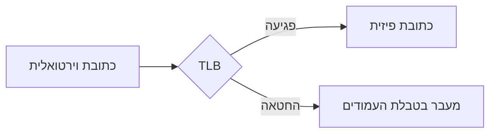

# Multi-Language Course Output Implementation Plan

> **For agentic workers:** REQUIRED SUB-SKILL: Use superpowers:subagent-driven-development (recommended) or superpowers:executing-plans to implement this plan task-by-task. Steps use checkbox (`- [ ]`) syntax for tracking.

**Goal:** Add a required target-language parameter to Presentation2Course, with Hebrew as the first (and first right-to-left) supported language, so every student-facing artifact is written in the language the user asked for.

**Architecture:** `outline.json` gains a required `language: {name, code}` field, written by the summarizer and read by everything downstream. `build.py` looks the code up against a small fixed RTL-language list and emits `dir`/`lang` on the shipped `<html>` element; the shared layout/print CSS is converted from physical to logical directional properties so the existing three themes mirror automatically. `course-writer` (the only agent producing literally student-facing prose) writes in the target language; `researcher` stays language-agnostic by design, since research is an internal work-order file, not something the student reads.

**Tech Stack:** Same as the base skill — Python 3.12+ stdlib, `markdown>=3.5`, pytest. No new dependencies.

## Global Constraints

- The target language is **required on every invocation** — there is no default, and the run must never silently fall back to English.
- An unresolvable stated language is a **hard stop**, in the same style as Phase 0's existing bad-deck exit codes — never a clarifying question. The skill's "ask no questions" rule stays absolute.
- Every student-facing artifact — prose, analogies, quizzes, glossary, `KNOWN-ISSUES.md`, the final report — is written in the target language.
- Jargon terms themselves stay in their original form inline (e.g. `TLB`); only their *definitions* translate.
- Internal ids, filenames, and anchors (topic ids, module filenames, heading anchors) always stay Latin/kebab-case, regardless of course language. They are never shown to the student.
- Reviewer findings (`pass-<n>.json`, `pass-<n>-auditor.json` — the `message`/`evidence` fields specifically) are always in English, regardless of course language, since findings are pipeline bookkeeping for the orchestrator, not student-facing.
- Research files (`.p2c/research/<topic-id>.md`) are **not** translated — they are an internal work-order artifact for the course-writer, not something the student reads. Only `course-writer` translates.
- RTL languages recognized in this plan: `he`, `ar`, `fa`, `ur`, `yi`, `dv`, `ps`, `sd` (ISO 639-1 codes). Any other code renders left-to-right.
- RTL layout is achieved via CSS **logical properties** in the shared `assets/base/layout.css` — never per-theme CSS duplication. `assets/themes/*/theme.css` files only define color/font *tokens* (CSS custom properties), not structural layout, so none of them need directional changes.
- Mermaid diagram containers are **always** `dir="ltr"`, regardless of page direction — diagram flow direction is independent of prose direction.

---

### Task 1: `language` field in the outline contract

`outline.json` is the summarizer's only output and the contract every later phase reads. This task adds the required `language` object to that contract, in both the hand-written validator and the published JSON Schema, and updates every existing fixture that gets loaded through `load_outline` so the rest of the suite keeps passing.

**Files:**
- Modify: `scripts/p2c/outline.py`
- Modify: `references/outline-schema.json`
- Modify: `tests/test_outline.py`
- Modify: `tests/fixtures/mini-course/outline.json`
- Modify: `tests/broken-course/outline.json`

**Interfaces:**
- Consumes: nothing new.
- Produces: `outline.py` gains `REQUIRED_LANGUAGE = ("name", "code")`; `validate_outline` reports `outline.language` problems the same way it reports every other required field. `REQUIRED_TOP` gains `"language"`. Every outline dict flowing through `load_outline` from here on must include `"language": {"name": str, "code": str}`.

- [ ] **Step 1: Write the failing tests**

In `tests/test_outline.py`, update the `outline()` helper to include the new field, and add new test functions:

```python
def outline(**overrides):
    base = {
        "title": "Operating Systems",
        "subject_domain": "systems",
        "language": {"name": "English", "code": "en"},
        "source_decks": ["week1.pdf"],
        "modules": [
            {
                "id": "m-memory",
                "title": "Memory",
                "prerequisites": ["Binary arithmetic"],
                "topics": [
                    {
                        "id": "tlb",
                        "title": "The TLB",
                        "slide_refs": ["week1.pdf#12"],
                        "jargon": ["TLB", "Page table"],
                        "diagrams": ["A box diagram of address translation"],
                        "gaps": ["Why translation needs caching at all"],
                    },
                    {
                        "id": "thrashing",
                        "title": "Thrashing",
                        "slide_refs": ["week1.pdf#20"],
                        "jargon": ["Working set"],
                        "diagrams": [],
                        "gaps": [],
                    },
                ],
            }
        ],
    }
    base.update(overrides)
    return base


def test_a_hebrew_language_outline_validates():
    assert validate_outline(outline(language={"name": "Hebrew", "code": "he"})) == []


def test_rejects_a_non_object_language():
    problems = validate_outline(outline(language="Hebrew"))
    assert any("outline.language must be an object" in p for p in problems)


def test_rejects_a_language_missing_name_or_code():
    problems = validate_outline(outline(language={"name": "Hebrew"}))
    assert any("outline.language" in p and "code" in p for p in problems)
    problems = validate_outline(outline(language={"code": "he"}))
    assert any("outline.language" in p and "name" in p for p in problems)


def test_rejects_an_empty_language_code():
    problems = validate_outline(outline(language={"name": "Hebrew", "code": "  "}))
    assert any("outline.language.code" in p for p in problems)
```

Every other existing test in this file keeps working unchanged: `test_reports_every_missing_top_level_key` computes its expected count from `len(REQUIRED_TOP)` rather than a hardcoded number, so it stays correct once `"language"` is added to that tuple.

- [ ] **Step 2: Run the tests to see them fail**

Run: `.venv/bin/pytest tests/test_outline.py -v`
Expected: the four new tests fail — `test_a_hebrew_language_outline_validates` fails because `validate_outline` doesn't yet know about `language` (it will actually currently *pass* trivially since nothing checks the field yet, but the missing-field tests will fail because no problem is reported for a bad `language`). Confirm each new test's failure message names `language`.

- [ ] **Step 3: Implement the validator**

In `scripts/p2c/outline.py`, add the required-key tuple and top-level require it:

```python
SUBJECT_DOMAINS = ("systems", "theory", "life-sciences", "other")
REQUIRED_TOP = ("title", "subject_domain", "source_decks", "modules", "language")
REQUIRED_MODULE = ("id", "title", "prerequisites", "topics")
REQUIRED_TOPIC = ("id", "title", "slide_refs", "jargon", "diagrams", "gaps")
REQUIRED_LANGUAGE = ("name", "code")
_SLIDE_REF = re.compile(r"^.+#\d+$")
```

Add a check function alongside `_check_str`/`_check_str_list`:

```python
def _check_language(obj: dict, where: str, problems: list[str]) -> None:
    value = obj.get("language")
    if not isinstance(value, dict):
        problems.append(f"{where}.language must be an object")
        return
    for key in REQUIRED_LANGUAGE:
        if key not in value:
            problems.append(f"{where}.language is missing required key '{key}'")
        elif not isinstance(value[key], str) or not value[key].strip():
            problems.append(f"{where}.language.{key} must be a non-empty string")
```

In `validate_outline`, right after the existing `source_decks` check, add:

```python
    if "language" in obj:
        _check_language(obj, "outline", problems)
```

- [ ] **Step 4: Run the tests to see them pass**

Run: `.venv/bin/pytest tests/test_outline.py -v`
Expected: PASS, all tests including the four new ones.

- [ ] **Step 5: Update the published JSON Schema**

In `references/outline-schema.json`, add `"language"` to the top-level `"required"` array, and add its property definition alongside `"source_decks"`:

```json
    "required": ["title", "subject_domain", "source_decks", "modules", "language"],
```

```json
    "language": {
      "type": "object",
      "required": ["name", "code"],
      "properties": {
        "name": {"type": "string", "minLength": 1, "description": "Full language name, e.g. 'Hebrew'."},
        "code": {"type": "string", "minLength": 1, "description": "ISO 639-1 code, e.g. 'he'. Looked up against a fixed known-RTL-code list to decide layout direction."}
      },
      "description": "The language every student-facing artifact is written in. Required -- resolved once in Phase 0 from what the user explicitly stated, never defaulted."
    },
```

- [ ] **Step 6: Update the two JSON fixtures loaded through `load_outline`**

`tests/fixtures/mini-course/outline.json` and `tests/broken-course/outline.json` are both loaded via `build()` → `load_outline()` in other test files (`test_build.py`, `test_broken_course.py`, `test_invariants.py`). Add the same field to both, right after `"subject_domain"`:

```json
  "language": {"name": "English", "code": "en"},
```

- [ ] **Step 7: Run the full suite**

Run: `.venv/bin/pytest -v`
Expected: PASS. (If anything else fails, it is another outline dict passed straight to `assemble()` or `validate_course()` that never goes through `load_outline` — those don't need the field; do not add it to `tests/test_assemble.py`'s or `tests/test_validate.py`'s inline `OUTLINE` dicts, since neither calls `load_outline`/`validate_outline`.)

- [ ] **Step 8: Commit**

```bash
git add scripts/p2c/outline.py references/outline-schema.json tests/test_outline.py \
  tests/fixtures/mini-course/outline.json tests/broken-course/outline.json
git commit -m "feat: add required language field to the outline contract"
```

---

### Task 2: RTL detection and `lang`/`dir` template placeholders

`build.py` needs to know, for a given language code, whether the shipped page should render right-to-left. This task adds a small fixed lookup table, two new template placeholders, and wires both through `fill_template`.

**Files:**
- Modify: `scripts/p2c/theme.py`
- Modify: `assets/base/template.html`
- Modify: `scripts/p2c/build.py`
- Modify: `tests/test_theme.py`
- Modify: `tests/test_build.py`

**Interfaces:**
- Consumes: `outline["language"]` (Task 1), a `dict` with `name`/`code` string keys.
- Produces: `p2c.theme.RTL_LANGUAGES: frozenset[str]`, `p2c.theme.is_rtl(code: str) -> bool`. `TEMPLATE_PLACEHOLDERS` gains `"{{LANG}}"`, `"{{DIR}}"`. `build.fill_template`'s signature becomes `fill_template(theme, rendered, *, title, source_decks, inline_mermaid, language)`.

- [ ] **Step 1: Write the failing tests**

Add to `tests/test_theme.py`:

```python
from p2c.theme import RTL_LANGUAGES, is_rtl


def test_is_rtl_recognizes_hebrew_and_arabic():
    assert is_rtl("he") is True
    assert is_rtl("ar") is True


def test_is_rtl_is_false_for_ltr_languages():
    assert is_rtl("en") is False
    assert is_rtl("es") is False


def test_is_rtl_is_false_for_an_unrecognized_code():
    assert is_rtl("xx") is False


def test_is_rtl_is_case_insensitive():
    assert is_rtl("HE") is True


def test_rtl_languages_are_lowercase_iso_codes():
    assert all(code == code.lower() for code in RTL_LANGUAGES)
    assert {"he", "ar", "fa", "ur"} <= RTL_LANGUAGES
```

Add to `tests/test_build.py`:

```python
def test_the_shipped_html_declares_language_and_direction(built):
    html = built.course_html.read_text()
    assert 'lang="en"' in html
    assert 'dir="ltr"' in html


def test_an_rtl_language_gets_dir_rtl_and_its_own_lang(tmp_path):
    outline = json.loads((MINI / "outline.json").read_text())
    outline["language"] = {"name": "Hebrew", "code": "he"}
    outline_path = tmp_path / "outline.json"
    outline_path.write_text(json.dumps(outline))
    result = build(outline_path, MINI / "modules", tmp_path / "out", ASSETS)
    html = result.course_html.read_text()
    assert 'lang="he"' in html
    assert 'dir="rtl"' in html
```

- [ ] **Step 2: Run the tests to see them fail**

Run: `.venv/bin/pytest tests/test_theme.py tests/test_build.py -v`
Expected: FAIL — `ImportError: cannot import name 'RTL_LANGUAGES'`, and the two new `test_build.py` cases fail on a missing `lang="..."`/`dir="..."` in the output.

- [ ] **Step 3: Implement `is_rtl` in `theme.py`**

Add near the top of `scripts/p2c/theme.py`, after `THEME_FOR_DOMAIN`:

```python
RTL_LANGUAGES = frozenset({"ar", "dv", "fa", "he", "ps", "sd", "ur", "yi"})


def is_rtl(code: str) -> bool:
    return code.lower() in RTL_LANGUAGES
```

Extend `TEMPLATE_PLACEHOLDERS`:

```python
TEMPLATE_PLACEHOLDERS = (
    "{{TITLE}}",
    "{{THEME_NAME}}",
    "{{THEME_CSS}}",
    "{{LAYOUT_CSS}}",
    "{{PRINT_CSS}}",
    "{{TOC}}",
    "{{CONTENT}}",
    "{{GLOSSARY}}",
    "{{SOURCE_DECKS}}",
    "{{MERMAID_JS}}",
    "{{COURSE_JS}}",
    "{{LANG}}",
    "{{DIR}}",
)
```

- [ ] **Step 4: Update the template**

In `assets/base/template.html`, change the `<html>` line:

```html
<html lang="{{LANG}}" dir="{{DIR}}" data-course-theme="{{THEME_NAME}}">
```

(replaces the current `<html lang="en" data-course-theme="{{THEME_NAME}}">`)

- [ ] **Step 5: Wire it through `build.py`**

In `scripts/p2c/build.py`, update the import and `fill_template`:

```python
from p2c.theme import Theme, is_rtl, load_theme, theme_for
```

```python
def fill_template(
    theme: Theme,
    rendered: Rendered,
    *,
    title: str,
    source_decks: list[str],
    inline_mermaid: bool,
    language: dict,
) -> str:
    decks = ", ".join(source_decks) if source_decks else "the source deck"
    substitutions = {
        "{{TITLE}}": html.escape(title),
        "{{THEME_NAME}}": theme.name,
        "{{THEME_CSS}}": theme.theme_css,
        "{{LAYOUT_CSS}}": theme.layout_css,
        "{{PRINT_CSS}}": theme.print_css,
        "{{TOC}}": rendered.toc_html,
        "{{CONTENT}}": rendered.html_body,
        "{{GLOSSARY}}": rendered.glossary_html or "<p>No jargon was recorded.</p>",
        "{{SOURCE_DECKS}}": html.escape(decks),
        "{{MERMAID_JS}}": theme.mermaid_js if (inline_mermaid and theme.mermaid_js) else "",
        "{{COURSE_JS}}": theme.course_js,
        "{{LANG}}": html.escape(language["code"]),
        "{{DIR}}": "rtl" if is_rtl(language["code"]) else "ltr",
    }
    # One pass, so substituted CSS/JS/prose can never itself be treated as a placeholder.
    return _PLACEHOLDER_RE.sub(
        lambda m: substitutions.get(m.group(0), m.group(0)), theme.template
    )
```

Update both call sites inside `build()` to pass `language=outline["language"]`:

```python
    html_text = fill_template(
        loaded,
        rendered,
        title=outline["title"],
        source_decks=rendered.front_matter.source_decks,
        inline_mermaid=rendered.uses_mermaid,
        language=outline["language"],
    )
```

```python
    validation_html = fill_template(
        loaded,
        rendered,
        title=outline["title"],
        source_decks=rendered.front_matter.source_decks,
        inline_mermaid=False,
        language=outline["language"],
    )
```

- [ ] **Step 6: Run the tests to see them pass**

Run: `.venv/bin/pytest tests/test_theme.py tests/test_build.py tests/test_assets.py -v`
Expected: PASS.

- [ ] **Step 7: Regenerate and review the golden snapshot**

The `<html>` tag changed, so the byte-identical golden test will now fail until regenerated:

```bash
P2C_UPDATE_GOLDEN=1 .venv/bin/pytest tests/test_build.py -k golden
git diff tests/golden/course.html
```

Confirm the diff touches **only** the `<html>` line (now `lang="en" dir="ltr"`) and nothing else. If anything else changed, stop and find out why before proceeding.

- [ ] **Step 8: Run the full suite**

Run: `.venv/bin/pytest -v`
Expected: PASS.

- [ ] **Step 9: Commit**

```bash
git add scripts/p2c/theme.py scripts/p2c/build.py assets/base/template.html \
  tests/test_theme.py tests/test_build.py tests/golden/course.html
git commit -m "feat: emit dir/lang on the shipped html from outline.json's language"
```

---

### Task 3: RTL-safe shared layout CSS

`assets/base/layout.css` is the one stylesheet all three themes share for structure (themes only define color/font tokens — confirmed by reading `assets/themes/*/theme.css`, which contain no directional properties at all). This task converts its physical left/right properties to logical inline-start/inline-end equivalents, so the same file serves both text directions automatically once `dir` is set on `<html>`. `assets/print.css` has no directional properties to convert (verified by inspection — `border-bottom`, `@page margin`, and symmetric shorthands are all direction-agnostic), so it only gains a regression test locking that in.

**Files:**
- Modify: `assets/base/layout.css`
- Modify: `tests/test_assets.py`

**Interfaces:**
- Consumes: nothing new.
- Produces: nothing new — this is a CSS-only change with no code contract. `layout.css`'s existing selectors and custom-property names are unchanged.

- [ ] **Step 1: Write the failing test**

Add to `tests/test_assets.py`:

```python
def test_layout_css_uses_logical_directional_properties_not_physical_ones():
    """Physical left/right properties don't mirror under dir="rtl"; logical
    inline-start/end properties do, so one layout.css serves both directions."""
    css = (ASSETS / "base" / "layout.css").read_text()
    for forbidden in (
        "text-align: left",
        "border-left:",
        "border-right:",
        "border-left-color:",
        "border-right-color:",
        "left: -9999px",
        "left: var(--space-4)",
    ):
        assert forbidden not in css, forbidden
    for required in (
        "text-align: start",
        "border-inline-start:",
        "border-inline-end:",
        "border-inline-start-color:",
        "inset-inline-start: -9999px",
        "inset-inline-start: var(--space-4)",
    ):
        assert required in css, required


def test_print_css_has_no_physical_directional_properties():
    """Locks in the current state: print.css has nothing to mirror. If a future
    edit adds a left/right property here, this test should force a decision
    about whether it needs to become logical too."""
    css = (ASSETS / "print.css").read_text()
    for forbidden in ("text-align: left", "text-align: right", "border-left:",
                       "border-right:", "left:", "right:"):
        assert forbidden not in css, forbidden
```

- [ ] **Step 2: Run the tests to see them fail**

Run: `.venv/bin/pytest tests/test_assets.py -k "logical or print_css_has_no" -v`
Expected: FAIL on the `layout.css` test (the physical properties are still present); PASS already on the `print.css` test (nothing to change there — this confirms the earlier inspection).

- [ ] **Step 3: Convert `layout.css`'s physical properties to logical ones**

In `assets/base/layout.css`, make these exact replacements (every other rule in the file is unchanged):

Replace:
```css
th, td { border: 1px solid var(--color-border); padding: var(--space-2) var(--space-3); text-align: left; }
```
With:
```css
th, td { border: 1px solid var(--color-border); padding: var(--space-2) var(--space-3); text-align: start; }
```

Replace:
```css
.skip-link {
  position: absolute; left: -9999px;
  background: var(--color-accent); color: var(--color-accent-contrast);
  padding: var(--space-2) var(--space-4);
}
.skip-link:focus { left: var(--space-4); top: var(--space-4); z-index: 10; }
```
With:
```css
.skip-link {
  position: absolute; inset-inline-start: -9999px;
  background: var(--color-accent); color: var(--color-accent-contrast);
  padding: var(--space-2) var(--space-4);
}
.skip-link:focus { inset-inline-start: var(--space-4); top: var(--space-4); z-index: 10; }
```

Replace:
```css
.sidebar {
  position: sticky; top: 0; align-self: start;
  height: 100vh; overflow-y: auto;
  padding: var(--space-6);
  border-right: 1px solid var(--color-border);
  background: var(--color-surface);
}
```
With:
```css
.sidebar {
  position: sticky; top: 0; align-self: start;
  height: 100vh; overflow-y: auto;
  padding: var(--space-6);
  border-inline-end: 1px solid var(--color-border);
  background: var(--color-surface);
}
```

Replace:
```css
.toc a {
  display: block; padding: var(--space-1) var(--space-2);
  text-decoration: none; color: var(--color-muted);
  border-left: 2px solid transparent; border-radius: 0 var(--radius) var(--radius) 0;
  font-size: 0.9rem;
}
.toc__module > a { color: var(--color-fg); font-weight: 600; margin-top: var(--space-3); }
.toc a:hover { color: var(--color-fg); background: var(--color-bg); }
.toc a[aria-current="true"] {
  color: var(--color-accent); border-left-color: var(--color-accent); background: var(--color-bg);
}
```
With:
```css
.toc a {
  display: block; padding: var(--space-1) var(--space-2);
  text-decoration: none; color: var(--color-muted);
  border-inline-start: 2px solid transparent;
  border-start-start-radius: 0; border-end-start-radius: 0;
  border-start-end-radius: var(--radius); border-end-end-radius: var(--radius);
  font-size: 0.9rem;
}
.toc__module > a { color: var(--color-fg); font-weight: 600; margin-top: var(--space-3); }
.toc a:hover { color: var(--color-fg); background: var(--color-bg); }
.toc a[aria-current="true"] {
  color: var(--color-accent); border-inline-start-color: var(--color-accent); background: var(--color-bg);
}
```

Replace:
```css
.callout {
  margin: var(--space-6) 0; padding: var(--space-4) var(--space-6);
  border-left: 4px solid var(--color-border);
  border-radius: 0 var(--radius) var(--radius) 0;
  background: var(--color-surface);
}
```
With:
```css
.callout {
  margin: var(--space-6) 0; padding: var(--space-4) var(--space-6);
  border-inline-start: 4px solid var(--color-border);
  border-start-start-radius: 0; border-end-start-radius: 0;
  border-start-end-radius: var(--radius); border-end-end-radius: var(--radius);
  background: var(--color-surface);
}
```

Replace:
```css
.term__def {
  display: block; margin: var(--space-2) 0; padding: var(--space-3);
  border: 1px solid var(--color-border); border-left: 3px solid var(--color-accent);
  border-radius: var(--radius); background: var(--color-surface);
  font-size: 0.92rem; color: var(--color-fg);
}
```
With:
```css
.term__def {
  display: block; margin: var(--space-2) 0; padding: var(--space-3);
  border: 1px solid var(--color-border); border-inline-start: 3px solid var(--color-accent);
  border-radius: var(--radius); background: var(--color-surface);
  font-size: 0.92rem; color: var(--color-fg);
}
```

Replace:
```css
.quiz__option {
  font: inherit; text-align: left; width: 100%; cursor: pointer;
  padding: var(--space-3) var(--space-4);
  background: var(--color-bg); color: var(--color-fg);
  border: 1px solid var(--color-border); border-radius: var(--radius);
}
```
With:
```css
.quiz__option {
  font: inherit; text-align: start; width: 100%; cursor: pointer;
  padding: var(--space-3) var(--space-4);
  background: var(--color-bg); color: var(--color-fg);
  border: 1px solid var(--color-border); border-radius: var(--radius);
}
```

`.shell`'s `grid-template-columns: 300px minmax(0, 1fr)` and `.sidebar__actions`'s `display: flex` are left untouched: CSS Grid and Flexbox both lay out their inline axis according to `direction`/`dir`, so the sidebar and its buttons already mirror correctly once `dir="rtl"` is set — no property change needed there. Do not "fix" these; they are not broken.

- [ ] **Step 4: Run the tests to see them pass**

Run: `.venv/bin/pytest tests/test_assets.py -v`
Expected: PASS.

- [ ] **Step 5: Regenerate and review the golden snapshot**

```bash
P2C_UPDATE_GOLDEN=1 .venv/bin/pytest tests/test_build.py -k golden
git diff tests/golden/course.html
```

Confirm the diff is exactly the `layout.css` rules changed above, embedded inline in the `<style>` block, and nothing else.

- [ ] **Step 6: Run the full suite**

Run: `.venv/bin/pytest -v`
Expected: PASS.

- [ ] **Step 7: Commit**

```bash
git add assets/base/layout.css tests/test_assets.py tests/golden/course.html
git commit -m "feat: convert shared layout CSS to logical properties for RTL support"
```

---

### Task 4: Pin Mermaid diagrams to left-to-right regardless of course language

Diagram flow direction is independent of prose direction — a flowchart's arrows don't have a natural "right-to-left" convention the way text does. This task makes every rendered `.mermaid` container explicitly `dir="ltr"`, both in the emitted HTML attribute and as CSS reinforcement, regardless of what direction the surrounding page is in.

**Files:**
- Modify: `scripts/p2c/mdrender.py`
- Modify: `assets/base/layout.css`
- Modify: `tests/test_mdrender.py`
- Modify: `tests/test_build.py`

**Interfaces:**
- Consumes: nothing new.
- Produces: the `.mermaid` container mdrender.py emits changes from `<div class="mermaid">...` to `<div class="mermaid" dir="ltr">...`. Any code or test asserting the exact old string must be updated in the same commit.

- [ ] **Step 1: Write the failing tests**

In `tests/test_mdrender.py`, find the existing assertion `assert '<div class="mermaid">flowchart LR' in r.html_body` and change it to:

```python
    assert '<div class="mermaid" dir="ltr">flowchart LR' in r.html_body
```

In `tests/test_build.py`, find `assert html.count('<div class="mermaid">') == 1` (in `test_mermaid_is_inlined_once_when_a_diagram_is_present`) and change it to:

```python
    assert html.count('<div class="mermaid" dir="ltr">') == 1
```

- [ ] **Step 2: Run the tests to see them fail**

Run: `.venv/bin/pytest tests/test_mdrender.py tests/test_build.py -v`
Expected: FAIL — both now expect a string `mdrender.py` doesn't emit yet.

- [ ] **Step 3: Implement**

In `scripts/p2c/mdrender.py`, change the mermaid replacement (currently `f'<div class="mermaid">{html.escape(fence.body)}</div>'`):

```python
                replacements[fence.token] = (
                    f'<div class="mermaid" dir="ltr">{html.escape(fence.body)}</div>'
                )
```

In `assets/base/layout.css`, add an explicit `direction: ltr` to the existing `.mermaid` rule as CSS-level reinforcement (belt-and-suspenders alongside the HTML attribute):

Replace:
```css
.mermaid { margin: var(--space-6) 0; text-align: center; overflow-x: auto; }
```
With:
```css
.mermaid { margin: var(--space-6) 0; text-align: center; overflow-x: auto; direction: ltr; }
```

- [ ] **Step 4: Run the tests to see them pass**

Run: `.venv/bin/pytest tests/test_mdrender.py tests/test_build.py tests/test_assets.py -v`
Expected: PASS.

- [ ] **Step 5: Regenerate and review the golden snapshot**

```bash
P2C_UPDATE_GOLDEN=1 .venv/bin/pytest tests/test_build.py -k golden
git diff tests/golden/course.html
```

The mini-course fixture has no diagrams, so this diff should be **empty apart from the `.mermaid` CSS rule** (the `dir="ltr"` HTML attribute never appears in this particular golden file, since it has no mermaid blocks — that combination is covered by `test_mermaid_is_inlined_once_when_a_diagram_is_present` instead, which builds its own throwaway course with a diagram).

- [ ] **Step 6: Run the full suite**

Run: `.venv/bin/pytest -v`
Expected: PASS.

- [ ] **Step 7: Commit**

```bash
git add scripts/p2c/mdrender.py assets/base/layout.css tests/test_mdrender.py tests/test_build.py tests/golden/course.html
git commit -m "fix: pin mermaid diagram containers to ltr regardless of course language"
```

---

### Task 5: Agent prompts read and write the target language

Of the five agent prompts, only `course-writer` produces literally student-facing prose, so only it needs to translate. `summarizer` needs to carry the resolved language into `outline.json`. `researcher` is deliberately left unchanged — its output is an internal work-order file the student never sees, and drawing on English sources while writing in English keeps its research quality independent of the target language. `novice-simulator` and `rubric-auditor` need one clarifying rule each: their own findings stay in English.

**Files:**
- Modify: `references/agents/summarizer.md`
- Modify: `references/agents/course-writer.md`
- Modify: `references/agents/novice-simulator.md`
- Modify: `references/agents/rubric-auditor.md`
- Modify: `references/quiz-format.md`
- Modify: `tests/test_references.py`

**Interfaces:**
- Consumes: nothing new from code.
- Produces: no code interface — these are prose files `SKILL.md` points subagents at. `tests/test_references.py` is the structural contract keeping them in sync with what this plan requires.

- [ ] **Step 1: Write the failing tests**

In `tests/test_references.py`, extend `test_summarizer_prompt_states_the_outline_contract`:

```python
def test_summarizer_prompt_states_the_outline_contract():
    text = (REFS / "agents" / "summarizer.md").read_text()
    assert "outline.json" in text
    assert "outline-schema.json" in text
    assert "20" in text  # pages are read in batches of 20
    for key in REQUIRED_TOPIC:
        assert key in text, key
    for domain in SUBJECT_DOMAINS:
        assert domain in text, domain
    assert "blank" in text.lower()
    assert "language" in text.lower()
    assert "kebab-case" in text.lower()
```

Add two new test functions:

```python
def test_course_writer_prompt_states_the_language_and_jargon_rule():
    text = (REFS / "agents" / "course-writer.md").read_text()
    lowered = text.lower()
    assert "language" in lowered
    assert "original form" in lowered or "original-form" in lowered


def test_reviewer_prompts_keep_their_own_findings_in_english():
    for name in ("novice-simulator.md", "rubric-auditor.md"):
        text = (REFS / "agents" / name).read_text().lower()
        assert "english" in text, name
```

- [ ] **Step 2: Run the tests to see them fail**

Run: `.venv/bin/pytest tests/test_references.py -v`
Expected: FAIL on all three (the prompts don't mention any of this yet).

- [ ] **Step 3: Update `summarizer.md`**

Add `"language"` to the `outline.json` example (right after `"subject_domain"`) and its Required-keys line, and add a new Rules bullet. The Output section's JSON example becomes:

```json
{
  "title": "course title, from the deck or its filename, written in the target language",
  "subject_domain": "systems | theory | life-sciences | other",
  "language": {"name": "Hebrew", "code": "he"},
  "source_decks": ["week1.pdf"],
  "modules": [{
    "id": "m-memory",
    "title": "Virtual Memory",
    "prerequisites": ["what a student must already know"],
    "topics": [{
      "id": "tlb",
      "title": "What a TLB caches",
      "slide_refs": ["week1.pdf#12"],
      "jargon": ["TLB", "Page table"],
      "diagrams": ["prose description of what the slide's diagram shows"],
      "gaps": ["asserted by the deck but never explained"]
    }]
  }]
}
```

Add to the Rules section (after the existing `**subject_domain**` bullet):

```markdown
- **`language`**: given to you by the orchestrator, exactly as `{"name": ..., "code": ...}`
  — copy it into the outline unchanged. Every title (`title`, module `title`, topic
  `title`) is written in that language. `id`s are always lowercase kebab-case ASCII,
  regardless of language — never transliterate or translate them.
```

- [ ] **Step 4: Update `course-writer.md`**

Add a new Rules bullet (in the "Mechanical requirements" list, alongside the existing "Never write a `prereq` block" rule):

```markdown
- Write in the course's target language (`outline.json`'s `language`). Jargon terms
  themselves stay in their original form inline, exactly as they appear in the
  `jargon` list — only the surrounding prose and the glossary's *definitions*
  translate. The glossary block's `term:` side is the original-form term; only the
  text after the colon is written in the target language.
```

- [ ] **Step 5: Update `references/quiz-format.md`**

In the `glossary` block section, add one clarifying sentence after the existing description:

```markdown
When the course is not in English, the term before the colon stays in its original
form (e.g. `TLB: ...`); only the definition after the colon is written in the
course's language.
```

- [ ] **Step 6: Update `novice-simulator.md` and `rubric-auditor.md`**

In `novice-simulator.md`, add to the Rules section:

```markdown
- Read and answer in whatever language the course is written in, the way a real
  student would. Write your own `message`/`evidence` fields in English regardless —
  findings are for the orchestrator, not the student.
```

In `rubric-auditor.md`, add to the Rules section:

```markdown
- If `outline.json` declares a target `language`, the course being written in it is
  expected, not a finding. Write your own `message`/`evidence` fields in English
  regardless of the course's language — findings are for the orchestrator, not the
  student.
```

- [ ] **Step 7: Run the tests to see them pass**

Run: `.venv/bin/pytest tests/test_references.py -v`
Expected: PASS.

- [ ] **Step 8: Run the full suite**

Run: `.venv/bin/pytest -v`
Expected: PASS.

- [ ] **Step 9: Commit**

```bash
git add references/agents/summarizer.md references/agents/course-writer.md \
  references/agents/novice-simulator.md references/agents/rubric-auditor.md \
  references/quiz-format.md tests/test_references.py
git commit -m "docs: agent prompts read and write the course's target language"
```

---

### Task 6: `SKILL.md` language resolution, dispatch updates, and README

The orchestrator (`SKILL.md`) is the only place that talks to the user, so language resolution — and its hard-fail path — lives entirely there, not in any script. This task adds that resolution step, threads the resolved language into the `course-writer` dispatch, and updates the README's public-facing usage documentation and non-goals list.

**Files:**
- Modify: `SKILL.md`
- Modify: `tests/test_skill.py`
- Modify: `README.md`

**Interfaces:**
- Consumes: nothing new from code — this is orchestration prose plus its structural test.
- Produces: nothing new for other tasks to consume; this is the last task that touches orchestration.

- [ ] **Step 1: Write the failing test**

Add to `tests/test_skill.py`:

```python
def test_language_is_required_and_unresolvable_is_a_hard_stop_not_a_question():
    lowered = SKILL.lower()
    assert "iso 639" in lowered
    idx = lowered.index("<language>")
    window = lowered[idx : idx + 800]
    assert "required" in window
    assert "hard fail" in window or "hard stop" in window
    assert "never a question" in window or "not a question" in window


def test_course_writer_dispatch_receives_the_resolved_language():
    phase3 = SKILL.index("Phase 3")
    phase4 = SKILL.index("Phase 4")
    assert "<language>" in SKILL[phase3:phase4]
```

- [ ] **Step 2: Run the test to see it fail**

Run: `.venv/bin/pytest tests/test_skill.py -v`
Expected: FAIL — `ValueError: substring not found` for `<language>` (doesn't exist in `SKILL.md` yet).

- [ ] **Step 3: Add language resolution to Phase 0**

In `SKILL.md`'s "## 0. Setup and paths" section, after the existing `<output>` bullet and before the "Confirm the one runtime dependency" paragraph, add:

```markdown
- `<language>`: the target language for this course. **Required — the user must
  state it explicitly every time; there is no default.** Resolve whatever they said
  (a name, a demonym, an ISO code, "in Hebrew") to its English name and ISO 639-1
  code, e.g. `{"name": "Hebrew", "code": "he"}`. If the request states no language
  at all, or states something you cannot confidently resolve to a real language,
  **hard fail before Phase 0 begins** and print the exact wording you could not
  resolve. This is never a question to ask — the zero-questions rule holds even
  here, because a wrong guess means redoing the entire run in the wrong language.
```

- [ ] **Step 4: Thread `<language>` into the summarizer dispatch (Phase 1)**

Change the existing sentence:

```markdown
Dispatch one subagent with `<SKILL>/references/agents/summarizer.md` as its instructions,
plus the paths of the normalized PDFs and the output path
`<output>/.p2c/outline.json`. It reads pages **visually, in batches of 20** — never by text
extraction.
```

To:

```markdown
Dispatch one subagent with `<SKILL>/references/agents/summarizer.md` as its instructions,
plus the paths of the normalized PDFs, the resolved `<language>`, and the output path
`<output>/.p2c/outline.json`. It reads pages **visually, in batches of 20** — never by text
extraction.
```

- [ ] **Step 5: Thread `<language>` into the course-writer dispatch (Phase 3)**

In Phase 3's bullet list of what each course-writer receives, add a bullet after "its module object, with its topics in order,":

```markdown
- the resolved `<language>`, so its prose, analogies, and quizzes are written in it
  (jargon terms stay in their original form — see `course-writer.md`),
```

- [ ] **Step 6: Add a failure-handling row**

In the "## Failure handling" table, add a row (placed before the "Deck pages unreadable" row, since it's checked earliest):

```markdown
| No language stated, or unresolvable | Hard fail before Phase 0, print the offending wording |
```

- [ ] **Step 7: Run the test to see it pass**

Run: `.venv/bin/pytest tests/test_skill.py -v`
Expected: PASS.

- [ ] **Step 8: Update the README**

Change the "## Usage" section:

```markdown
## Usage

```
Turn ./lectures/week3.pdf into a course, language: English
Turn ./lectures/week3.pdf into a course, language: Hebrew
Turn ./lectures/ into a course, language: Spanish
```

A single file becomes a single course. A directory becomes one multi-module course
covering the whole set. Both PDF and PPTX work.

**The target language is required, every time** — there is no default. Every
student-facing artifact (prose, analogies, quizzes, glossary, `KNOWN-ISSUES.md`, the
final report) is written in that language; jargon terms themselves stay in their
original form inline, only their definitions translate. Right-to-left languages
(Hebrew, Arabic, Persian, Urdu, Yiddish, Divehi, Pashto, and Sindhi today) get correct
RTL layout automatically — any other stated language renders left-to-right. If the
request doesn't state a language, or states one that can't be resolved, the run stops
rather than guessing.

The skill otherwise asks you **nothing** while it runs. You didn't write the deck, so
you have no context to contribute — everything is reported at the end instead.
```

Remove "No multi-language output." from the "## What this won't do" section (it currently reads "No video or audio. No LMS export. No multi-language output. No student accounts or cross-session progress." — delete just that middle sentence).

- [ ] **Step 9: Run the full suite**

Run: `.venv/bin/pytest -v`
Expected: PASS.

- [ ] **Step 10: Commit**

```bash
git add SKILL.md tests/test_skill.py README.md
git commit -m "feat: SKILL.md resolves and dispatches a required target language"
```

---

### Task 7: Hebrew fixture, golden snapshot, and end-to-end verification

This is the capstone task: a real (small, hand-written) Hebrew course fixture exercising every earlier task together — the required `language` field, RTL `dir`/`lang` emission, logical CSS, a Hebrew-labeled Mermaid diagram pinned LTR, and jargon terms kept in their original form. It also verifies `p2c.invariants.check_course` needs no changes to stay language-agnostic, per the design's explicit "confirm, don't assume" testing requirement.

**Files:**
- Create: `tests/fixtures/mini-course-he/outline.json`
- Create: `tests/fixtures/mini-course-he/modules/01-section.md`
- Modify: `tests/test_build.py`
- Modify: `tests/test_invariants.py`

**Interfaces:**
- Consumes: everything from Tasks 1–6.
- Produces: `tests/golden/course-he.html`, a second golden snapshot alongside the existing English one.

- [ ] **Step 1: Create the Hebrew outline fixture**

Create `tests/fixtures/mini-course-he/outline.json`:

```json
{
  "title": "יסודות מערכות הפעלה",
  "subject_domain": "systems",
  "language": {"name": "Hebrew", "code": "he"},
  "source_decks": ["week1.pdf"],
  "modules": [
    {
      "id": "m-memory",
      "title": "זיכרון וירטואלי",
      "prerequisites": ["חשבון בינארי"],
      "topics": [
        {
          "id": "tlb",
          "title": "מה ה-TLB שומר במטמון",
          "slide_refs": ["week1.pdf#12"],
          "jargon": ["TLB", "טבלת עמודים"],
          "diagrams": ["תרשים תיבות המראה כתובת וירטואלית הופכת לכתובת פיזית"],
          "gaps": ["למה תרגום כתובות דורש מטמון בכלל"]
        },
        {
          "id": "thrashing",
          "title": "תרשיש (Thrashing)",
          "slide_refs": ["week1.pdf#20"],
          "jargon": ["קבוצת עבודה"],
          "diagrams": [],
          "gaps": ["מה מייחד תרשיש מהחלפת עמודים רגילה"]
        }
      ]
    }
  ]
}
```

Note: the topic ids (`tlb`, `thrashing`) and module id (`m-memory`) stay Latin/kebab-case exactly like the English fixture, per the Global Constraint that internal ids never translate — this is deliberate, not an oversight.

- [ ] **Step 2: Create the Hebrew module file — mind the filename**

`p2c.assemble.module_filename(1, module)` computes `f"01-{slugify(module['title'])}.md"`, and `p2c.text.slugify` ASCII-folds its input (`unicodedata.normalize("NFKD", text).encode("ascii", "ignore")`). Hebrew has no ASCII-compatible decomposition, so it folds to an empty string and `slugify` falls back to its documented default, `"section"`. **The module file must therefore be named exactly `01-section.md`** — not a human-readable Hebrew name — or `assemble()` will raise `AssembleError: module file not written`. This is expected, mechanical behavior, not a bug: anchors and filenames are never student-facing.

Create `tests/fixtures/mini-course-he/modules/01-section.md`:

````markdown
<!-- topic: tlb -->
### מה ה-TLB שומר במטמון

כל תוכנית פונה לזיכרון בעזרת כתובות וירטואליות, אך החומרה עצמה עובדת מול כתובות
פיזיות בזיכרון האמיתי. מישהו צריך לתרגם בין השניים בכל גישה לזיכרון, בלי לעכב
את התוכנית.

```analogy
דמיינו פנקס אישי שבו רשום "קיצור 4" מול הכתובת האמיתית. ה-TLB הוא כמו הדפים
האחרונים שפתחתם בפנקס — שמורים בהישג יד כדי לא לחפש מחדש בכל פעם. האנלוגיה
נשברת כשזוכרים שה-TLB מתעדכן כל הזמן, בעוד פנקס אמיתי נשאר קבוע.
```

**TLB** (Translation Lookaside Buffer) הוא מטמון חומרה קטן ומהיר, השומר תרגומים
אחרונים בין כתובות וירטואליות לפיזיות. כשהתרגום המבוקש כבר נמצא במטמון הזה,
המעבד חוסך מעבר מלא ב**טבלת העמודים**.



לדוגמה: תוכנית שקוראת שוב ושוב מאותו מערך תמצא את התרגום כבר שמור ב-TLB אחרי
הפעם הראשונה בלבד.

```quiz
q: מה בדיוק ה-TLB שומר במטמון?
- [ ] את תוכן העמודים האחרונים שנקראו
- [x] תרגומים בין כתובות וירטואליות לפיזיות
- [ ] את טבלת העמודים כולה
why: בלבול נפוץ הוא לחשוב שה-TLB שומר נתונים ממש — אך הוא יושב לפני טבלת
     העמודים, לא לפני הזיכרון עצמו, ושומר רק את התרגום.
```

<!-- topic: thrashing -->
### תרשיש (Thrashing)

כשיותר מדי תהליכים מתחרים על פחות מדי זיכרון פיזי, המערכת מבלה את רוב זמנה
בהבאת עמודים מהדיסק במקום בהרצת עבודה ממשית.

```analogy
דמיינו מטבח קטן ששבעה טבחים מנסים לעבוד בו בו-זמנית, וכל אחד צריך כלי שנמצא
אצל השני. במקום לבשל, כולם מבלים את הזמן בהחלפת כלים. האנלוגיה נשברת כי במטבח
אפשר להוסיף כלים; זיכרון פיזי הוא קבוע.
```

**קבוצת העבודה** של תהליך היא אוסף העמודים שהוא באמת משתמש בהם בפרק זמן נתון.
כשסכום קבוצות העבודה של כל התהליכים חורג מהזיכרון הפיזי הזמין, המערכת נכנסת
לתרשיש: קצב תפוקת ה-CPU צונח, למרות שהמערכת "עסוקה" כל הזמן בהבאת עמודים.

לדוגמה: מערכת עם 100 מסגרות זיכרון שמריצה חמישה תהליכים שכל אחד מהם צריך 30
מסגרות תיכנס לתרשיש — 150 חורג מ-100 — עוד לפני שהמעבד עשה עבודה שימושית.

```quiz
q: מה קורה בפועל כשמערכת נכנסת לתרשיש?
- [x] תפוקת המעבד יורדת, אף שהמערכת נראית עסוקה כל הזמן
- [ ] המערכת קורסת מיידית
- [ ] הזיכרון הפיזי גדל אוטומטית כדי להתאים
why: תרשיש אינו קריסה — המערכת ממשיכה לרוץ, אך רוב הזמן מוקדש להבאת עמודים
     מהדיסק במקום להרצת התהליכים עצמם, ולכן התפוקה בפועל צונחת.
```

```glossary
TLB: מטמון חומרה קטן ומהיר השומר תרגומים אחרונים בין כתובות וירטואליות לפיזיות.
טבלת עמודים: המיפוי המלא בזיכרון בין עמודים וירטואליים למסגרות פיזיות.
קבוצת עבודה: אוסף העמודים שתהליך משתמש בהם בפועל בפרק זמן נתון.
```
````

- [ ] **Step 3: Write the failing tests**

Add to `tests/test_build.py`:

```python
MINI_HE = REPO / "tests" / "fixtures" / "mini-course-he"
GOLDEN_HE = REPO / "tests" / "golden" / "course-he.html"


@pytest.fixture
def built_he(tmp_path):
    return build(MINI_HE / "outline.json", MINI_HE / "modules", tmp_path, ASSETS)


def test_the_hebrew_course_builds_clean(built_he):
    assert [f.code for f in built_he.findings] == []


def test_the_hebrew_course_gets_rtl_layout_and_ltr_diagrams(built_he):
    html = built_he.course_html.read_text()
    assert 'lang="he"' in html
    assert 'dir="rtl"' in html
    assert '<div class="mermaid" dir="ltr">' in html
    assert "TLB" in html  # jargon stays in its original form even in a Hebrew course
    assert "<dt id=\"def-tlb\">TLB</dt>" in html


def test_the_hebrew_course_matches_its_golden_snapshot(built_he):
    if os.environ.get("P2C_UPDATE_GOLDEN") == "1":
        GOLDEN_HE.parent.mkdir(parents=True, exist_ok=True)
        GOLDEN_HE.write_text(built_he.course_html.read_text())
    assert built_he.course_html.read_text() == GOLDEN_HE.read_text(), (
        "course-he.html changed; re-run with P2C_UPDATE_GOLDEN=1 and review the diff"
    )
```

Add to `tests/test_invariants.py`:

```python
MINI_HE = REPO / "tests" / "fixtures" / "mini-course-he"


@pytest.fixture
def course_dir_he(tmp_path):
    build(MINI_HE / "outline.json", MINI_HE / "modules", tmp_path, ASSETS)
    (tmp_path / ".p2c").mkdir(exist_ok=True)
    (tmp_path / ".p2c" / "outline.json").write_text((MINI_HE / "outline.json").read_text())
    return tmp_path


def test_a_sound_hebrew_course_violates_nothing(course_dir_he):
    """Confirms check_course needs no language-specific changes: same invariants,
    same result, regardless of the course's language."""
    assert check_course(course_dir_he) == []
```

- [ ] **Step 4: Run the tests to see them fail**

Run: `.venv/bin/pytest tests/test_build.py tests/test_invariants.py -v`
Expected: FAIL — `test_the_hebrew_course_matches_its_golden_snapshot` fails with a `FileNotFoundError` (no golden file yet); the others should already pass if Tasks 1–6 are correctly in place, which is itself a useful signal — if `test_the_hebrew_course_builds_clean` or the RTL/ltr test fails here, one of the earlier tasks has a gap and must be fixed before proceeding, not patched around in this task.

- [ ] **Step 5: Generate and review the golden snapshot**

```bash
P2C_UPDATE_GOLDEN=1 .venv/bin/pytest tests/test_build.py -k hebrew_course_matches
```

Read the generated `tests/golden/course-he.html` end to end once. Confirm: the `<html>` tag reads `lang="he" dir="rtl"`; the sidebar/TOC titles and quiz text are the Hebrew content written above; `TLB` and the other jargon terms appear untranslated wherever they're used as clickable terms and in the glossary `<dt>`; the mermaid `<div>` has `dir="ltr"`.

- [ ] **Step 6: Run the tests to see them pass**

Run: `.venv/bin/pytest tests/test_build.py tests/test_invariants.py -v`
Expected: PASS.

- [ ] **Step 7: Run the full suite**

Run: `.venv/bin/pytest -v`
Expected: PASS, no skips beyond the pre-existing `soffice`/Chromium/`P2C_COURSE_DIR` ones.

- [ ] **Step 8: Commit**

```bash
git add tests/fixtures/mini-course-he tests/test_build.py tests/test_invariants.py \
  tests/golden/course-he.html
git commit -m "test: Hebrew fixture and golden snapshot exercising the full RTL pipeline"
```
