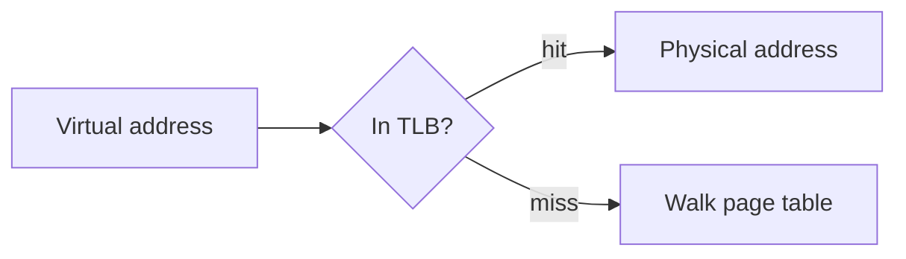

`````markdown
# Content block formats

Six fenced block kinds are meaningful to the build. Anything else is rendered as an
ordinary code block.

## `quiz` — one comprehension check

````
```quiz
q: What does a TLB actually cache?
- [ ] The contents of recently used pages
- [x] Virtual-to-physical page mappings
- [ ] The page table itself
why: It caches translations, not data. Confusing it with a data cache is
     the most common mistake here — the TLB sits in front of the page
     table, not in front of memory.
```
````

Grammar, enforced by the build:

- Exactly one `q:` line. It may wrap onto following unindented-or-indented lines until
  the first option.
- 3 or 4 options, each `- [ ] text` or `- [x] text`. No option may be empty.
- Exactly one option marked `[x]`.
- Exactly one `why:`, non-empty, wrapping onto indented continuation lines.
- No other lines. A stray line is a build failure.
- Plain text only — no markdown, no backticks, no HTML inside a quiz block.

`why:` must address the **tempting wrong answer**, not restate the right one. That is
where the teaching happens. See `style-guide.md`.

One or more quiz blocks per topic. Every topic needs at least one. Quizzes are
ungraded with unlimited retries, so never write "you scored" or "try again later".

## `mermaid` — a diagram

````

````

The first non-blank line must be a Mermaid diagram keyword (`flowchart`, `graph`,
`sequenceDiagram`, `stateDiagram-v2`, `classDiagram`, `erDiagram`, `journey`, `gantt`,
`pie`, `mindmap`, `timeline`, `quadrantChart`, `xychart-beta`, `block-beta`,
`architecture-beta`). Brackets and quotes must balance. Use Mermaid for anything
expressible as flow, sequence, state, or architecture; inline `<svg>` otherwise.

A block that fails validation gets **one** repair attempt, then must be replaced with a
prose description. A broken diagram never ships.

## `glossary` — the module's jargon definitions

````
```glossary
TLB: A small, fast cache holding recently used virtual-to-physical page mappings.
Page table: The full in-memory map from virtual pages to physical frames.
```
````

One block per module file, at the end. One `term: definition` per line; a definition may
wrap onto indented continuation lines. Every jargon term the outline recorded for this
module's topics **must** appear here, or the build fails. Definitions are one or two
sentences, plain language, no jargon of their own.

## Topic markers

Every topic section must open with an HTML comment naming its outline id:

```markdown
<!-- topic: tlb-basics -->
### What a TLB caches
```

The build uses these to prove every outline topic reached the course, and to scope quiz
and term ids. A missing marker is a build failure.

## `analogy` — the plain-language comparison

```analogy
A TLB is the sticky note on your monitor with the four phone numbers you actually
dial, rather than the whole company directory in the drawer.
```

Renders as a distinctly styled callout. **It must appear before the technical
explanation of the topic, never after.** That ordering is the point of the project.
Markdown inside the block is rendered normally.

## `unverified` — an admitted gap

```unverified
The lecturer's claim about cache line size on this architecture could not be confirmed
against a primary source. Treat the specific number with suspicion.
```

Required whenever the topic's research file says `unverified: true`. Say what could not
be confirmed and what the student should distrust. Never quietly invent a confident
explanation instead — a student who cannot tell the difference is worse off with
invention than with an admitted gap.

## `prereq` — emitted by the build, not by writers

```prereq
- Binary arithmetic
- Pointers
```

The build writes this at the start of each module from `outline.json`. Writers must not
author it.
`````
