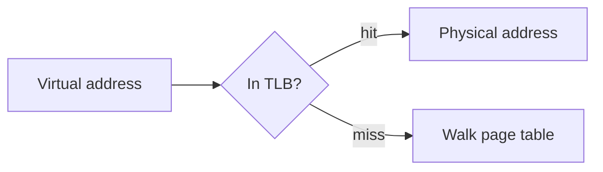

`````markdown
# Content block formats

Eight fenced block kinds are meaningful to the build. Anything else is rendered as an
ordinary code block.

## `quiz` — one comprehension check

````
```quiz
q: What does a TLB actually cache?
- [ ] The contents of recently used pages
- [x] Virtual-to-physical page mappings
- [ ] The page table itself
why: It caches translations, not data. Confusing it with a data cache is
     the most common mistake here — the TLB sits in front of the page
     table, not in front of memory.
```
````

Grammar, enforced by the build:

- Exactly one `q:` line. It may wrap onto following unindented-or-indented lines until
  the first option.
- 3 or 4 options, each `- [ ] text` or `- [x] text`. No option may be empty.
- Exactly one option marked `[x]`.
- Exactly one `why:`, non-empty, wrapping onto indented continuation lines.
- No other lines. A stray line is a build failure.
- Plain text only — no markdown, no backticks, no HTML inside a quiz block.

`why:` must address the **tempting wrong answer**, not restate the right one. That is
where the teaching happens. See `style-guide.md`.

One or more quiz blocks per topic. Every `full`-depth topic needs at least one; a
`brief`-depth topic uses `<!-- no-quiz: ... -->` instead (see `references/style-guide.md`'s
"Brief topics" section). Quizzes are ungraded with unlimited retries, so never write
"you scored" or "try again later".

## `mermaid` — a diagram

````

````

The first non-blank line must be a Mermaid diagram keyword (`flowchart`, `graph`,
`sequenceDiagram`, `stateDiagram-v2`, `classDiagram`, `erDiagram`, `journey`, `gantt`,
`pie`, `mindmap`, `timeline`, `quadrantChart`, `xychart-beta`, `block-beta`,
`architecture-beta`). Brackets and quotes must balance. Use Mermaid for anything
expressible as flow, sequence, state, or architecture; inline `<svg>` otherwise.

A block that fails validation gets **one** repair attempt, then must be replaced with a
prose description. A broken diagram never ships.

## `figure` — a reused slide image

````
```figure
source: week1.pdf#12
caption: The lookup path, as drawn in the lecture.
```
````

Exactly one `source:` (a `deck.pdf#page` ref, copied verbatim from the value
the orchestrator gave you when a topic has a `reusable_image`) and one
`caption:`, which may wrap onto indented continuation lines. The build
resolves `source:` to the real slide image at the referenced page — the
writer never supplies image bytes, only these two lines. An unresolvable
source (missing deck, out-of-range page) is a hard build failure naming the
topic and the source.

## `animate` — a bounded animation pattern

````
```animate
pattern: state-machine
states:
  - Request arrives at the TLB
  - TLB miss triggers a page-table walk
  - Page table entry is cached back into the TLB
transitions:
  - Request arrives at the TLB -> TLB miss triggers a page-table walk: miss
  - TLB miss triggers a page-table walk -> Page table entry is cached back into the TLB: walk completes
```
````

````
```animate
pattern: state-toggle
before: Cache line marked Shared
after: Cache line marked Modified after a local write
```
````

`state-machine` needs at least 2 `states:` entries and at least 1
`transitions:` line, each written as `<from> -> <to>: <action>`. Every
transition must connect two *consecutive* entries in `states:` (in the order
you listed them) — except one optional final transition, listed last, from
the last state back to any earlier one, for a genuinely cyclic process. No
branching: a state may have only one outgoing transition (aside from that
one permitted trailing back-edge case).

`array-ops` visualizes an array operation sequence (e.g. one pass of a sort):

````
```animate
pattern: array-ops
array:
  - 5
  - 3
  - 8
  - 1
ops:
  - compare 0 1
  - swap 0 1
  - highlight 2
```
````

`array:` needs at least 2 integer values. `ops:` needs at least one line, each one
of `compare i j`, `swap i j`, or `highlight i` (indices into `array`, 0-based).

`path-trace` visualizes a point moving along a plotted line or curve (also usable
for a tree/graph edge being traced):

````
```animate
pattern: path-trace
points:
  - 0, 10
  - 5, 2
  - 10, 8
  - 15, 0
caption: Gradient descent converging toward the minimum
```
````

`points:` needs at least 2 `x, y` pairs (plain numbers, not a function
expression). `caption:` is required.

`pipeline` visualizes an input flowing through named stages, each transforming it:

````
```animate
pattern: pipeline
stages:
  - Raw image: single RGB frame, no depth information
  - Encoder: compresses the frame into a feature map
  - Decoder: expands features back to per-pixel values
  - Depth map: one distance estimate per pixel
```
````

`stages:` needs 2–6 entries, each written `<name>: <what changes>`. Both halves are
required — a stage with no transformation described is a static flowchart, not a
sequence.

`layer-stack` visualizes abstraction tiers building up, or a signal passing down:

````
```animate
pattern: layer-stack
direction: up
layers:
  - Pixels: raw sensor values
  - Edges: local intensity changes
  - Objects: assembled shapes
```
````

`layers:` needs 2–6 entries listed **bottom-up**. `direction:` is optional
(`up` or `down`, default `up`) and reverses only the reveal order, not the drawing.

`transform` visualizes one entity becoming another through labeled steps:

````
```animate
pattern: transform
from: Disparity map
to: Metric depth map
steps:
  - Invert each disparity value
  - Scale by the focal-length/baseline constant
```
````

`from:` and `to:` are both required; `steps:` needs 1–4 entries. Use this instead of
`state-toggle` when the change has intermediate steps worth naming.

Each pattern rejects the keys it does not use, so a typo'd block (e.g. `stages:` on
a `transform`) fails loudly instead of being silently ignored. `caption:` is one such
key: only `path-trace` renders a caption, so it is the only pattern that accepts
one — `pipeline`, `layer-stack`, and `transform` all reject it.

Seven patterns exist: `state-machine`, `state-toggle`, `array-ops`, `path-trace`,
`pipeline`, `layer-stack`, `transform` — no others. This is a deliberately bounded
set, not a general animation authoring tool.

All patterns respect `prefers-reduced-motion` and render fully static (every
step/state/frame shown at once, not a single frozen frame) in print.

## `glossary` — the module's jargon definitions

````
```glossary
TLB: A small, fast cache holding recently used virtual-to-physical page mappings.
Page table: The full in-memory map from virtual pages to physical frames.
```
````

One block per module file, at the end. One `term: definition` per line; a definition may
wrap onto indented continuation lines. Every jargon term the outline recorded for this
module's topics **must** appear here, or the build fails. Definitions are one or two
sentences, plain language, no jargon of their own. When the course is not in English, the term before the colon stays in its original
form (e.g. `TLB: ...`); only the definition after the colon is written in the
course's language.

## Topic markers

Every topic section must open with an HTML comment naming its outline id:

```markdown
<!-- topic: tlb-basics -->
### What a TLB caches
```

The build uses these to prove every outline topic reached the course, and to scope quiz
and term ids. A missing marker is a build failure.

## `analogy` — the plain-language comparison

```analogy
A TLB is the sticky note on your monitor with the four phone numbers you actually
dial, rather than the whole company directory in the drawer.
```

Renders as a distinctly styled callout. **It must appear before the technical
explanation of the topic, never after.** That ordering is the point of the project.
Markdown inside the block is rendered normally.

## `unverified` — an admitted gap

```unverified
The lecturer's claim about cache line size on this architecture could not be confirmed
against a primary source. Treat the specific number with suspicion.
```

Required whenever the topic's research file says `unverified: true`. Say what could not
be confirmed and what the student should distrust. Never quietly invent a confident
explanation instead — a student who cannot tell the difference is worse off with
invention than with an admitted gap.

## `prereq` — emitted by the build, not by writers

```prereq
- Binary arithmetic
- Pointers
```

The build writes this at the start of each module from `outline.json`. Writers must not
author it.
`````
