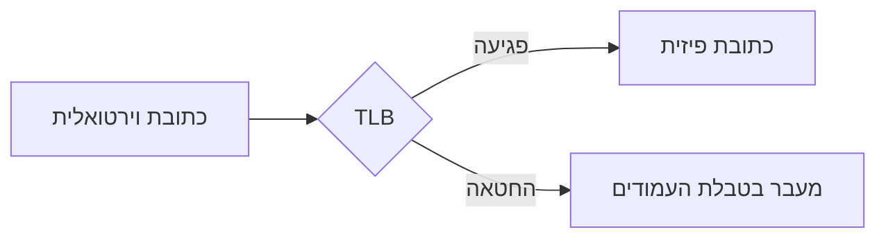

<!-- topic: tlb -->
### מה ה-TLB שומר במטמון

כל תוכנית פונה לזיכרון בעזרת כתובות וירטואליות, אך החומרה עצמה עובדת מול כתובות
פיזיות בזיכרון האמיתי. מישהו צריך לתרגם בין השניים בכל גישה לזיכרון, בלי לעכב
את התוכנית.

```analogy
דמיינו פנקס אישי שבו רשום "קיצור 4" מול הכתובת האמיתית. ה-TLB הוא כמו הדפים
האחרונים שפתחתם בפנקס — שמורים בהישג יד כדי לא לחפש מחדש בכל פעם. האנלוגיה
נשברת כשזוכרים שה-TLB מתעדכן כל הזמן, בעוד פנקס אמיתי נשאר קבוע.
```

**TLB** (Translation Lookaside Buffer) הוא מטמון חומרה קטן ומהיר, השומר תרגומים
אחרונים בין כתובות וירטואליות לפיזיות. כשהתרגום המבוקש כבר נמצא במטמון הזה,
המעבד חוסך מעבר מלא ב**טבלת העמודים**.



```figure
source: terse.pdf#1
caption: השקופית המקורית שהתרשים הזה משוחזר ממנה.
```

```animate
pattern: path-trace
points:
  - 0, 10
  - 5, 2
  - 10, 8
  - 15, 0
caption: TLB hit rate rising as the working set warms up
```

לדוגמה: תוכנית שקוראת שוב ושוב מאותו מערך תמצא את התרגום כבר שמור ב-TLB אחרי
הפעם הראשונה בלבד.

```quiz
q: מה בדיוק ה-TLB שומר במטמון?
- [ ] את תוכן העמודים האחרונים שנקראו
- [x] תרגומים בין כתובות וירטואליות לפיזיות
- [ ] את טבלת העמודים כולה
why: בלבול נפוץ הוא לחשוב שה-TLB שומר נתונים ממש — אך הוא יושב לפני טבלת
     העמודים, לא לפני הזיכרון עצמו, ושומר רק את התרגום.
```

<!-- topic: thrashing -->
### תרשיש (Thrashing)

כשיותר מדי תהליכים מתחרים על פחות מדי זיכרון פיזי, המערכת מבלה את רוב זמנה
בהבאת עמודים מהדיסק במקום בהרצת עבודה ממשית.

```analogy
דמיינו מטבח קטן ששבעה טבחים מנסים לעבוד בו בו-זמנית, וכל אחד צריך כלי שנמצא
אצל השני. במקום לבשל, כולם מבלים את הזמן בהחלפת כלים. האנלוגיה נשברת כי במטבח
אפשר להוסיף כלים; זיכרון פיזי הוא קבוע.
```

**קבוצת העבודה** של תהליך היא אוסף העמודים שהוא באמת משתמש בהם בפרק זמן נתון.
כשסכום קבוצות העבודה של כל התהליכים חורג מהזיכרון הפיזי הזמין, המערכת נכנסת
לתרשיש: קצב תפוקת ה-CPU צונח, למרות שהמערכת "עסוקה" כל הזמן בהבאת עמודים.

לדוגמה: מערכת עם 100 מסגרות זיכרון שמריצה חמישה תהליכים שכל אחד מהם צריך 30
מסגרות תיכנס לתרשיש — 150 חורג מ-100 — עוד לפני שהמעבד עשה עבודה שימושית.

```animate
pattern: state-toggle
before: קבוצת העבודה בתוך הזיכרון הפיזי
after: קבוצת העבודה מוחלפת (thrashing)
```

```animate
pattern: array-ops
array:
  - 5
  - 3
  - 8
  - 1
ops:
  - compare 0 1
  - swap 0 1
  - highlight 2
```

```quiz
q: מה קורה בפועל כשמערכת נכנסת לתרשיש?
- [x] תפוקת המעבד יורדת, אף שהמערכת נראית עסוקה כל הזמן
- [ ] המערכת קורסת מיידית
- [ ] הזיכרון הפיזי גדל אוטומטית כדי להתאים
why: תרשיש אינו קריסה — המערכת ממשיכה לרוץ, אך רוב הזמן מוקדש להבאת עמודים
     מהדיסק במקום להרצת התהליכים עצמם, ולכן התפוקה בפועל צונחת.
```

```glossary
TLB: מטמון חומרה קטן ומהיר השומר תרגומים אחרונים בין כתובות וירטואליות לפיזיות.
טבלת עמודים: המיפוי המלא בזיכרון בין עמודים וירטואליים למסגרות פיזיות.
קבוצת עבודה: אוסף העמודים שתהליך משתמש בהם בפועל בפרק זמן נתון.
```

<!-- topic: course-goals -->
### מטרות הקורס

הקורס הזה עובר על זיכרון וירטואלי מהיסודות: איך כתובות מתורגמות, למה תרגום
דורש מטמון בכלל, ומה קורה כשלחץ זיכרון מכריח את המערכת לבחור מה לפנות.

<!-- no-quiz: נושא מנהלתי קצר, אין מה לבדוק -->

<!-- no-visual: סיכום אג'נדה ללא מנגנון לתרשם; הנושאים שהוא מציג כבר כוללים תרשימים משלהם. -->
